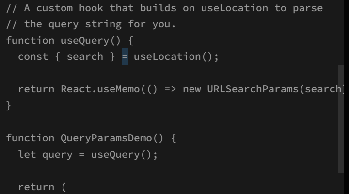
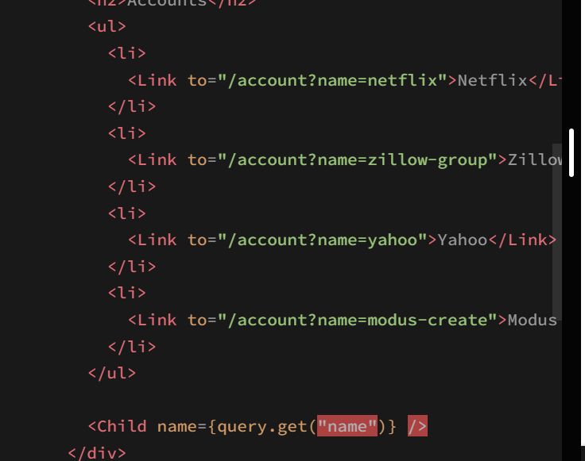
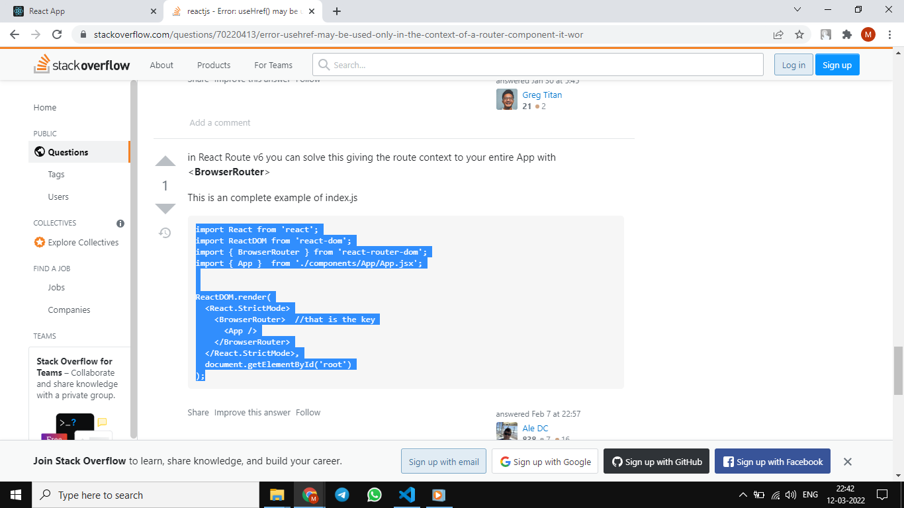
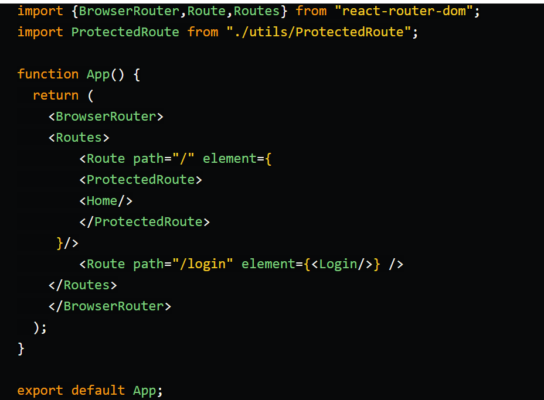
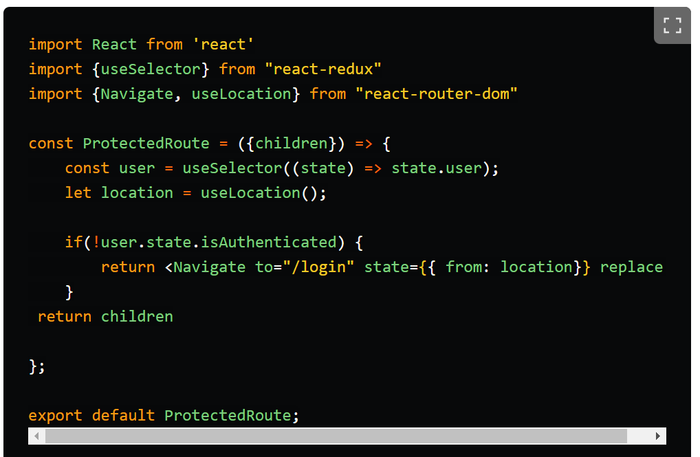

# React Router DOM Revision

This file incorporates React Router notes from the pasted `JS revision.md`.

---

# 1. What is React Router DOM?

React Router DOM handles client-side routing in React apps.

It lets the UI change based on the URL without a full page reload.

Visual notes from `react_1.docx`:





---

# 2. Core Components

| Component | Use |
| --------- | --- |
| `BrowserRouter` | Enables routing with browser history |
| `Routes` | Wraps route definitions |
| `Route` | Maps path to element |
| `Link` | Navigates without reload |
| `NavLink` | Link with active styling support |
| `Outlet` | Renders nested route child |
| `Navigate` | Redirects |

```jsx
import { BrowserRouter, Routes, Route, Link } from "react-router-dom";

function App() {
  return (
    <BrowserRouter>
      <nav>
        <Link to="/">Home</Link>
        <Link to="/users">Users</Link>
      </nav>

      <Routes>
        <Route path="/" element={<Home />} />
        <Route path="/users" element={<Users />} />
      </Routes>
    </BrowserRouter>
  );
}
```

Troubleshooting: if you see `useHref() may be used only in the context of a <Router>` or similar errors for `useNavigate()` / `useRoutes()`, a Router hook or component is being rendered outside router context.

Fix at the app root:

```jsx
import { BrowserRouter } from "react-router-dom";
import App from "./App";

createRoot(document.getElementById("root")).render(
  <BrowserRouter>
    <App />
  </BrowserRouter>
);
```

Then keep route definitions inside the app:

```jsx
import { Routes, Route } from "react-router-dom";

function App() {
  return (
    <Routes>
      <Route path="/" element={<Home />} />
      <Route path="/about" element={<About />} />
    </Routes>
  );
}
```

Visual note from `react_js.docx`:



---

# 3. Dynamic Routes

```jsx
<Route path="/users/:userId" element={<UserDetails />} />
```

```jsx
import { useParams } from "react-router-dom";

function UserDetails() {
  const { userId } = useParams();
  return <h1>User {userId}</h1>;
}
```

---

# 4. Nested Routes

```jsx
<Route path="/dashboard" element={<DashboardLayout />}>
  <Route index element={<DashboardHome />} />
  <Route path="reports" element={<Reports />} />
  <Route path="settings" element={<Settings />} />
</Route>
```

```jsx
import { Outlet } from "react-router-dom";

function DashboardLayout() {
  return (
    <div>
      <aside>Sidebar</aside>
      <main>
        <Outlet />
      </main>
    </div>
  );
}
```

---

# 5. Interview Notes

### Why use React Router?

To create multi-page-feeling React apps where navigation updates the URL and UI without full page reload.

### What is `Outlet`?

`Outlet` renders the matched child route inside a parent layout.

### What is the difference between `Link` and `a`?

`Link` navigates inside the SPA without full reload. `a` performs normal browser navigation.

---

# 6. SPA Routing vs Conventional Routing

Traditional routing usually asks the server for a new HTML page on navigation, causing a full page refresh.

React Router changes browser history and renders a different component tree on the client without reloading the whole page.

```text
Conventional link -> HTTP request -> new HTML document -> full page reload
React Router Link -> history update -> React renders matched route -> no full reload
```

The backend still needs routes for APIs, auth, and production fallback handling.

---

# 7. Protected Routes and RBAC

Protected routes hide UI from unauthenticated users, but they do not secure backend data.

```jsx
function ProtectedRoute({ children, allowedRoles }) {
  const user = useAuthUser();

  if (!user) return <Navigate to="/login" replace />;
  if (allowedRoles && !allowedRoles.includes(user.role)) {
    return <p role="alert">No access</p>;
  }

  return children;
}
```

RBAC means Role-Based Access Control. Always enforce it on the server/API too.

Visual notes:





---

# 8. Legacy `Switch` Note

React Router v5 used `Switch` to render the first matching route.

React Router v6+ replaced `Switch` with `Routes`.

```jsx
// v6+
<Routes>
  <Route path="/" element={<Home />} />
</Routes>
```

Common migration:

```jsx
// React Router v5
<Switch>
  <Route path="/users" component={Users} />
</Switch>

// React Router v6+
<Routes>
  <Route path="/users" element={<Users />} />
</Routes>
```

Remember:

* `Switch` became `Routes`.
* `component={Users}` became `element={<Users />}`.
* Route hooks/components must render under a router such as `BrowserRouter`.
