# Redux, Redux Toolkit, Thunk, Saga, and Context Revision

This file incorporates state management notes from the pasted `JS revision.md`.

---

# 1. Local State, Global State, and Props

| Concept | Meaning |
| ------- | ------- |
| Local state | Owned by one component |
| Global state | Shared across many components |
| Props | Passed from parent to child |
| Context | Shares scoped values without prop drilling |
| Redux | Predictable global state container |

Use local state first. Move state upward only when needed.

---

# 2. Context API

```jsx
import { createContext, useContext, useState } from "react";

const UserContext = createContext(null);

function Component1() {
  const [name] = useState("mani");

  return (
    <UserContext.Provider value={name}>
      <p>Name: {name}</p>
      <Component2 />
    </UserContext.Provider>
  );
}

function Component2() {
  return <Component3 />;
}

function Component3() {
  const name = useContext(UserContext);
  return <div>Name: {name}</div>;
}
```

Context consumers re-render when provider value changes. Split contexts when unrelated values change independently.

---

# 3. Redux Core Concepts

| Concept | Meaning |
| ------- | ------- |
| Store | Holds application state |
| Action | Plain object describing what happened |
| Reducer | Pure function that returns next state |
| Dispatch | Sends action to store |
| Selector | Reads data from store |

Redux flow:

```text
Component -> dispatch(action) -> reducer -> store updates -> UI re-renders
```

---

# 4. Redux Toolkit

Redux Toolkit is the recommended way to write Redux.

It provides:

* `configureStore`
* `createSlice`
* `createAsyncThunk`
* good defaults
* Immer-based immutable updates

```js
import { createSlice } from "@reduxjs/toolkit";

const counterSlice = createSlice({
  name: "counter",
  initialState: { value: 0 },
  reducers: {
    increment(state) {
      state.value += 1;
    },
  },
});
```

`state.value += 1` is safe here because Immer produces immutable updates.

Store setup:

```js
import { configureStore } from "@reduxjs/toolkit";
import counterReducer from "./counterSlice";

export const store = configureStore({
  reducer: {
    counter: counterReducer,
  },
});
```

React setup:

```jsx
import { Provider } from "react-redux";
import { store } from "./store";

createRoot(document.getElementById("root")).render(
  <Provider store={store}>
    <App />
  </Provider>
);
```

Redux is different from a plain JavaScript import/export object. A module export shares a value, but Redux gives predictable updates, subscriptions, DevTools, middleware, and a single state flow.

---

# 5. `createAsyncThunk`

```js
export const fetchUsers = createAsyncThunk("users/fetchUsers", async () => {
  const response = await fetch("/api/users");
  if (!response.ok) throw new Error("Failed to load users");
  return response.json();
});
```

Handle:

* pending
* fulfilled
* rejected

---

# 6. Redux Thunk

Thunk lets action creators return functions.

```js
function fetchData() {
  return async (dispatch, getState) => {
    dispatch({ type: "FETCH_DATA_START" });

    try {
      const response = await fetch("/api/data");
      const data = await response.json();
      dispatch({ type: "FETCH_DATA_SUCCESS", payload: data });
    } catch (error) {
      dispatch({ type: "FETCH_DATA_ERROR", payload: error.message });
    }
  };
}
```

---

# 7. Redux Saga

Redux Saga handles advanced side effects using generator functions.

| Effect | Use |
| ------ | --- |
| `takeEvery` | Run saga for every matching action |
| `takeLatest` | Keep latest request, cancel previous |
| `call` | Call async function |
| `put` | Dispatch action |
| `all` | Run sagas together |

```js
function* handleLogin(action) {
  try {
    const response = yield call(loginApi, action.payload);
    yield put({ type: "login/success", payload: response.token });
  } catch (error) {
    yield put({ type: "login/failure", payload: error.message });
  }
}
```

---

# 8. Thunk vs Saga vs RTK Query

| Tool | Best for |
| ---- | -------- |
| Redux Thunk | Simple async logic |
| `createAsyncThunk` | Standard Redux Toolkit async actions |
| Redux Saga | Complex side effects and cancellation |
| RTK Query | Server-state fetching and caching |

Detailed practical notes:

* [Redux Toolkit, Thunk, and RTK Query Practical Notes](./g_redux_toolkit_thunk_practical_notes.md)
* [Redux Saga Practical Notes](./h_redux_saga_practical_notes.md)

---

# 9. Redux vs Context API

Use Context for theme, logged-in user, locale, and small shared settings.

Use Redux for large global state, frequent updates, debugging, predictable transitions, and async workflows across features.

Visual notes:

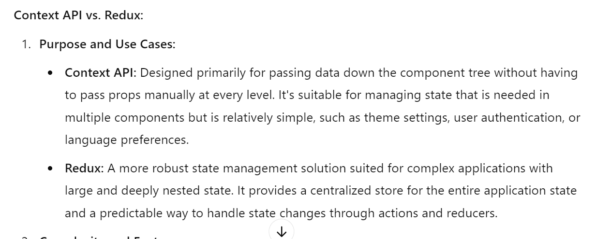

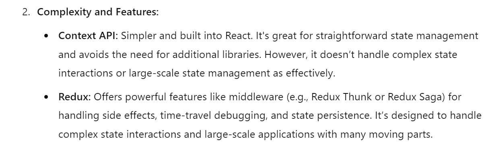

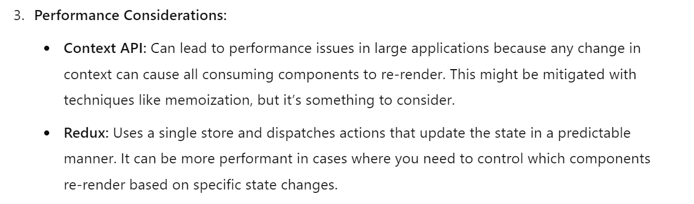

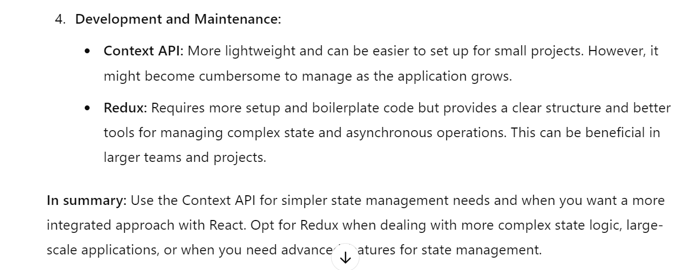

---

# 10. Plain Objects vs Redux

Plain objects can hold data, but they do not provide a predictable state workflow by themselves.

Redux adds:

* one store
* plain action objects
* pure reducers
* immutable updates
* subscriptions
* DevTools/debug history
* middleware for async work
* selector memoization patterns such as `reselect`

Use plain objects for local data structures. Use Redux when many features need predictable shared state and traceable updates.

Visual notes:

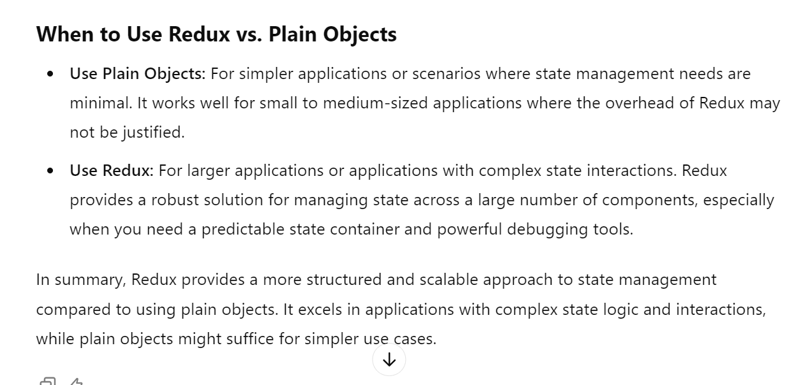

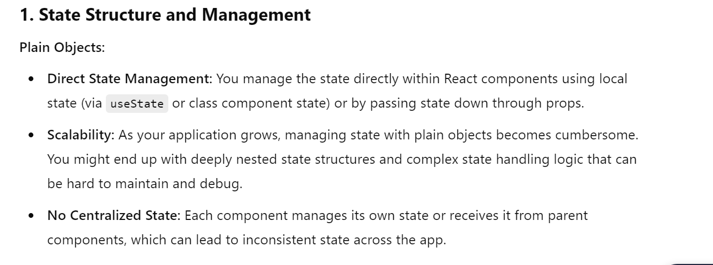

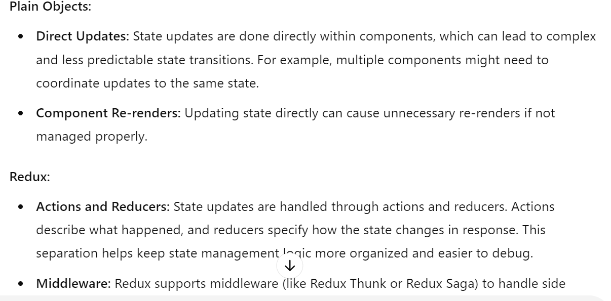

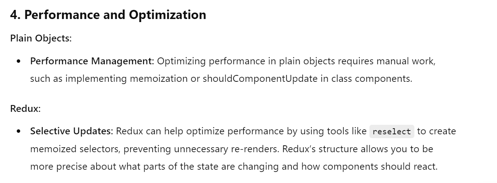

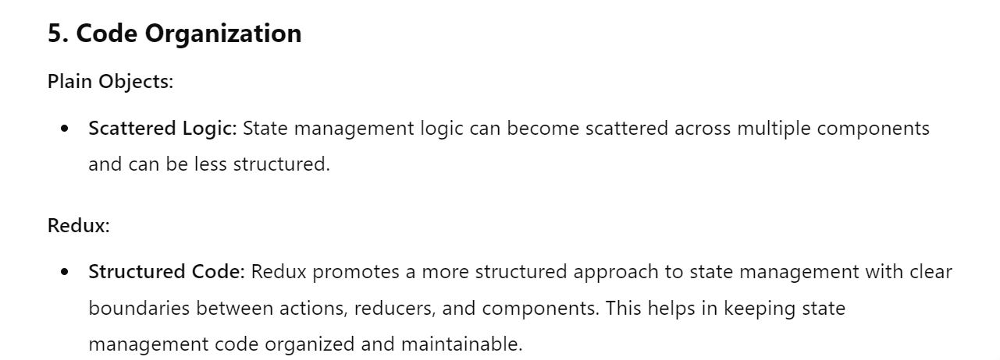

---

# 11. Flux vs Redux

Flux is an architecture for unidirectional data flow.

```text
Action -> Dispatcher -> Store(s) -> View
```

Redux was inspired by Flux but simplifies the model:

* Flux can have multiple stores and a dispatcher.
* Redux usually has a single store.
* Redux reducers calculate the next immutable state.

Visual notes:

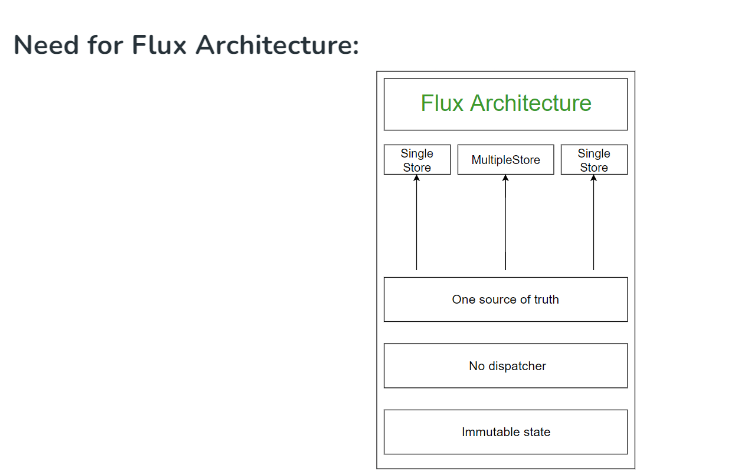

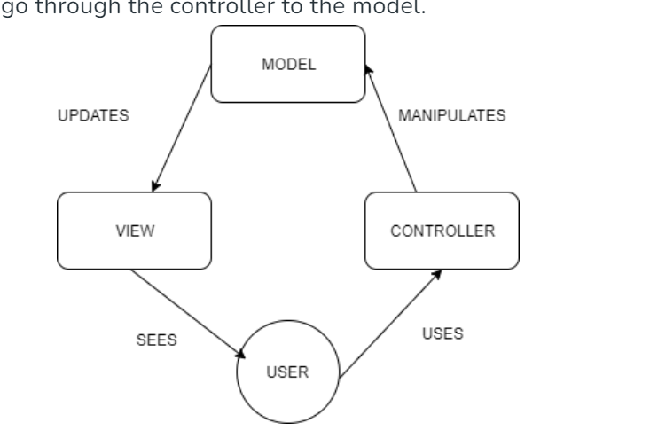

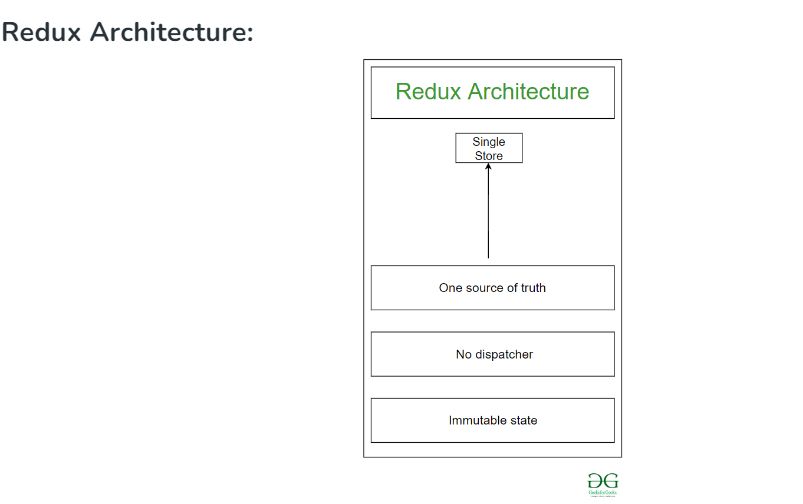

---

# 12. Why Redux State Is Immutable

Redux state should not be mutated directly. Return a new object/array when state changes.

Why immutability matters:

* easier change detection
* predictable debugging
* time-travel DevTools
* fewer accidental side effects
* simpler tests

Redux Toolkit uses Immer, so code can look mutable inside reducers while Immer produces immutable updates.

Use memoized selectors when derived Redux data is expensive or when creating new arrays/objects would cause unnecessary rerenders.

Visual notes:

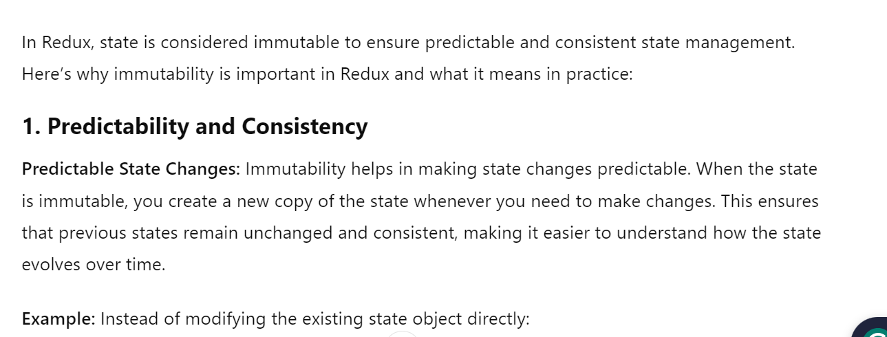

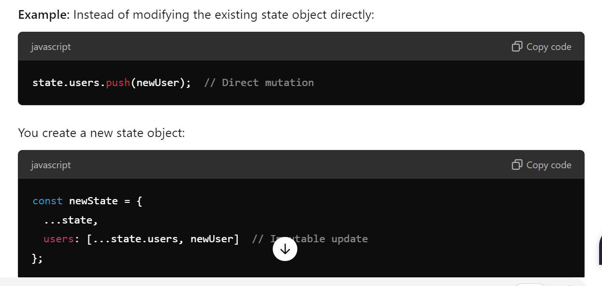

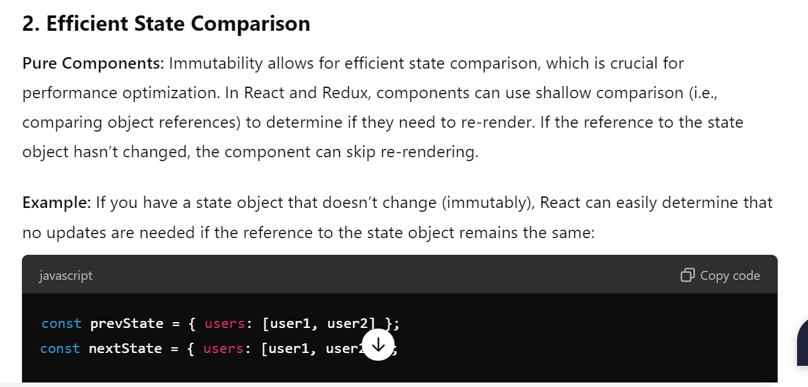

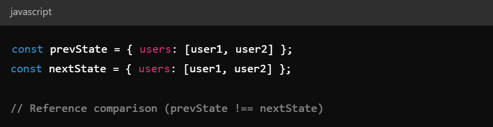

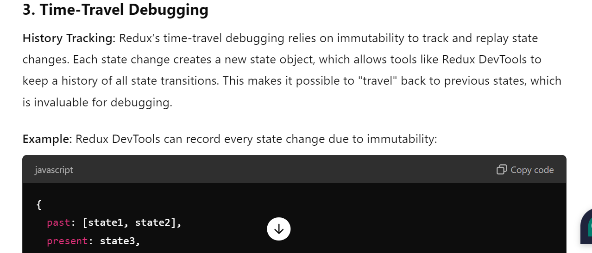

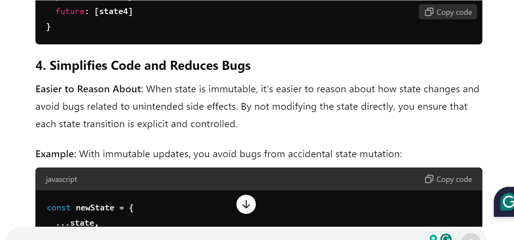

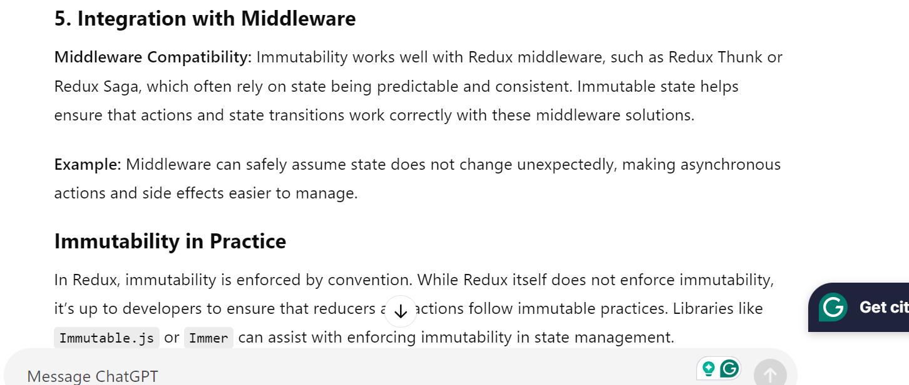
