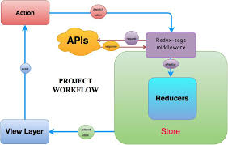

# Redux Saga Practical Notes

This file incorporates `ReduxSaga.docx` and keeps the useful generator, effect, and interview material in one place.

---

# 1. What Redux Saga Is

Redux Saga is Redux middleware for handling side effects with generator functions.

Side effects include:

* API calls
* retries
* cancellation
* polling
* debounce/throttle workflows
* background tasks
* WebSocket/channel flows
* workflows that must happen in a specific order

Saga flow:

```text
component dispatches action
-> watcher saga sees action
-> worker saga performs side effect
-> worker dispatches success/failure action
-> reducer updates store
-> UI rerenders
```

Visual workflow from `ReduxSaga.docx`:



---

# 2. Why Saga When Thunk Exists?

Use thunk or `createAsyncThunk` for simple async calls.

Use Saga when async logic has orchestration complexity:

* cancel previous request when a new one starts
* login must happen before logout watcher begins
* retry a failed request three times
* poll until a stop action
* coordinate multiple effects
* listen globally for Redux actions
* test side-effect flow step by step

---

# 3. Worker Saga and Watcher Saga

```js
import { call, put, takeLatest } from "redux-saga/effects";
import { fetchUserFailure, fetchUserSuccess } from "./userSlice";
import { getUser } from "./api";

function* fetchUserWorker(action) {
  try {
    const user = yield call(getUser, action.payload);
    yield put(fetchUserSuccess(user));
  } catch (error) {
    yield put(fetchUserFailure(error.message));
  }
}

export function* userWatcher() {
  yield takeLatest("user/fetchRequested", fetchUserWorker);
}
```

Always handle worker saga errors so one failed request does not break the saga flow.

---

# 4. Common Effects

| Effect | Meaning |
| ------ | ------- |
| `call(fn, ...args)` | Run a function and wait for its result. |
| `put(action)` | Dispatch a Redux action. |
| `take(pattern)` | Wait for one matching action. |
| `takeEvery(pattern, worker)` | Start a worker for every matching action. |
| `takeLatest(pattern, worker)` | Keep only the latest worker; cancel previous in-flight worker. |
| `select(selector)` | Read state from the Redux store. |
| `fork(fn, ...args)` | Start a non-blocking task. |
| `cancel(task)` | Cancel a forked task. |
| `all([...effects])` | Run effects in parallel, similar to `Promise.all`. |
| `delay(ms)` | Wait for a duration. |

---

# 5. `takeEvery` vs `takeLatest`

| Effect | Use when |
| ------ | -------- |
| `takeEvery` | Every request/action should be handled. Good for audit logs, notifications, or independent saves. |
| `takeLatest` | Only the latest result matters. Good for search, filters, autocomplete, and repeated refresh clicks. |

Example:

```js
function* rootSaga() {
  yield takeLatest("search/queryChanged", searchWorker);
}
```

If the user types `r`, `re`, `rea`, `react`, `takeLatest` cancels older workers and keeps the `react` result.

---

# 6. Blocking vs Non-Blocking Effects

| Type | Examples | Behavior |
| ---- | -------- | -------- |
| Blocking | `call`, `take` | Saga waits before continuing. |
| Non-blocking | `fork`, `takeEvery` | Saga starts work and continues listening/running. |

Use `take` + `call` when you intentionally want one action handled once:

```js
function* loginOnceFlow() {
  const action = yield take("login/requested");
  yield call(loginWorker, action);
}
```

---

# 7. Reading State with `select`

```js
import { select } from "redux-saga/effects";

const selectToken = (state) => state.auth.token;

function* fetchPrivateData() {
  const token = yield select(selectToken);
  const data = yield call(api.getPrivateData, token);
  yield put(privateDataLoaded(data));
}
```

Use `select` when the saga needs current state. Do not pass every store value through action payloads.

---

# 8. Retry Pattern

```js
function* fetchWithRetry(action) {
  for (let attempt = 1; attempt <= 3; attempt += 1) {
    try {
      const response = yield call(api.fetchStats, action.payload.id);
      yield put(statsLoaded(response));
      return;
    } catch (error) {
      if (attempt === 3) {
        yield put(statsFailed(error.message));
      }
    }
  }
}
```

Practical upgrade: add `delay` between attempts and avoid retrying non-retryable HTTP errors such as `400` validation failures.

---

# 9. Generator Function Basics

Normal functions run from start to finish. Generator functions can pause and resume.

```js
function* numbers() {
  yield 1;
  yield 2;
  return 3;
}

const iterator = numbers();

console.log(iterator.next()); // { value: 1, done: false }
console.log(iterator.next()); // { value: 2, done: false }
console.log(iterator.next()); // { value: 3, done: true }
```

Saga uses this pause/resume behavior to describe side effects as plain objects. That is why saga flows are testable.

---

# 10. Interview Questions

### What is Redux Saga?

Redux Saga is middleware that listens to Redux actions and handles side effects using generator functions.

### What is the difference between watcher and worker saga?

A watcher saga listens for actions. A worker saga performs the side effect.

### What is the difference between `call` and directly calling a function?

`call` returns a plain effect description for the middleware. That makes the flow easier to test and lets saga control cancellation and execution.

### What is the difference between `fork` and `call`?

`call` is blocking. `fork` starts a non-blocking task and returns a task descriptor that can be cancelled.

### Why use `takeLatest`?

Use `takeLatest` when only the newest request should update the UI, such as search or filter changes.

---

# 11. Source References

* Redux Saga docs: https://redux-saga.js.org/
* Redux Saga API reference: https://redux-saga.js.org/docs/api/
* Redux Saga `takeLatest` helper: https://redux-saga.js.org/docs/basics/UsingSagaHelpers/
* Redux Saga task cancellation: https://redux-saga.js.org/docs/advanced/TaskCancellation/

