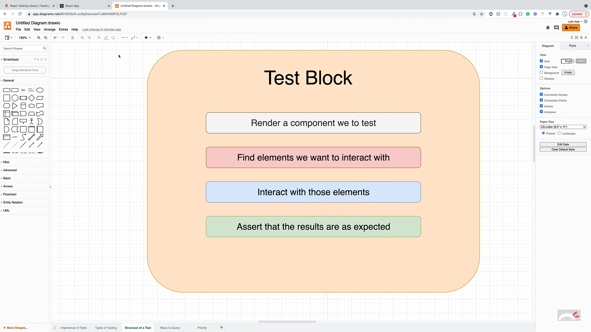
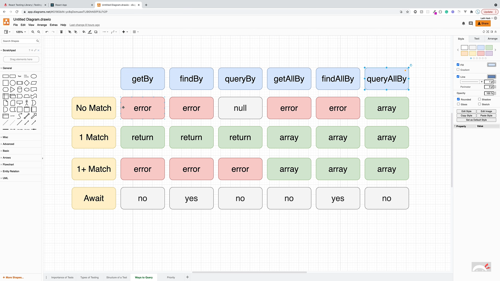
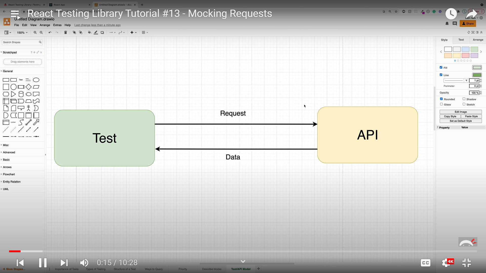
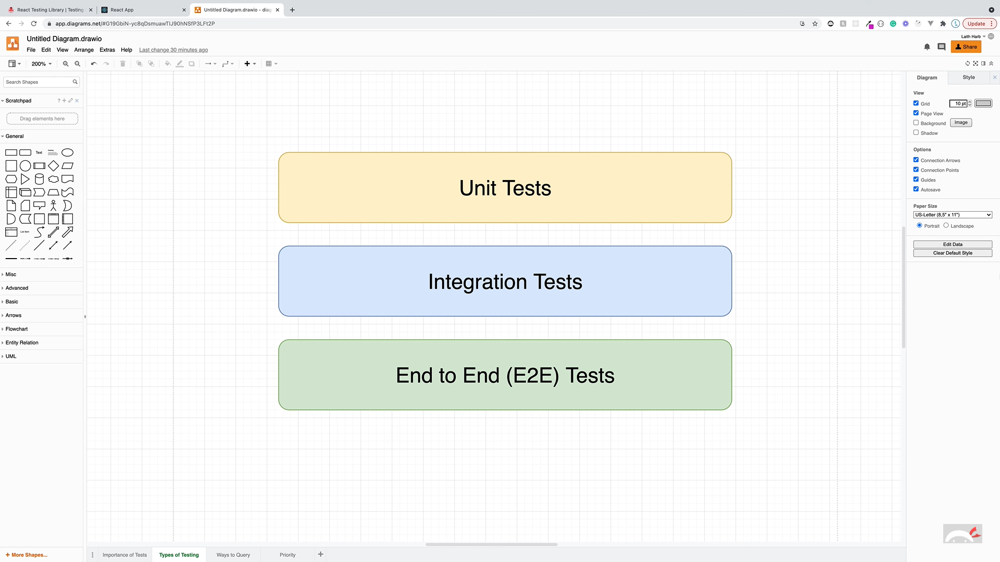

# React Testing Library Practical Interview Notes

This file incorporates `ReactTestingLibrary.docx` and keeps the notes focused on practical tests you can write in interviews and projects.

---

# 1. What RTL Is

React Testing Library is a lightweight way to test React components through rendered output and user-visible behavior.

The mental model:

```text
render component -> find elements like a user -> interact -> assert visible result
```

Avoid testing private state, props, internal function names, or component implementation details.

---

# 2. Test Block Structure

```text
Arrange: render the component with required props/providers
Act: interact with the UI
Assert: check user-visible output
```

Visual recap from `ReactTestingLibrary.docx`:



---

# 3. Query Priority

Prefer queries that match accessibility and user behavior.

| Query | Use |
| ----- | --- |
| `getByRole` | Best default for buttons, links, headings, checkboxes, alerts, dialogs, etc. |
| `getByLabelText` | Best for form inputs with labels. |
| `getByPlaceholderText` | Acceptable when placeholder is the only visible hook, but labels are better. |
| `getByText` | Good for visible text that is not better represented by role/name. |
| `getByTestId` | Last resort for elements users cannot identify semantically. |

Query variants:

| Variant | Missing element | Multiple matches | Async? |
| ------- | --------------- | ---------------- | ------ |
| `getBy*` | throws | throws | no |
| `queryBy*` | returns `null` | throws | no |
| `findBy*` | rejects after timeout | rejects | yes |
| `getAllBy*` | throws | returns array | no |
| `queryAllBy*` | returns `[]` | returns array | no |
| `findAllBy*` | rejects after timeout | resolves array | yes |

Visual recap:



---

# 4. Common Matchers

Use `@testing-library/jest-dom` matchers for readable assertions.

```js
expect(screen.getByRole("button", { name: /submit/i })).toBeEnabled();
expect(screen.getByText(/saved/i)).toBeInTheDocument();
expect(screen.getByLabelText(/email/i)).toHaveValue("a@b.com");
expect(screen.getByRole("link", { name: /home/i })).toHaveAttribute("href", "/");
expect(screen.queryByText(/loading/i)).not.toBeInTheDocument();
```

---

# 5. `userEvent` vs `fireEvent`

| Tool | Practical use |
| ---- | ------------- |
| `userEvent` | Preferred for realistic user behavior such as typing, clicking, tabbing, selecting, and keyboard input. |
| `fireEvent` | Lower-level escape hatch when you need to dispatch one DOM event directly. |

Example:

```jsx
import { render, screen } from "@testing-library/react";
import userEvent from "@testing-library/user-event";

test("submits login details", async () => {
  const onSubmit = vi.fn();
  const user = userEvent.setup();

  render(<LoginForm onSubmit={onSubmit} />);

  await user.type(screen.getByLabelText(/username/i), "john");
  await user.type(screen.getByLabelText(/password/i), "secret");
  await user.click(screen.getByRole("button", { name: /login/i }));

  expect(onSubmit).toHaveBeenCalledWith({
    username: "john",
    password: "secret",
  });
});
```

---

# 6. Async UI Testing

Use `findBy*` when the element appears after an async update.

```jsx
test("shows user after fetch", async () => {
  render(<UsersList />);

  expect(screen.getByText(/loading/i)).toBeInTheDocument();

  expect(await screen.findByText("John Doe")).toBeInTheDocument();
  expect(screen.queryByText(/loading/i)).not.toBeInTheDocument();
});
```

Use `waitFor` when the assertion itself needs to retry:

```jsx
await waitFor(() => {
  expect(saveUser).toHaveBeenCalledTimes(1);
});
```

---

# 7. Mocking Functions and APIs

Mock function props:

```jsx
test("calls click handler", async () => {
  const user = userEvent.setup();
  const handleClick = vi.fn();

  render(<Button onClick={handleClick}>Save</Button>);

  await user.click(screen.getByRole("button", { name: /save/i }));

  expect(handleClick).toHaveBeenCalledTimes(1);
});
```

Mock network at the request boundary. MSW is usually better than replacing `fetch` everywhere because the component still performs a real request from its point of view.

Visual recap from the source doc:



---

# 8. Testing Redux, Context, and Router

Create small test helpers instead of repeating providers in every test.

```jsx
import { Provider } from "react-redux";
import { MemoryRouter } from "react-router-dom";
import { render } from "@testing-library/react";
import { configureStore } from "@reduxjs/toolkit";

function renderWithProviders(
  ui,
  {
    route = "/",
    preloadedState,
    store = configureStore({ reducer: rootReducer, preloadedState }),
  } = {}
) {
  window.history.pushState({}, "Test page", route);

  return {
    store,
    ...render(
      <Provider store={store}>
        <MemoryRouter initialEntries={[route]}>{ui}</MemoryRouter>
      </Provider>
    ),
  };
}
```

Router example:

```jsx
test("renders about route", () => {
  renderWithProviders(<App />, { route: "/about" });
  expect(screen.getByRole("heading", { name: /about/i })).toBeInTheDocument();
});
```

---

# 9. Coverage and Test Types

Coverage should guide missing test areas, not become the goal by itself.

Focus coverage on:

* critical user flows
* validation paths
* empty/error/loading states
* accessibility roles and labels
* branching business rules

Visual recap:



---

# 10. Interview Questions

### What is the difference between `getBy`, `queryBy`, and `findBy`?

`getBy` is for elements that must already exist. `queryBy` is for checking absence. `findBy` is for elements that appear asynchronously.

### Why prefer `userEvent` over `fireEvent`?

`userEvent` simulates higher-level user interactions. For example, typing triggers focus, keyboard, input, and change-related behavior more realistically than firing a single event.

### What is RTL's philosophy compared with Enzyme?

RTL encourages behavior tests from the user's perspective. Enzyme made it easier to inspect component internals, which often led to brittle tests that failed during harmless refactors.

### How do you test accessibility?

Query by role, label, and accessible name. Assert keyboard-visible behavior, focus movement, form labels, button names, alert text, and disabled states.

### What does RTL not cover well?

RTL is mainly for unit and integration-style component tests. Full browser journeys, real layout, cross-browser behavior, and visual regressions are better covered by tools such as Playwright or Cypress.

---

# 11. Best Practices Checklist

* Use `screen` queries.
* Prefer `getByRole` with an accessible `name`.
* Prefer `findBy*` for async UI.
* Assert visible behavior, not private state.
* Keep test data small but realistic.
* Avoid unnecessary snapshots.
* Mock network boundaries, not React internals.
* Test empty, loading, success, and error states.

---

# 12. Source References

* React Testing Library docs: https://testing-library.com/docs/react-testing-library/intro/
* Testing Library queries guide: https://testing-library.com/docs/queries/about/
* user-event docs: https://testing-library.com/docs/user-event/intro/

