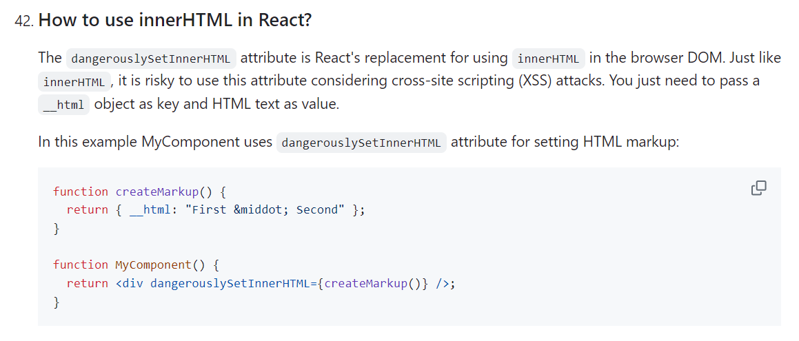

# React Security, Accessibility, and Protected Routes Revision

This file incorporates React security, auth, and accessibility notes from the pasted `JS revision.md`.

---

# 1. Protected Routes

Frontend route protection improves UX, but backend authorization is still required.

```jsx
import { Navigate } from "react-router-dom";

function ProtectedRoute({ children }) {
  const token = localStorage.getItem("token");

  if (!token) {
    return <Navigate to="/login" replace />;
  }

  return children;
}
```

Role-based example:

```jsx
function ProtectedRoute({ children, role }) {
  const user = useAuthUser();

  if (!user) return <Navigate to="/login" replace />;
  if (role && user.role !== role) return <p role="alert">No access</p>;

  return children;
}
```

Important:

```text
Hiding a route in React does not secure the API.
The backend must verify token/session and permissions.
```

---

# 2. JWT Storage

Options:

| Storage | Notes |
| ------- | ----- |
| memory | safer from persistent XSS, lost on refresh |
| localStorage | easy, but exposed to XSS |
| httpOnly cookie | not readable by JS, needs CSRF strategy |

Use project/team security requirements to choose.

Access tokens vs refresh tokens:

| Token | Purpose | Lifetime |
| ----- | ------- | -------- |
| Access token | Sent to APIs to access protected resources | short |
| Refresh token | Used to request a new access token | longer, must be protected carefully |

Sessions keep a user recognized across multiple requests. A session identifier can be stored in a cookie, and the server uses that identifier to find session data. For secure applications, prefer server-validated sessions or tokens with backend authorization checks.

RBAC means Role-Based Access Control. The frontend can hide routes and buttons, but the backend must enforce roles and permissions.

Interview comparison:

| Topic | Practical meaning |
| ----- | ----------------- |
| Session | Server-side record that identifies the logged-in user across requests. |
| Access token | Short-lived credential sent to protected APIs. |
| Refresh token | Longer-lived credential used to request a new access token. |
| Cookie auth | Browser sends cookie automatically; needs CSRF strategy. |
| Bearer token auth | JavaScript sends token in `Authorization`; storage choice affects XSS risk. |

Security rule: frontend auth improves UX, but the API must still verify identity and permission on every protected request.

---

# 3. XSS in React

React escapes normal string rendering.

```jsx
return <div>{userInput}</div>;
```

Dangerous:

```jsx
return <div dangerouslySetInnerHTML={{ __html: userInput }} />;
```

Prevent XSS:

* avoid injecting raw HTML
* sanitize trusted rich text
* validate inputs
* use Content Security Policy where possible
* keep dependencies updated

Visual note:



---

# 4. CSRF

CSRF is mainly a risk when auth uses cookies automatically sent by the browser.

Prevention:

* SameSite cookies
* CSRF tokens
* check origin/referer on server
* avoid unsafe state changes through GET

---

# 5. Accessibility in React

React does not automatically make UI accessible.

Checklist:

* use semantic HTML
* labels for inputs
* real buttons for actions
* real links for navigation
* visible focus styles
* keyboard navigation
* meaningful error messages
* `aria-live` for dynamic status when needed
* manage focus in modals/routes

Example:

```jsx
function LoginForm({ error }) {
  return (
    <form>
      <label htmlFor="email">Email</label>
      <input id="email" name="email" type="email" />

      {error && <p role="alert">{error}</p>}

      <button type="submit">Login</button>
    </form>
  );
}
```
