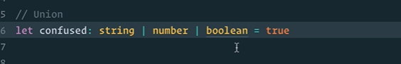
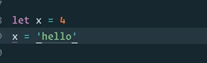
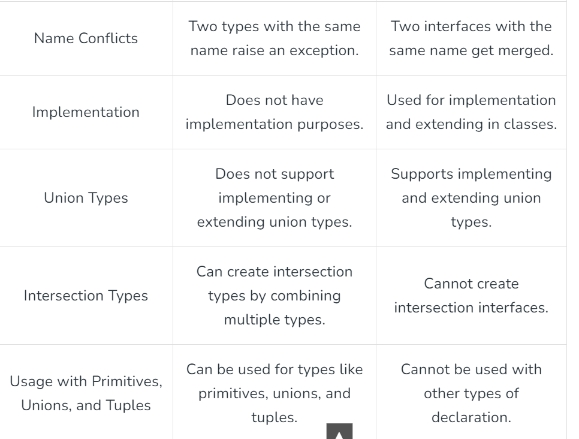
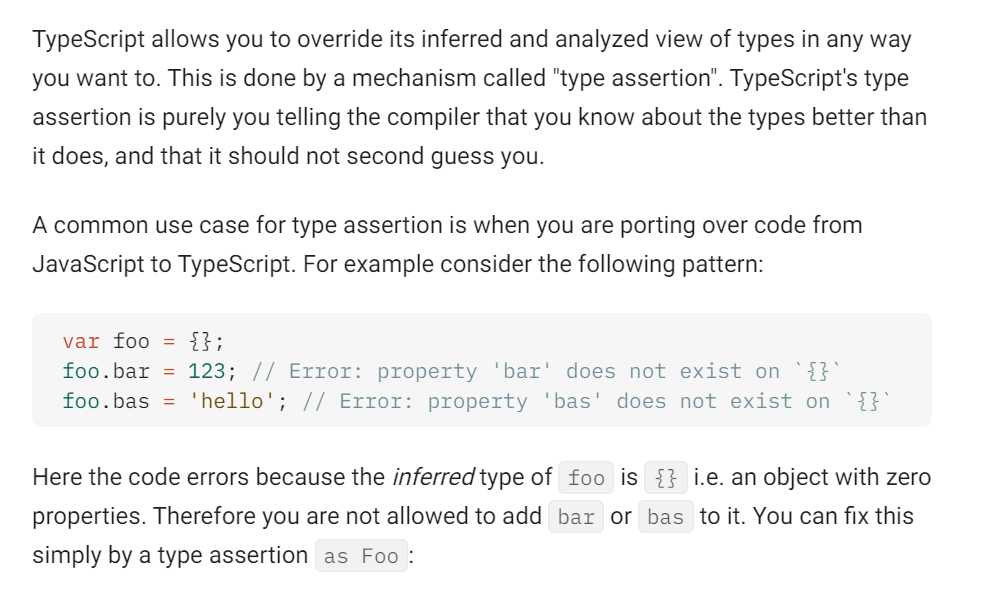

# TypeScript Fundamentals

This note incorporates unique practical points from `typeScript.docx`.

---

# 1. What TypeScript Is

TypeScript is JavaScript plus static typing. It checks code before runtime and then compiles to plain JavaScript.

Use TypeScript to:

* catch many bugs during development
* document function and component contracts
* improve autocomplete and refactoring
* make large frontend codebases easier to maintain

TypeScript does not replace runtime validation. API data, form data, and user input still need runtime checks.

---

# 2. Setup

Prefer local project installs for real projects:

```bash
npm install -D typescript
npx tsc --init
npx tsc --version
```

Compile a file:

```bash
npx tsc index.ts
```

Old notes may show global installation:

```bash
npm install -g typescript
```

Global installs are fine for quick practice, but local dev dependencies make team and CI versions predictable.

---

# 3. Basic Types

```ts
let isActive: boolean = true;
let count: number = 1;
let title: string = "Frontend";
let skills: string[] = ["HTML", "CSS", "React"];
let moreSkills: Array<string> = ["TypeScript"];
let user: object = { name: "Mani" };
let empty: null = null;
let missing: undefined = undefined;
```

Tuple:

```ts
let basket: [string, number];
basket = ["basketball", 10];
```

Tuple is useful when position matters and the list length is fixed.

---

# 4. `any` vs `unknown`

`any` disables type checking. Use it only as a temporary migration placeholder.

```ts
let unsafe: any = "hello";
unsafe.toFixed(); // TypeScript allows it, runtime may fail.
```

`unknown` forces narrowing before use.

```ts
let value: unknown = "hello";

if (typeof value === "string") {
  console.log(value.toUpperCase());
}
```

Interview line: `unknown` is the safer alternative to `any` because it keeps TypeScript involved.

---

# 5. `void` vs `never`

`void` means the function does not return a useful value.

```ts
function logMessage(message: string): void {
  console.log(message);
}
```

`never` means the function never returns normally.

```ts
function throwError(message: string): never {
  throw new Error(message);
}
```

Use `never` for functions that always throw, infinite loops, and exhaustive checks.

---

# 6. Interfaces and Types

Interface:

```ts
interface RobotArmy {
  count: number;
  type: string;
  magic?: string;
}
```

Type alias:

```ts
type RobotArmyType = {
  count: number;
  type: string;
  magic?: string;
};
```

Practical rule:

* use `interface` for public object contracts, especially libraries and declaration merging
* use `type` freely in application code, especially unions, intersections, tuples, and React props

| Feature | `interface` | `type` |
| ------- | ----------- | ------ |
| Object shape | Yes | Yes |
| Declaration merging | Yes | No |
| Union types | No | Yes |
| Tuple aliases | No | Yes |
| Class `implements` | Good fit | Works for object-shaped aliases |

---

# 7. Functions

```ts
function add(a: number, b: number): number {
  return a + b;
}

const multiply = (a: number, b: number): number => {
  return a * b;
};

async function fetchName(): Promise<string> {
  return "Mani";
}
```

Type return values when they clarify intent or protect public APIs. TypeScript can infer many local return types.

---

# 8. Union, Intersection, and Narrowing

Union:

```ts
let result: number | string;
result = 42;
result = "done";
```

Intersection:

```ts
type Employee = { name: string };
type Manager = { department: string };
type TechLead = Employee & Manager;
```

Narrowing:

```ts
function printId(id: string | number) {
  if (typeof id === "string") {
    console.log(id.toUpperCase());
  } else {
    console.log(id.toFixed(2));
  }
}
```

---

# 9. Enums and Literal Unions

Enum:

```ts
enum Direction {
  Up = "UP",
  Down = "DOWN",
  Left = "LEFT",
  Right = "RIGHT",
}

let move: Direction = Direction.Up;
```

Literal union alternative:

```ts
type DirectionValue = "UP" | "DOWN" | "LEFT" | "RIGHT";
```

Enums group related constants with meaningful names. Literal unions are often lighter for frontend props and statuses.

---

# Visual Notes from `typeScript.docx`








