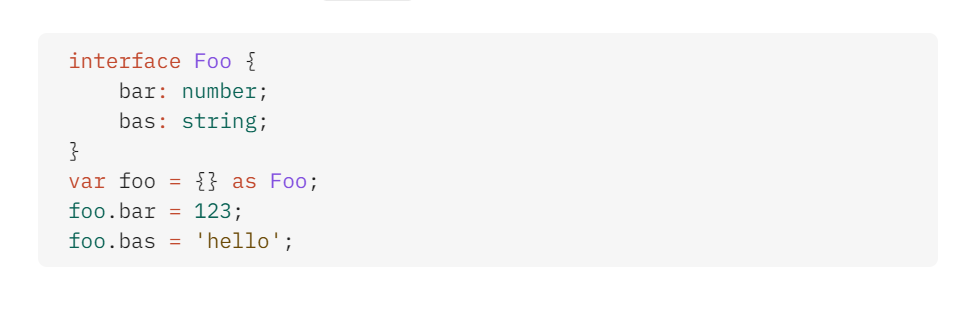
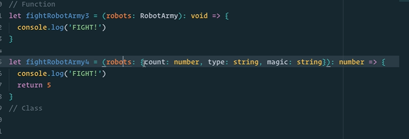
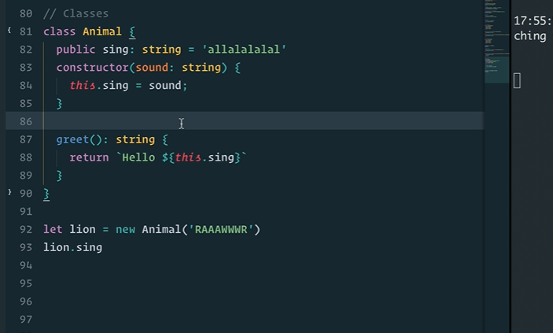
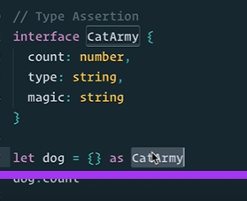
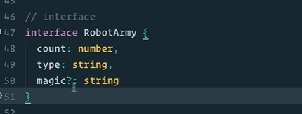

# TypeScript Advanced Types, Utility Types, and OOP

This note incorporates unique practical points from `typeScript.docx`.

---

# 1. Generics

Generics let code work with many types while preserving type safety.

```ts
function identity<T>(value: T): T {
  return value;
}

identity<number>(10);
identity<string>("hello");
identity(true); // TypeScript infers boolean
```

Common generic letters:

| Letter | Common meaning |
| ------ | -------------- |
| `T` | Type |
| `U` | Another type |
| `K` | Key |
| `V` | Value |

---

# 2. Generic Arrow Functions

```ts
const identity = <T,>(value: T): T => {
  return value;
};
```

The comma in `<T,>` is commonly used in `.tsx` files so TypeScript does not confuse the generic with JSX.

Multiple generics:

```ts
const pair = <T, U>(a: T, b: U): [T, U] => {
  return [a, b];
};
```

Generic constraint:

```ts
const getLength = <T extends { length: number }>(item: T): number => {
  return item.length;
};

getLength("Hello");
getLength([1, 2, 3]);
// getLength(123); // Error: number has no length
```

---

# 3. Generic Interfaces and API Responses

```ts
interface ApiResponse<T> {
  data: T;
  error?: string;
}

type User = {
  id: number;
  name: string;
};

const response: ApiResponse<User[]> = {
  data: [{ id: 1, name: "Asha" }],
};
```

Use this pattern for reusable API state, table rows, select options, and form values.

---

# 4. Utility Types

```ts
interface User {
  id: number;
  name: string;
  email: string;
  passwordHash: string;
}

type PartialUser = Partial<User>;
type ReadonlyUser = Readonly<User>;
type UserPreview = Pick<User, "id" | "name">;
type PublicUser = Omit<User, "passwordHash">;
```

`Omit` vs `Exclude`:

| Utility | Works on | Meaning |
| ------- | -------- | ------- |
| `Omit<Type, Keys>` | object properties | remove keys from object shape |
| `Exclude<Union, Members>` | union members | remove members from a union |

```ts
type Status = "pending" | "success" | "failed" | "cancelled";
type ActiveStatus = Exclude<Status, "failed" | "cancelled">;
```

---

# 5. `keyof`, `typeof`, and Type Assertions

```ts
type User = { id: number; name: string };
type UserKey = keyof User; // "id" | "name"

const config = { apiBaseUrl: "/api", retryCount: 3 };
type Config = typeof config;
```

Type assertion:

```ts
let input: unknown = "Hello TS";
let length = (input as string).length;
```

Use assertions only when you know more than TypeScript can infer. Prefer narrowing when possible.

---

# 6. Classes, Access Modifiers, and Inheritance

```ts
class Person {
  constructor(public name: string, private age: number) {}

  greet() {
    return `Hello, ${this.name}`;
  }
}
```

Access modifiers:

| Modifier | Meaning |
| -------- | ------- |
| `public` | accessible everywhere; default |
| `private` | accessible only inside the class |
| `protected` | accessible inside the class and subclasses |
| `readonly` | cannot be reassigned after initialization |

Inheritance:

```ts
class Animal {
  constructor(public name: string) {}

  move() {
    console.log(`${this.name} is moving`);
  }
}

class Dog extends Animal {
  bark() {
    console.log(`${this.name} barks`);
  }
}
```

Abstract class:

```ts
abstract class Shape {
  abstract area(): number;
}

class Circle extends Shape {
  constructor(public radius: number) {
    super();
  }

  area() {
    return Math.PI * this.radius * this.radius;
  }
}
```

Interface vs abstract class:

* interface describes shape only
* abstract class can provide partial implementation

---

# 7. Modules, Ambient Declarations, and Decorators

Module:

```ts
// math.ts
export function add(a: number, b: number) {
  return a + b;
}

// app.ts
import { add } from "./math";
```

Ambient declaration:

```ts
declare module "legacy-library";
```

Decorators are advanced/experimental depending on compiler settings and are common in Angular/NestJS style code.

```ts
function Log(target: unknown, propertyKey: string) {
  console.log(`Property decorated: ${propertyKey}`);
}
```

---

# Visual Notes from `typeScript.docx`










