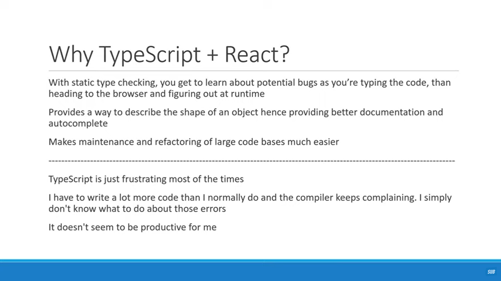
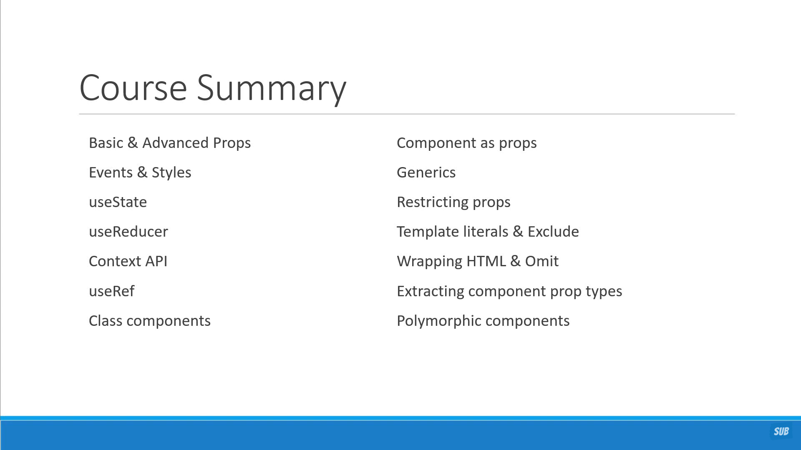
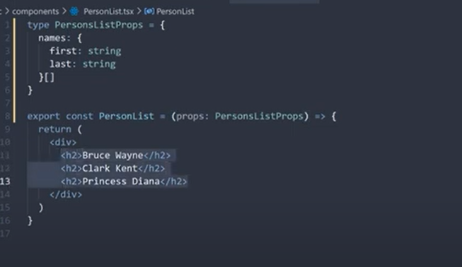
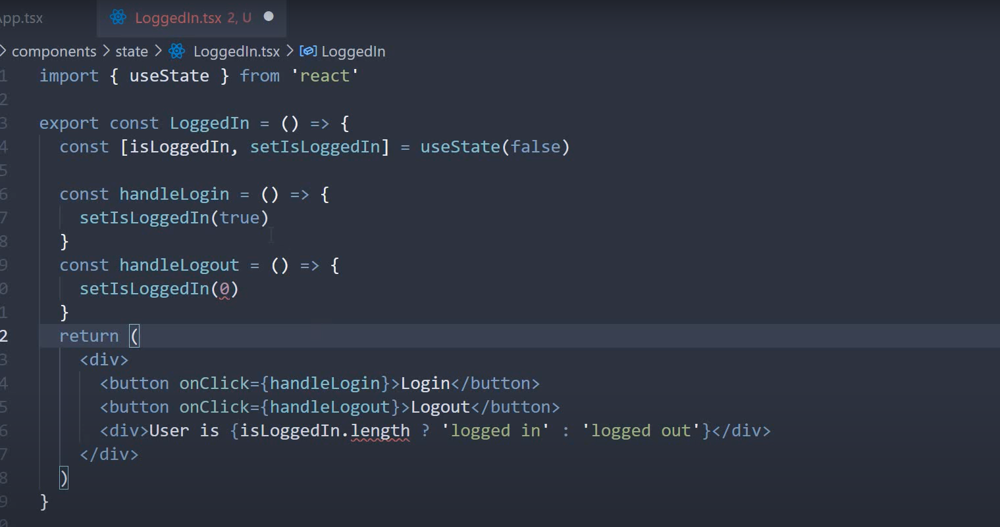
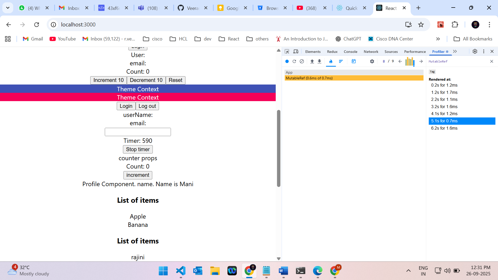
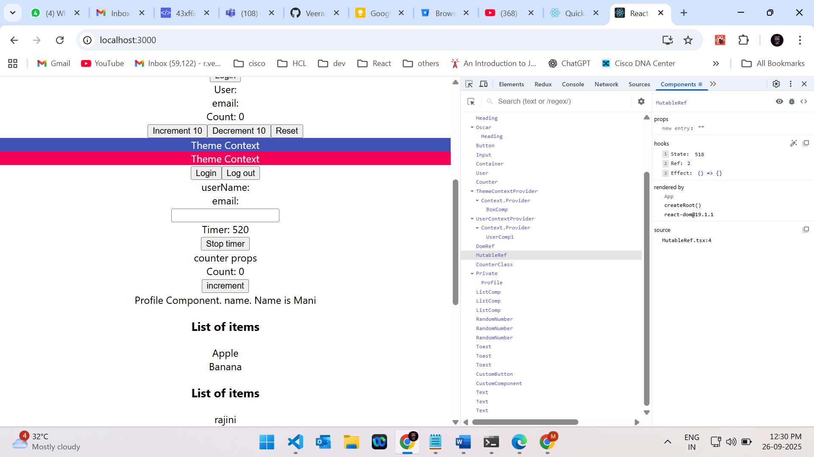

# React with TypeScript

This note incorporates unique practical points from `react with typescript - codeevolution.docx` and the React integration section of `typeScript.docx`.

---

# 1. Setup

Modern Vite setup:

```bash
npm create vite@latest my-app -- --template react-ts
cd my-app
npm install
npm run dev
```

Older Create React App setup:

```bash
npx create-react-app react-typescript-demo --template typescript
```

Use CRA knowledge for legacy projects. Prefer Vite/framework setups for new practice.

---

# 2. Props

```tsx
type GreetProps = {
  name: string;
  messageCount?: number;
};

function Greet({ name, messageCount = 0 }: GreetProps) {
  return (
    <div>
      {name} has {messageCount} messages
    </div>
  );
}
```

Array of objects:

```tsx
type PersonListProps = {
  persons: {
    id: number;
    name: string;
  }[];
};

function PersonList({ persons }: PersonListProps) {
  return (
    <div>
      {persons.map((person) => (
        <div key={person.id}>{person.name}</div>
      ))}
    </div>
  );
}
```

---

# 3. Children

String-only children:

```tsx
type HeadingProps = {
  children: string;
};

function Heading({ children }: HeadingProps) {
  return <h1>{children}</h1>;
}
```

Any renderable React child:

```tsx
type CardProps = {
  children: React.ReactNode;
};

function Card({ children }: CardProps) {
  return <section>{children}</section>;
}
```

---

# 4. Events and Styles

Button click:

```tsx
type ButtonProps = {
  handleClick: (event: React.MouseEvent<HTMLButtonElement>, id: number) => void;
};

function Button({ handleClick }: ButtonProps) {
  return <button onClick={(event) => handleClick(event, 1)}>Click</button>;
}
```

Input change:

```tsx
type InputProps = {
  value: string;
  handleChange: (event: React.ChangeEvent<HTMLInputElement>) => void;
};

function Input({ value, handleChange }: InputProps) {
  return <input value={value} onChange={handleChange} />;
}
```

Inline styles:

```tsx
type ContainerProps = {
  styles: React.CSSProperties;
};

function Container({ styles }: ContainerProps) {
  return <div style={styles} />;
}
```

---

# 5. `useState`

Let TypeScript infer simple state:

```tsx
const [count, setCount] = React.useState(0);
```

Add explicit type when state starts as `null` or an empty collection:

```tsx
type User = {
  name: string;
  email: string;
};

function UserPanel() {
  const [user, setUser] = React.useState<User | null>(null);

  return <div>User: {user?.name ?? "Guest"}</div>;
}
```

Avoid assertion as a habit:

```tsx
const [user, setUser] = React.useState<User>({} as User);
```

Use assertions only when you are sure the value will be initialized before it is read. `User | null` is usually safer.

---

# 6. `useReducer`

```tsx
type State = {
  count: number;
};

type CounterAction =
  | { type: "increment"; payload: number }
  | { type: "decrement"; payload: number }
  | { type: "reset" };

const initialState: State = { count: 0 };

function reducer(state: State, action: CounterAction): State {
  switch (action.type) {
    case "increment":
      return { count: state.count + action.payload };
    case "decrement":
      return { count: state.count - action.payload };
    case "reset":
      return initialState;
    default:
      return state;
  }
}
```

Discriminated unions make reducer actions safe and readable.

---

# 7. Context

Context with a fixed value:

```tsx
const theme = {
  primary: { text: "#fff", main: "#3f51b5" },
  secondary: { text: "#fff", main: "#f50057" },
};

const ThemeContext = React.createContext(theme);
```

Context with future/nullable value:

```tsx
type User = {
  name: string;
  email: string;
};

type UserContextType = {
  user: User | null;
  setUser: React.Dispatch<React.SetStateAction<User | null>>;
};

const UserContext = React.createContext<UserContextType | null>(null);
```

Consumer:

```tsx
function UserProfile() {
  const userContext = React.useContext(UserContext);

  if (!userContext) {
    throw new Error("UserProfile must be used inside UserContext.Provider");
  }

  return <div>{userContext.user?.name}</div>;
}
```

You may see `createContext({} as UserContextType)` in examples. It avoids null checks but can hide provider mistakes. Prefer a runtime guard for shared app contexts.

---

# 8. Refs

DOM ref:

```tsx
function DomRef() {
  const inputRef = React.useRef<HTMLInputElement>(null);

  React.useEffect(() => {
    inputRef.current?.focus();
  }, []);

  return <input ref={inputRef} type="text" />;
}
```

Mutable timer ref:

```tsx
function Timer() {
  const [timer, setTimer] = React.useState(0);
  const timerRef = React.useRef<number | null>(null);

  function stopTimer() {
    if (timerRef.current !== null) {
      window.clearInterval(timerRef.current);
    }
  }

  React.useEffect(() => {
    timerRef.current = window.setInterval(() => {
      setTimer((value) => value + 1);
    }, 1000);

    return stopTimer;
  }, []);

  return <button onClick={stopTimer}>Stop: {timer}</button>;
}
```

---

# 9. Class Components

```tsx
type CounterProps = {
  message: string;
};

type CounterState = {
  count: number;
};

class CounterClass extends React.Component<CounterProps, CounterState> {
  state: CounterState = {
    count: 0,
  };

  render() {
    return (
      <div>
        <div>{this.props.message}</div>
        <div>Count: {this.state.count}</div>
        <button onClick={() => this.setState((prev) => ({ count: prev.count + 1 }))}>
          Increment
        </button>
      </div>
    );
  }
}
```

If a class component has no props, use `{}`. If it has no state, omit the second generic.

---

# 10. Component Props and Component Types

Pass a component as a prop:

```tsx
type ProfileProps = {
  name: string;
};

type PrivateProps = {
  isLoggedIn: boolean;
  component: React.ComponentType<ProfileProps>;
};

function Private({ isLoggedIn, component: Component }: PrivateProps) {
  return isLoggedIn ? <Component name="Mani" /> : <Login />;
}
```

Extract another component's props:

```tsx
function CustomComponent(props: React.ComponentProps<typeof Greet>) {
  return (
    <div>
      {props.name} {props.messageCount}
    </div>
  );
}
```

---

# 11. Generic Components

```tsx
type ListProps<T> = {
  items: T[];
  onClick: (value: T) => void;
  renderItem: (value: T) => React.ReactNode;
};

function List<T>({ items, onClick, renderItem }: ListProps<T>) {
  return (
    <ul>
      {items.map((item, index) => (
        <li key={index} onClick={() => onClick(item)}>
          {renderItem(item)}
        </li>
      ))}
    </ul>
  );
}
```

Use generics when the component should work with many item shapes while preserving exact item type.

---

# 12. Wrapping Native HTML Elements

```tsx
type CustomButtonProps = {
  variant: "primary" | "secondary";
  children: string;
} & Omit<React.ComponentProps<"button">, "children">;

function CustomButton({ variant, children, ...rest }: CustomButtonProps) {
  return (
    <button className={`button-${variant}`} {...rest}>
      {children}
    </button>
  );
}
```

Why `Omit`?

`React.ComponentProps<"button">` already includes `children?: React.ReactNode`. `Omit<..., "children">` removes the native children type so your stricter `children: string` type can win.

---

# 13. Polymorphic Components

```tsx
type TextOwnProps<E extends React.ElementType> = {
  size?: "sm" | "md" | "lg";
  color?: "primary" | "secondary";
  children: React.ReactNode;
  as?: E;
};

type TextProps<E extends React.ElementType> =
  TextOwnProps<E> &
  Omit<React.ComponentProps<E>, keyof TextOwnProps<E>>;

function Text<E extends React.ElementType = "div">({
  size = "md",
  color = "primary",
  children,
  as,
  ...rest
}: TextProps<E>) {
  const Component = as || "div";

  return (
    <Component className={`text-${size}-${color}`} {...rest}>
      {children}
    </Component>
  );
}
```

Usage:

```tsx
<Text as="h1" size="lg">Heading</Text>
<Text as="p" size="sm">Paragraph</Text>
<Text as="label" htmlFor="email" color="secondary">Email</Text>
<Text as="a" href="/home">Home</Text>
```

This pattern preserves native props of the chosen element while letting your custom props win.

---

# 14. Template Literal Types

```ts
type Horizontal = "left" | "center" | "right";
type Vertical = "top" | "center" | "bottom";

type ToastPosition =
  | Exclude<`${Horizontal}-${Vertical}`, "center-center">
  | "center";

type ToastProps = {
  position: ToastPosition;
};
```

Template literal types are useful for constrained design-system props.

---

# 15. React DevTools

React DevTools has two important tabs:

* Components: inspect props, state, hooks, owners, and component tree
* Profiler: measure render time and identify unnecessary renders

---

# Visual Notes from `react with typescript - codeevolution.docx`












