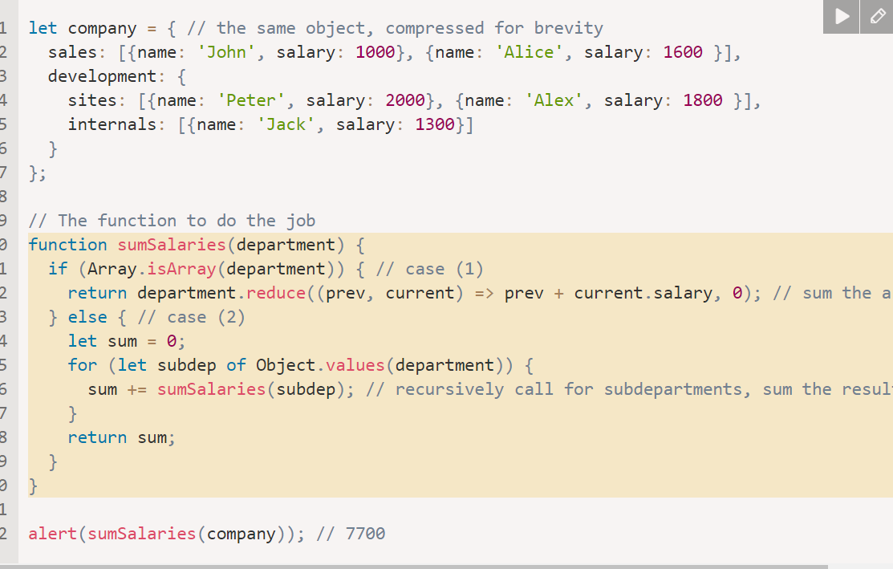
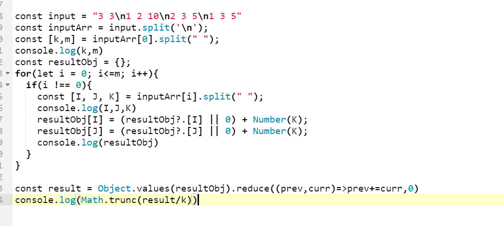

# JavaScript Coding Programs

This note incorporates unique practice problems from `programs.docx`.

Use these as machine-coding and interview drills. For each problem, first explain the approach, then write clean code, then test edge cases.

---

# 1. Deep Flatten Object

Problem: convert nested objects into dot notation.

```js
const input = {
  user: {
    name: "Veera",
    address: {
      city: "Mumbai",
    },
  },
};

// Expected:
// { "user.name": "Veera", "user.address.city": "Mumbai" }
```

Solution:

```js
function flattenObject(obj, parent = "", result = {}) {
  for (const key in obj) {
    if (!Object.prototype.hasOwnProperty.call(obj, key)) continue;

    const value = obj[key];
    const newKey = parent ? `${parent}.${key}` : key;

    if (value !== null && typeof value === "object" && !Array.isArray(value)) {
      flattenObject(value, newKey, result);
    } else {
      result[newKey] = value;
    }
  }

  return result;
}
```

Test:

```js
console.log(
  flattenObject({
    user: { name: "Veera", address: { city: "Mumbai" } },
    family: { brother: "Harish", child: { child1: "child1" } },
  })
);
```

---

# 2. Top K Frequent Elements

Problem: find the `k` most frequent values.

```js
const nums = [1, 1, 1, 2, 2, 3, 3, 3, 3, 4];
const k = 3;
```

Solution:

```js
function topKFrequent(nums, k) {
  const frequency = new Map();

  for (const num of nums) {
    frequency.set(num, (frequency.get(num) ?? 0) + 1);
  }

  return [...frequency.entries()]
    .sort((a, b) => b[1] - a[1])
    .slice(0, k)
    .map(([value, count]) => ({ value, count }));
}

console.log(topKFrequent(nums, k));
```

Interview note: for large inputs, discuss bucket sort or a heap.

---

# 3. Smallest Subarray Containing K Consecutive Values

Problem: given `arr` and `k`, return the smallest subarray that contains `k` consecutive numeric values, not necessarily in order.

```js
smallestSubarrayWithKConsecutive([2, 3, 1, 4], 2); // [2, 3]
smallestSubarrayWithKConsecutive([6, 5, 3, 2, 7, 1, 4], 6); // whole array
```

Simple brute-force solution:

```js
function hasKConsecutiveValues(values, k) {
  const set = new Set(values);

  for (const value of set) {
    let isStart = !set.has(value - 1);
    if (!isStart) continue;

    let length = 1;
    let current = value;

    while (set.has(current + 1)) {
      current += 1;
      length += 1;
      if (length >= k) return true;
    }
  }

  return false;
}

function smallestSubarrayWithKConsecutive(arr, k) {
  for (let length = k; length <= arr.length; length += 1) {
    for (let start = 0; start + length <= arr.length; start += 1) {
      const subarray = arr.slice(start, start + length);
      if (hasKConsecutiveValues(subarray, k)) {
        return subarray;
      }
    }
  }

  return -1;
}
```

Interview note: start with brute force if unclear, then discuss optimizing with sliding windows/maps only after confirming the exact definition.

---

# 4. String Rotation

Rotate a string left by `n` positions.

```js
function rotateLeft(str, count) {
  if (str.length === 0) return str;

  const steps = count % str.length;
  return str.slice(steps) + str.slice(0, steps);
}

console.log(rotateLeft("english", 10));
```

---

# 5. Binary and Decimal Conversion

```js
const binary = "1010";
const decimal = 10;

console.log(parseInt(binary, 2)); // 10
console.log(decimal.toString(2)); // "1010"
```

For very large binary strings:

```js
const bigDecimal = BigInt("0b" + binary);
```

---

# 6. Fibonacci Series

```js
function fibonacciSeries(n) {
  if (n <= 0) return [];
  if (n === 1) return [0];

  const series = [0, 1];

  for (let i = 2; i < n; i += 1) {
    series.push(series[i - 1] + series[i - 2]);
  }

  return series;
}

console.log(fibonacciSeries(7)); // [0, 1, 1, 2, 3, 5, 8]
```

---

# 7. Factorial

```js
function factorial(n) {
  if (n < 0) {
    throw new Error("Factorial is not defined for negative numbers");
  }

  let result = 1;

  while (n > 0) {
    result *= n;
    n -= 1;
  }

  return result;
}

console.log(factorial(5)); // 120
console.log(factorial(0)); // 1
```

---

# 8. Palindrome

Number palindrome:

```js
function isNumberPalindrome(x) {
  if (x < 0) return false;

  let original = x;
  let reversed = 0;

  while (x > 0) {
    const digit = x % 10;
    reversed = reversed * 10 + digit;
    x = Math.floor(x / 10);
  }

  return reversed === original;
}
```

String palindrome:

```js
function isStringPalindrome(str) {
  let left = 0;
  let right = str.length - 1;

  while (left < right) {
    if (str[left] !== str[right]) return false;
    left += 1;
    right -= 1;
  }

  return true;
}
```

---

# 9. Concurrency-Controlled Promise Pool

Problem: execute at most `limit` async tasks at a time and preserve result order.

```js
async function promisePool(functions, limit) {
  let index = 0;
  const results = [];

  async function worker() {
    while (index < functions.length) {
      const currentIndex = index;
      index += 1;

      results[currentIndex] = await functions[currentIndex]();
    }
  }

  await Promise.all(Array.from({ length: limit }, worker));
  return results;
}
```

Test:

```js
const sleep = (time) => new Promise((resolve) => setTimeout(resolve, time));

const functions = [
  () => sleep(500).then(() => "Task1"),
  () => sleep(300).then(() => "Task2"),
  () => sleep(200).then(() => "Task3"),
  () => sleep(400).then(() => "Task4"),
];

promisePool(functions, 2).then(console.log);
```

Mental model:

```text
fixed number of workers + shared task index + ordered result array
```

Real-world use: rate-limited API calls, batch uploads, image processing, and background jobs.

---

# 10. Keyboard Row Press Count

Problem: given rows of keyboard letters, count how many characters of a word are typed from each row.

```js
const rows = {
  1: "qwertyuiop",
  2: "asdfghjkl",
  3: "zxcvbnm",
};

function keyboardRowCount(word) {
  const charToRow = new Map();

  for (const [row, letters] of Object.entries(rows)) {
    for (const letter of letters) {
      charToRow.set(letter, row);
    }
  }

  const count = { 1: 0, 2: 0, 3: 0 };

  for (const char of word.toLowerCase()) {
    const row = charToRow.get(char);
    if (row) count[row] += 1;
  }

  return count;
}

console.log(keyboardRowCount("typing")); // { 1: 4, 2: 1, 3: 1 }
```

---

# 11. Sum Salaries Recursively

Problem: find total salary across nested departments.

```js
const company = {
  sales: [
    { name: "John", salary: 1000 },
    { name: "Alice", salary: 1600 },
  ],
  development: {
    sites: [
      { name: "Peter", salary: 2000 },
      { name: "Alex", salary: 1800 },
    ],
    internals: [{ name: "Jack", salary: 1300 }],
  },
};

function sumSalaries(department) {
  if (Array.isArray(department)) {
    return department.reduce((total, employee) => total + employee.salary, 0);
  }

  let sum = 0;

  for (const subDepartment of Object.values(department)) {
    sum += sumSalaries(subDepartment);
  }

  return sum;
}

console.log(sumSalaries(company)); // 7700
```

Visual note from `programs.docx`:



---

# 12. Range Update Average

Problem: `N` boxes, `M` operations. Each operation adds `K` balls to boxes from `I` to `J`. Return the floor average number of balls after all operations.

Example:

```text
N = 3, M = 2
1 2 10
2 3 5

boxes = [10, 15, 5]
average = 10
```

Straightforward solution:

```js
function averageBalls(n, operations) {
  const boxes = Array(n).fill(0);

  for (const [i, j, k] of operations) {
    for (let box = i - 1; box <= j - 1; box += 1) {
      boxes[box] += k;
    }
  }

  const total = boxes.reduce((sum, value) => sum + value, 0);
  return Math.floor(total / n);
}

console.log(averageBalls(3, [[1, 2, 10], [2, 3, 5]])); // 10
```

Optimized difference-array solution:

```js
function averageBallsOptimized(n, operations) {
  const diff = Array(n + 1).fill(0);

  for (const [i, j, k] of operations) {
    diff[i - 1] += k;
    diff[j] -= k;
  }

  let running = 0;
  let total = 0;

  for (let i = 0; i < n; i += 1) {
    running += diff[i];
    total += running;
  }

  return Math.floor(total / n);
}
```

Visual note from `programs.docx`:



---

# 13. Maximum Removable Letters

Problem: repeatedly remove adjacent characters when `str[i] !== str[i + 1]`. Return the maximum number of removed letters.

Stack solution:

```js
function maxRemovableLetters(str) {
  const stack = [];

  for (const char of str) {
    if (stack.length > 0 && stack[stack.length - 1] !== char) {
      stack.pop();
    } else {
      stack.push(char);
    }
  }

  return str.length - stack.length;
}

console.log(maxRemovableLetters("aabc")); // 4
console.log(maxRemovableLetters("abcdefg")); // 4
```

Why this works: when two adjacent different letters can cancel, the stack keeps the current unresolved sequence.

---

# 14. Flatten Nested Object with Dot Keys

Source interview: HCL/Cisco notes from `questions (2).docx`.

Problem:

```js
const obj = {
  a: {
    b: 1,
    c: 2,
  },
  d: 3,
};

// output:
// { "a.b": 1, "a.c": 2, d: 3 }
```

Clean recursive solution:

```js
function flattenObject(input, parentKey = "", result = {}) {
  for (const [key, value] of Object.entries(input)) {
    const nextKey = parentKey ? `${parentKey}.${key}` : key;

    if (
      value !== null &&
      typeof value === "object" &&
      !Array.isArray(value)
    ) {
      flattenObject(value, nextKey, result);
    } else {
      result[nextKey] = value;
    }
  }

  return result;
}

const obj2 = {
  level1: {
    level2: {
      level3: {
        level4: {
          value: 100,
          text: "hello",
        },
      },
      other: true,
    },
  },
};

console.log(flattenObject(obj2));
```

Output:

```js
{
  "level1.level2.level3.level4.value": 100,
  "level1.level2.level3.level4.text": "hello",
  "level1.level2.other": true
}
```

Interview edge cases:

* `null` is an object in JavaScript, so guard it.
* Decide whether arrays should remain arrays or flatten by index.
* Use a result object parameter to avoid repeated object spreading in deep recursion.

---

# 15. Container With Most Water

Source interview: `Hcl interview prep1. .docx`.

Problem: given an array of line heights, choose two lines that can hold the maximum water area.

Brute force idea:

```text
try every pair
area = distance between indexes * smaller height
track max
```

Optimized two-pointer solution:

```js
function maxArea(height) {
  let left = 0;
  let right = height.length - 1;
  let best = 0;

  while (left < right) {
    const width = right - left;
    const currentHeight = Math.min(height[left], height[right]);
    best = Math.max(best, width * currentHeight);

    if (height[left] < height[right]) {
      left += 1;
    } else {
      right -= 1;
    }
  }

  return best;
}

console.log(maxArea([1, 8, 6, 2, 5, 4, 8, 3, 7])); // 49
```

Why move the smaller pointer?

```text
Area is limited by the smaller height.
Moving the taller pointer cannot improve the limiting height, and width only gets smaller.
Move the smaller side and look for a taller boundary.
```

Complexity: `O(n)` time, `O(1)` space.

---

# 16. Roman to Integer

Source interview: `Hcl interview prep1. .docx`.

Rule:

* if current value is smaller than next value, subtract it
* otherwise add it

```js
function romanToInt(s) {
  const values = {
    I: 1,
    V: 5,
    X: 10,
    L: 50,
    C: 100,
    D: 500,
    M: 1000,
  };

  let total = 0;

  for (let i = 0; i < s.length; i += 1) {
    const current = values[s[i]];
    const next = values[s[i + 1]];

    if (next && current < next) {
      total -= current;
    } else {
      total += current;
    }
  }

  return total;
}

console.log(romanToInt("III")); // 3
console.log(romanToInt("IV")); // 4
console.log(romanToInt("MCMXCIV")); // 1994
```

Complexity: `O(n)` time, `O(1)` space.

---

# 17. Own `Array.prototype.map`

Source interview: Nagarro notes from `questions (2).docx`.

```js
Array.prototype.myMap = function myMap(callback, thisArg) {
  if (this == null) {
    throw new TypeError("Array.prototype.myMap called on null or undefined");
  }

  if (typeof callback !== "function") {
    throw new TypeError("callback must be a function");
  }

  const array = Object(this);
  const result = [];

  for (let index = 0; index < array.length; index += 1) {
    if (Object.prototype.hasOwnProperty.call(array, index)) {
      result[index] = callback.call(thisArg, array[index], index, array);
    }
  }

  return result;
};

console.log([1, 2, 3].myMap((number) => number * 2)); // [2, 4, 6]
```

Interview notes:

* preserve indexes for sparse arrays
* call callback with `value`, `index`, and original array
* support optional `thisArg`
* throw when callback is not a function

---

# 18. Valid Parentheses

Source interview: Nagarro notes from `questions (2).docx`.

```js
function isValidParentheses(input) {
  const pairs = {
    ")": "(",
    "}": "{",
    "]": "[",
  };

  const stack = [];

  for (const char of input) {
    if (char === "(" || char === "{" || char === "[") {
      stack.push(char);
      continue;
    }

    if (pairs[char]) {
      if (stack.pop() !== pairs[char]) return false;
    }
  }

  return stack.length === 0;
}

console.log(isValidParentheses("()[]{}")); // true
console.log(isValidParentheses("(]")); // false
console.log(isValidParentheses("([{}])")); // true
```

Mental model:

```text
opening bracket -> push
closing bracket -> must match latest opening bracket
end -> stack must be empty
```

---

# 19. Unique and Single-Occurrence Elements

Source interview: Tecnotree notes from `questions (2).docx`.

```js
function uniqueValues(array) {
  return [...new Set(array)];
}

function singleOccurrenceValues(array) {
  const frequency = new Map();

  for (const item of array) {
    frequency.set(item, (frequency.get(item) || 0) + 1);
  }

  return array.filter((item) => frequency.get(item) === 1);
}

console.log(uniqueValues([1, 2, 2, 3, 4, 4])); // [1, 2, 3, 4]
console.log(singleOccurrenceValues([1, 2, 2, 3, 4, 4])); // [1, 3]
```

Use `Set` for uniqueness. Use `Map` when count matters.
