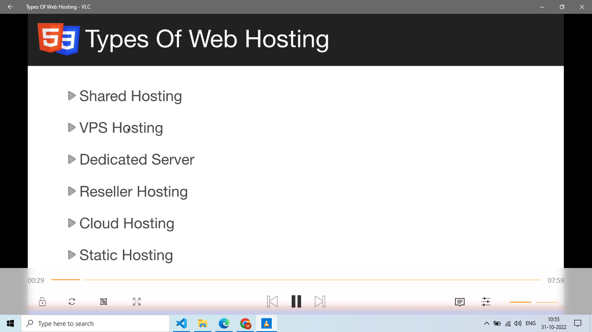
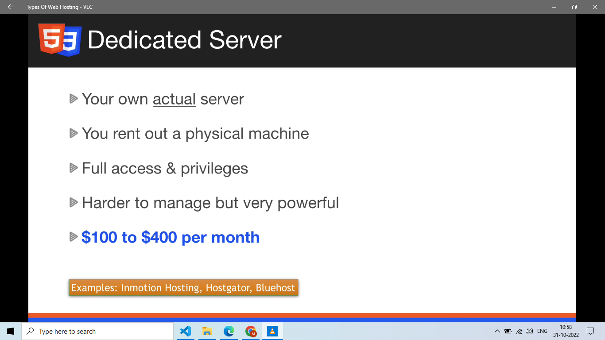
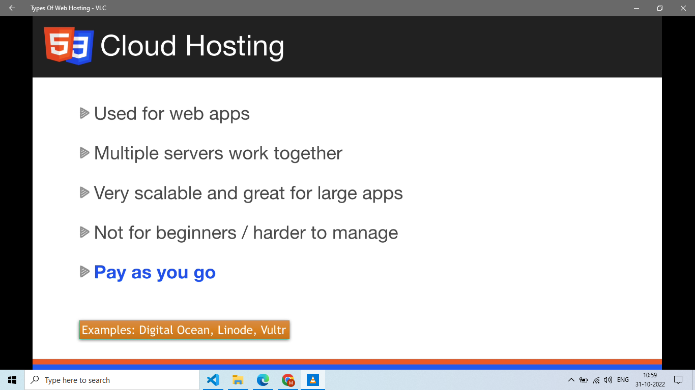
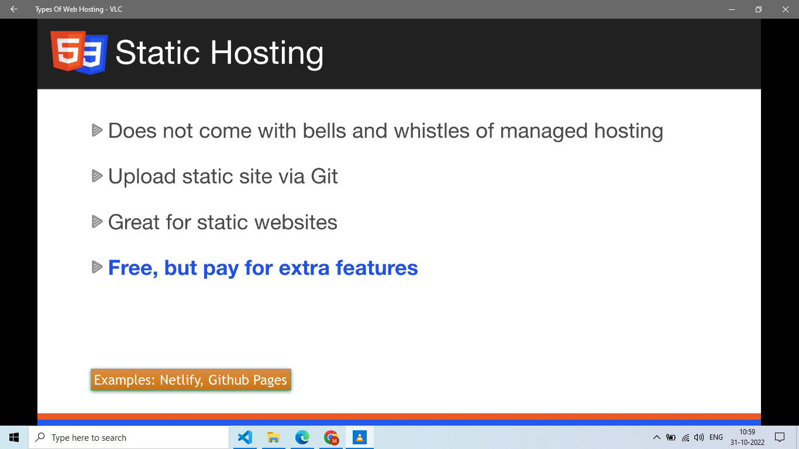

# How the Web Works

This note explains what happens when you open a website, in simple practical steps.

---

# 1. Simple Flow

When you type a URL and press Enter:

```text
URL entered
  -> Browser finds server
  -> Browser sends HTTP request
  -> Server sends HTML
  -> Browser loads CSS, JS, images, fonts
  -> Browser shows the page
  -> JavaScript adds interaction
```

Example URL:

```text
https://example.com/products?page=2
```

| Part | Meaning |
| ---- | ------- |
| `https` | Protocol |
| `example.com` | Domain |
| `/products` | Path |
| `?page=2` | Query parameter |

---

# 2. Files Browser Usually Loads

A normal frontend page often loads:

```text
index.html
styles.css
main.js
logo.png
font.woff2
API requests
```

In DevTools, open the **Network** tab and reload the page. You can see every file the browser requested.

---

# 3. Basic HTML Page

```html
<!doctype html>
<html lang="en">
  <head>
    <meta charset="utf-8">
    <meta name="viewport" content="width=device-width, initial-scale=1">
    <title>My Page</title>
    <link rel="stylesheet" href="styles.css">
    <script type="module" src="main.js"></script>
  </head>
  <body>
    <main>
      <h1>Hello Web</h1>
      <button id="btn">Click me</button>
    </main>
  </body>
</html>
```

Important points:

* HTML gives structure.
* CSS makes it look good.
* JavaScript makes it interactive.
* `type="module"` loads modern JavaScript safely after parsing.

---

# 4. Common HTTP Methods

| Method | Used for |
| ------ | -------- |
| `GET` | Read data |
| `POST` | Create data |
| `PUT` | Replace data |
| `PATCH` | Update part of data |
| `DELETE` | Delete data |

Example:

```js
const response = await fetch("/api/products");
const products = await response.json();
```

---

# 5. Common Status Codes

| Code | Meaning |
| ---- | ------- |
| `200` | Success |
| `201` | Created |
| `204` | Success with no body |
| `400` | Bad request |
| `401` | Not logged in |
| `403` | No permission |
| `404` | Not found |
| `500` | Server error |

In frontend code, do not assume every response is successful.

```js
const response = await fetch("/api/user");

if (!response.ok) {
  throw new Error(`Request failed: ${response.status}`);
}
```

---

# 5.1 Web Hosting Types

Hosting means putting your site/app files somewhere users can reach through the internet.

| Hosting type | Simple meaning | Common use |
| ------------ | -------------- | ---------- |
| Shared hosting | Many sites share one server. | basic websites, low cost |
| VPS | Your own virtual server on shared hardware. | more control than shared hosting |
| Dedicated server | Physical server rented for one customer. | high control, expensive |
| Cloud hosting | Scalable infrastructure from cloud providers. | apps that need scaling and managed services |
| Reseller hosting | Someone sells hosting space to other customers. | agencies/hosting businesses |
| Static hosting | Serves HTML, CSS, JS, images from storage/CDN. | frontend apps, docs, portfolios |

For React/Vite apps, production build output is usually static files:

```text
npm run build -> dist/ -> static hosting/CDN
```

Dynamic backend APIs are hosted separately or through serverless/fullstack platforms.

Visual notes from `htmlCss.docx`:











---

# 6. Practical Debugging

## Page is blank

Check:

```text
Console tab -> JavaScript error?
Network tab -> JS/CSS file failed?
Elements tab -> HTML exists?
```

## CSS not updating

Check:

```text
Hard refresh
Disable cache in Network tab
Check correct CSS file path
Check if another CSS rule overrides it
```

## API not working

Check:

```text
Network tab
Request URL
Status code
Request payload
Response body
CORS error in Console
```

---

# 7. Performance Basics

To make a page load faster:

* Keep images small.
* Avoid huge JavaScript files.
* Load important content first.
* Use `loading="lazy"` for below-the-fold images.
* Do not block the page with unnecessary scripts.

Example:

```html

```

---

# 8. Quick Exercise

Open any website and do this:

```text
1. Open DevTools
2. Go to Network tab
3. Reload page
4. Find the HTML document
5. Find CSS files
6. Find JS files
7. Find image files
8. Find one API request if available
```

Write down:

* Which request loaded first?
* Which request was largest?
* Did any request fail?
* How long did the page take to load?

---

# 9. Interview Notes

### What happens when you enter a URL?

The browser resolves the domain, sends an HTTP request, receives HTML, loads linked assets, builds the page, and runs JavaScript.

### Why can JavaScript block rendering?

If a normal script loads during HTML parsing, the browser may pause parsing until the script downloads and runs.

### Why use the Network tab?

It shows files, API calls, status codes, payloads, response data, cache behavior, and timing.
