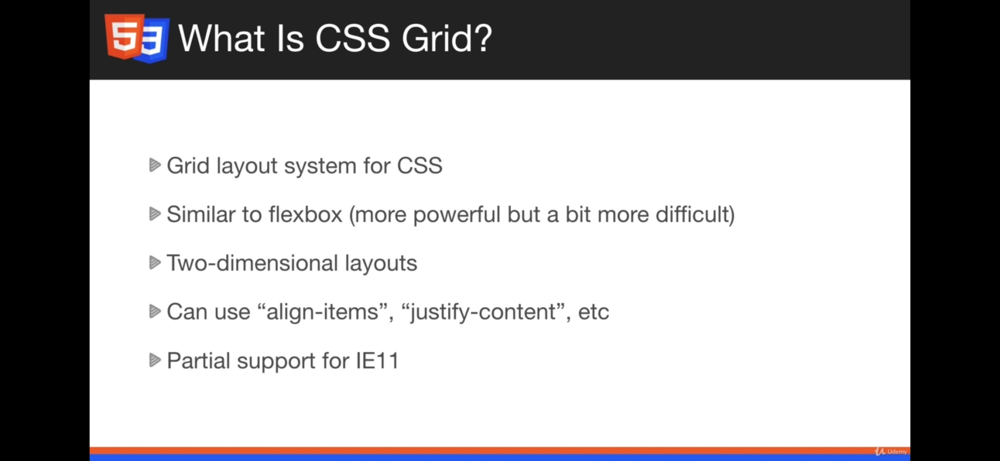
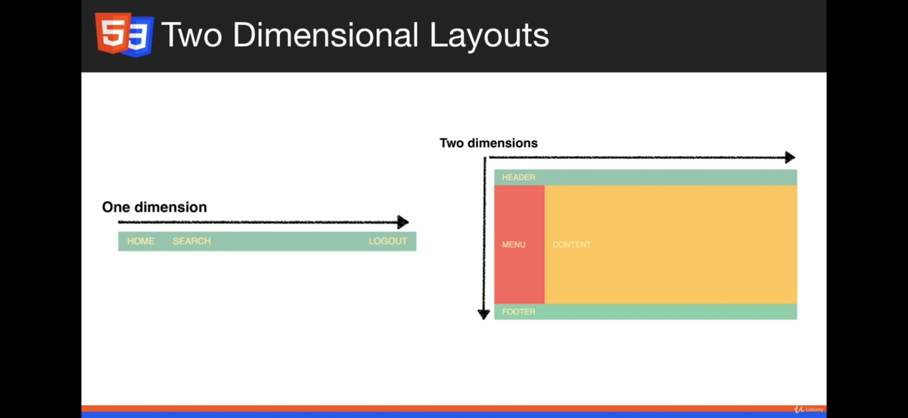
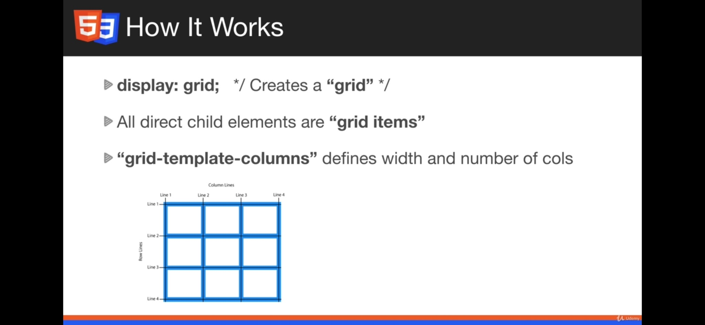
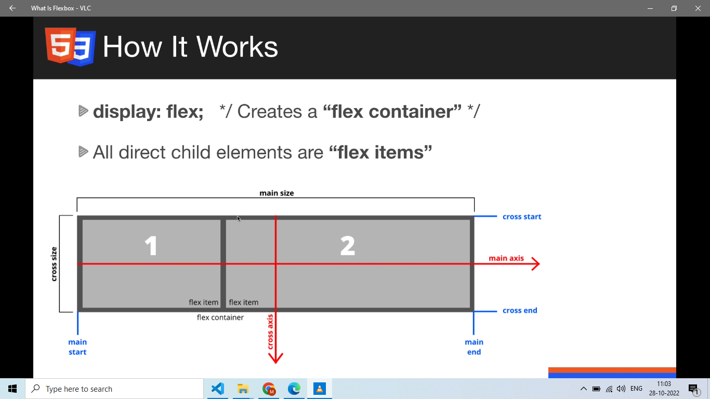
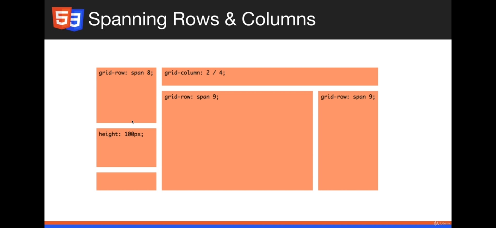

# CSS Grid Layout (Senior Frontend Engineer Perspective)

Before going deeper into frameworks or libraries, understand this topic as part of real frontend engineering: two-dimensional layout for page and component structure.

---

# 1. Fundamentals

* CSS Grid is for two-dimensional layout.
* Grid is ideal when rows and columns both matter.
* Grid can define explicit tracks and place items precisely without extra wrapper markup.

---

# 2. Core Concepts

| Concept | Practical meaning |
| ------- | ----------------- |
| Grid container | Parent with `display: grid`. |
| Track | A row or column. |
| Grid line | Boundary used for placement. |
| `fr` | Fraction of available space. |
| `minmax()` | Responsive min and max track sizes. |
| Named areas | Readable placement system for page regions. |

---

# 3. Internal Working

* The grid algorithm places items into explicit or implicit tracks, then resolves track sizes from fixed, content, flexible, and minmax constraints.
* Auto-placement fills available cells based on flow direction.

---

# 4. Common Mistakes

* Using grid when simple inline alignment needs flexbox.
* Creating fixed columns that overflow on mobile.
* Overusing named areas for tiny components.
* Forgetting gap is part of layout math.

---

# 5. Best Practices

* Use `repeat(auto-fit, minmax())` for responsive card grids.
* Use named areas for page shells.
* Prefer grid for dashboard layouts and comparison panels.
* Avoid fixed viewport-based heights unless the layout truly needs them.

---

# 6. Code Example

```css
.layout {
  display: grid;
  grid-template-columns: 16rem minmax(0, 1fr);
  grid-template-areas: "sidebar content";
  min-height: 100vh;
}

.cards {
  display: grid;
  grid-template-columns: repeat(auto-fit, minmax(16rem, 1fr));
  gap: 1rem;
}
```

---

# 7. Real-world Scenarios

* Using CSS Grid Layout while building a real frontend feature.
* Debugging a production issue where CSS Grid Layout was misunderstood.
* Explaining CSS Grid Layout clearly during a frontend interview.

---

# 7.1 Practical Grid Examples

Auto-fit card grid:

```css
.gallery {
  display: grid;
  grid-template-columns: repeat(auto-fit, minmax(150px, 1fr));
  gap: 1rem;
}
```

Grid placement:

```css
.summary {
  grid-column: span 2;
}

.hero {
  grid-column: 1 / -1;
}
```

Use grid for outer layouts or when rows and columns both matter. Use flexbox for a single row/column alignment problem.

Visual notes from `htmlCss.docx`:











---

# 8. Senior Deep Dive

## When to Use

* Use normal flow for documents, flexbox for one axis, grid for two axes, and positioning for intentional overlays or offsets.
* Use custom properties and tokens when values express product design decisions.
* Use modern CSS when support is acceptable and it removes complexity.

## Debug Checklist

* Check whether the element participates in block, inline, flex, grid, or positioned layout.
* Inspect computed styles, overwritten declarations, box model, min/max constraints, overflow, and active media/container queries.
* For overlap issues, inspect containing blocks and stacking contexts before increasing `z-index`.

## Code Review Checklist

* Does the layout survive long words, translated text, zoom, and narrow screens?
* Are focus, hover, disabled, validation, and reduced-motion states handled?
* Are selectors shallow and ownership boundaries clear?


---

# Revision Notes

* CSS Grid Layout matters because it affects real users, future maintainers, and production behavior.
* Learn the mental model before memorizing syntax.
* Use browser DevTools, tests, and small examples to verify behavior.
* CSS Grid is for two-dimensional layout.
* Grid is ideal when rows and columns both matter.
* Grid can define explicit tracks and place items precisely without extra wrapper markup.

---

# Cheat Sheet

| Concept | Practical meaning |
| ------- | ----------------- |
| Grid container | Parent with `display: grid`. |
| Track | A row or column. |
| Grid line | Boundary used for placement. |
| `fr` | Fraction of available space. |
| `minmax()` | Responsive min and max track sizes. |
| Named areas | Readable placement system for page regions. |

---

# Interview Questions with Answers

### 1. How would you explain CSS Grid Layout in a real project?

I start from the layout requirement, decide whether normal flow, flexbox, grid, or positioning fits, then use the cascade deliberately.

### 2. What happens internally when CSS Grid Layout is involved?

The browser resolves cascade and computed styles, calculates boxes, lays them out, paints, and composites. A CSS bug usually lives in one of those steps.

### 3. How do you debug issues related to CSS Grid Layout?

I inspect the element, check computed styles, box model, active media/container queries, overwritten rules, overflow, and stacking contexts.

### 4. What is the biggest production risk with CSS Grid Layout?

The biggest risk is building something that works for the demo state but fails with real content, slow networks, accessibility needs, errors, or future changes.

### 5. What should a senior engineer look for in code review?

They should check the mental model, edge cases, accessibility, performance cost, naming, state ownership, test coverage, and whether the simpler native/platform option was considered.

---

# Hands-on Exercises

## Exercise 1

Build a small responsive layout that demonstrates CSS Grid Layout.

### Solution

Test at narrow, medium, and wide widths; include long text; inspect computed styles and box model in DevTools.

## Exercise 2

Create one intentional broken version and debug it.

### Solution

Identify whether the issue came from cascade, box model, layout model, overflow, media query, or stacking context.

---

# Senior Frontend Engineer Takeaway

For senior-level work, CSS Grid Layout is not only a syntax topic. You should be able to explain the mental model, choose the right pattern for a product requirement, identify common failure modes, and verify behavior through tooling, tests, and browser inspection.
