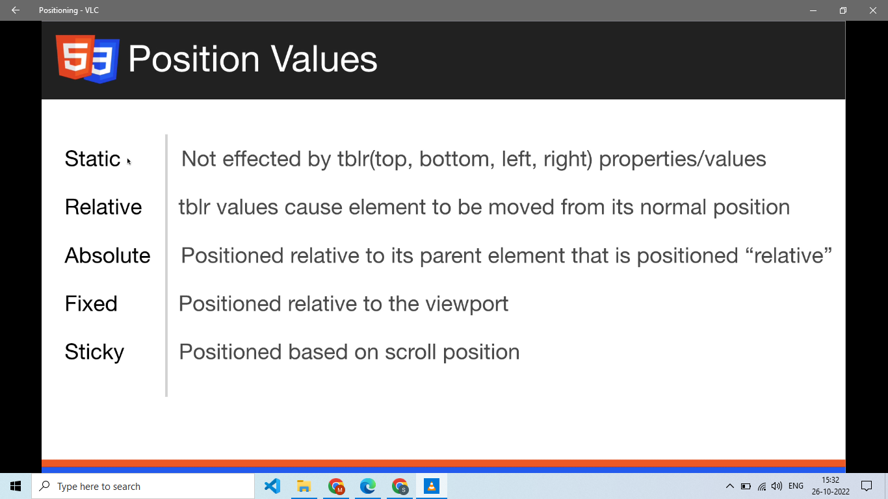

# Positioning, Stacking, and z-index (Senior Frontend Engineer Perspective)

Before going deeper into frameworks or libraries, understand this topic as part of real frontend engineering: containing blocks, positioned elements, and stacking contexts.

---

# 1. Fundamentals

* Positioning moves elements out of normal flow or anchors them relative to containing blocks.
* Stacking controls what appears in front when boxes overlap.
* `z-index` only makes sense within stacking context rules.

---

# 2. Core Concepts

| Concept | Practical meaning |
| ------- | ----------------- |
| Static | Default position in normal flow. |
| Relative | Keeps space but offsets visually. |
| Absolute | Positioned relative to nearest positioned ancestor. |
| Fixed | Positioned relative to viewport. |
| Sticky | Switches between relative and fixed within a scroll container. |
| Stacking context | An isolated z-order group. |

---

# 3. Internal Working

* Properties like `position` with `z-index`, `opacity < 1`, `transform`, `filter`, and `isolation` can create stacking contexts.
* Sticky positioning depends on scroll containers and inset values.

---

# 4. Common Mistakes

* Setting huge z-index values without understanding stacking contexts.
* Using absolute positioning for normal page layout.
* Breaking sticky elements by adding overflow to an ancestor.
* Covering content with fixed headers without offset spacing.

---

# 5. Best Practices

* Use positioning for overlays, badges, popovers, and sticky UI, not general layout.
* Create intentional stacking tokens.
* Inspect stacking contexts when z-index appears ignored.
* Use logical inset properties for international layouts.

---

# 6. Code Example

```css
.card {
  position: relative;
}

.badge {
  position: absolute;
  inset-block-start: 0.75rem;
  inset-inline-end: 0.75rem;
  z-index: 1;
}

.header {
  position: sticky;
  top: 0;
  z-index: 10;
}
```

---

# 7. Real-world Scenarios

* Using Positioning, Stacking, and z-index while building a real frontend feature.
* Debugging a production issue where Positioning, Stacking, and z-index was misunderstood.
* Explaining Positioning, Stacking, and z-index clearly during a frontend interview.

---

# 7.1 Sticky Navbar Example

```html
<header class="site-header">
  <a href="/" class="logo">Frontend Notes</a>
  <nav aria-label="Primary">
    <a href="/html">HTML</a>
    <a href="/css">CSS</a>
    <a href="/react">React</a>
  </nav>
</header>
```

```css
.site-header {
  position: sticky;
  top: 0;
  z-index: 10;
  display: flex;
  align-items: center;
  justify-content: space-between;
  gap: 1rem;
  padding: 1rem;
  background: white;
  border-bottom: 1px solid #d0d7de;
}
```

If sticky does not work, check parent `overflow`, the scroll container, and whether an inset such as `top: 0` is set.

Visual note from `htmlCss.docx`:



---

# 8. Senior Deep Dive

## When to Use

* Use normal flow for documents, flexbox for one axis, grid for two axes, and positioning for intentional overlays or offsets.
* Use custom properties and tokens when values express product design decisions.
* Use modern CSS when support is acceptable and it removes complexity.

## Debug Checklist

* Check whether the element participates in block, inline, flex, grid, or positioned layout.
* Inspect computed styles, overwritten declarations, box model, min/max constraints, overflow, and active media/container queries.
* For overlap issues, inspect containing blocks and stacking contexts before increasing `z-index`.

## Code Review Checklist

* Does the layout survive long words, translated text, zoom, and narrow screens?
* Are focus, hover, disabled, validation, and reduced-motion states handled?
* Are selectors shallow and ownership boundaries clear?


---

# Revision Notes

* Positioning, Stacking, and z-index matters because it affects real users, future maintainers, and production behavior.
* Learn the mental model before memorizing syntax.
* Use browser DevTools, tests, and small examples to verify behavior.
* Positioning moves elements out of normal flow or anchors them relative to containing blocks.
* Stacking controls what appears in front when boxes overlap.
* `z-index` only makes sense within stacking context rules.

---

# Cheat Sheet

| Concept | Practical meaning |
| ------- | ----------------- |
| Static | Default position in normal flow. |
| Relative | Keeps space but offsets visually. |
| Absolute | Positioned relative to nearest positioned ancestor. |
| Fixed | Positioned relative to viewport. |
| Sticky | Switches between relative and fixed within a scroll container. |
| Stacking context | An isolated z-order group. |

---

# Interview Questions with Answers

### 1. Why does increasing `z-index` sometimes not bring an element to the front?

Because the element may be inside a different stacking context. `z-index` is only compared within the same stacking context. Properties like `position` with `z-index`, `opacity < 1`, `transform`, `filter`, and `isolation` can create new contexts.

### 2. What is the difference between `relative`, `absolute`, `fixed`, and `sticky`?

`relative` keeps its normal space and offsets visually. `absolute` is removed from normal flow and positioned against its containing block. `fixed` is positioned against the viewport. `sticky` behaves like relative until a scroll threshold, then sticks within its scroll container.

### 3. Why does `position: sticky` fail?

Common causes are a parent with an unexpected overflow value, no scrollable space, missing `top`/`bottom` offset, or the sticky element being inside the wrong scroll container. I inspect ancestors and scroll containers before changing random values.

### 4. When should positioning not be used?

Do not use positioning as the main page layout tool. Normal flow, flexbox, and grid are more resilient. Positioning is for overlays, badges, popovers, sticky headers, anchored controls, and deliberate visual offsets.

### 5. How do you manage z-index in a design system?

I prefer named layering tokens like dropdown, sticky header, modal, toast, and tooltip instead of arbitrary huge numbers. I also check stacking context creation so a token can actually work where it is used.

---

# Hands-on Exercises

## Exercise 1

Build a small responsive layout that demonstrates Positioning, Stacking, and z-index.

### Solution

Test at narrow, medium, and wide widths; include long text; inspect computed styles and box model in DevTools.

## Exercise 2

Create one intentional broken version and debug it.

### Solution

Identify whether the issue came from cascade, box model, layout model, overflow, media query, or stacking context.

---

# Senior Frontend Engineer Takeaway

For senior-level work, Positioning, Stacking, and z-index is not only a syntax topic. You should be able to explain the mental model, choose the right pattern for a product requirement, identify common failure modes, and verify behavior through tooling, tests, and browser inspection.
