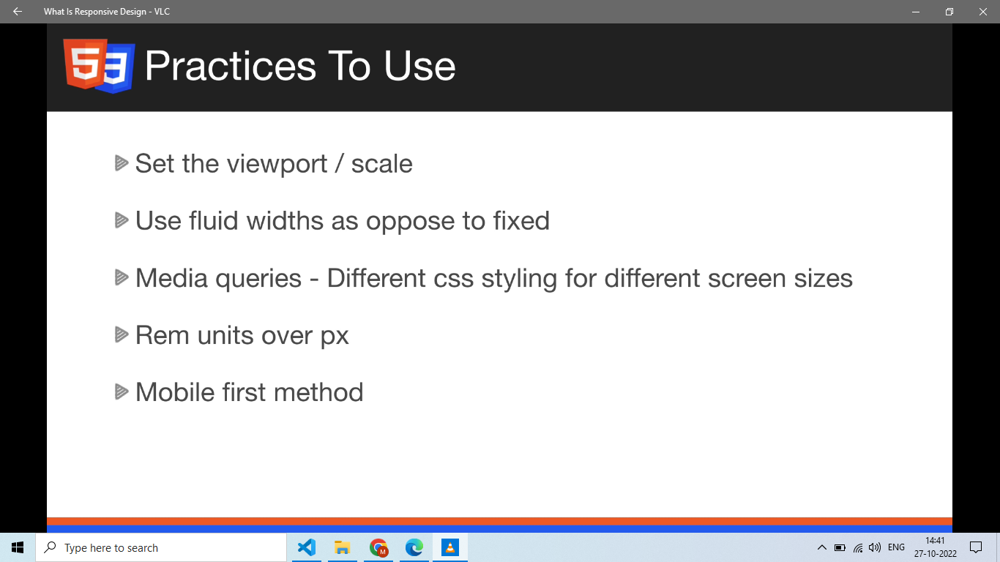

# Responsive Design, Media Queries, and Container Queries (Senior Frontend Engineer Perspective)

Before going deeper into frameworks or libraries, understand this topic as part of real frontend engineering: making interfaces adapt to screens, containers, and input methods.

---

# 1. Fundamentals

* Responsive design means interfaces adapt to device size, container size, input method, and user preferences.
* Start with fluid layouts, then add breakpoints where content needs them.
* Container queries let components respond to their own space, not only the viewport.

---

# 2. Core Concepts

| Concept | Practical meaning |
| ------- | ----------------- |
| Fluid layout | Uses percentages, flexible tracks, and intrinsic sizing. |
| Breakpoint | A CSS condition where layout changes. |
| Media query | Applies styles based on viewport or device features. |
| Container query | Applies styles based on an ancestor container. |
| Responsive image | Serves appropriate image size or crop. |

---

# 3. Internal Working

* Media queries are evaluated against environment features such as width and pointer type.
* Container queries require a containment context through `container-type`.

---

# 4. Common Mistakes

* Designing desktop first and patching mobile at the end.
* Using breakpoints based only on popular devices.
* Hiding important content on mobile.
* Ignoring coarse pointer and reduced motion preferences.

---

# 5. Best Practices

* Use content-driven breakpoints.
* Prefer flexible constraints like `min()`, `max()`, and `clamp()`.
* Test at awkward widths, zoom levels, and long translations.
* Use responsive images for large media.

---

# 6. Code Example

```css
.profile {
  container-type: inline-size;
  display: grid;
  gap: 1rem;
}

@container (min-width: 36rem) {
  .profile {
    grid-template-columns: 12rem 1fr;
  }
}

@media (prefers-reduced-motion: reduce) {
  * {
    animation-duration: 0.01ms;
    scroll-behavior: auto;
  }
}
```

---

# 7. Real-world Scenarios

* Using Responsive Design, Media Queries, and Container Queries while building a real frontend feature.
* Debugging a production issue where Responsive Design, Media Queries, and Container Queries was misunderstood.
* Explaining Responsive Design, Media Queries, and Container Queries clearly during a frontend interview.

---

# 7.1 Media Query Practice

Common syntax:

```css
@media (max-width: 600px) {
  .sidebar {
    display: none;
  }
}

@media (min-width: 768px) and (orientation: landscape) {
  .layout {
    grid-template-columns: 16rem 1fr;
  }
}

@media (min-resolution: 2dppx) {
  .logo {
    background-image: url("/logo@2x.png");
  }
}
```

Approximate breakpoint language:

| Range | Treat as |
| ----- | -------- |
| up to `600px` | small/mobile layouts |
| `600px` to `900px` | tablet/intermediate layouts |
| `900px` and above | desktop/wide layouts |

These are not fixed rules. Add breakpoints when the content/layout needs them.

Responsive flex layout:

```css
.cards {
  display: flex;
  flex-direction: column;
  gap: 1rem;
}

@media (min-width: 768px) {
  .cards {
    flex-direction: row;
  }

  .card {
    flex: 1;
  }
}
```

Visual note from `htmlCss.docx`:



---

# 8. Senior Deep Dive

## When to Use

* Use normal flow for documents, flexbox for one axis, grid for two axes, and positioning for intentional overlays or offsets.
* Use custom properties and tokens when values express product design decisions.
* Use modern CSS when support is acceptable and it removes complexity.

## Debug Checklist

* Check whether the element participates in block, inline, flex, grid, or positioned layout.
* Inspect computed styles, overwritten declarations, box model, min/max constraints, overflow, and active media/container queries.
* For overlap issues, inspect containing blocks and stacking contexts before increasing `z-index`.

## Code Review Checklist

* Does the layout survive long words, translated text, zoom, and narrow screens?
* Are focus, hover, disabled, validation, and reduced-motion states handled?
* Are selectors shallow and ownership boundaries clear?


---

# Revision Notes

* Responsive Design, Media Queries, and Container Queries matters because it affects real users, future maintainers, and production behavior.
* Learn the mental model before memorizing syntax.
* Use browser DevTools, tests, and small examples to verify behavior.
* Responsive design means interfaces adapt to device size, container size, input method, and user preferences.
* Start with fluid layouts, then add breakpoints where content needs them.
* Container queries let components respond to their own space, not only the viewport.

---

# Cheat Sheet

| Concept | Practical meaning |
| ------- | ----------------- |
| Fluid layout | Uses percentages, flexible tracks, and intrinsic sizing. |
| Breakpoint | A CSS condition where layout changes. |
| Media query | Applies styles based on viewport or device features. |
| Container query | Applies styles based on an ancestor container. |
| Responsive image | Serves appropriate image size or crop. |

---

# Interview Questions with Answers

### 1. How do you choose breakpoints?

I choose breakpoints where the content or layout breaks, not because of a specific device name. I start fluid, test real content, zoom, and narrow widths, then add breakpoints only when the current layout stops working well.

### 2. When are container queries better than media queries?

Container queries are better for reusable components whose layout depends on their parent size, not the viewport. A card in a sidebar and the same card in a wide main area may need different layouts on the same screen width.

### 3. What does mobile-first CSS mean in practice?

Base styles support the simplest/narrowest layout first, then media queries enhance for more space. It usually reduces overrides and makes the default experience more resilient on constrained devices.

### 4. What responsive issues do you test beyond viewport width?

I test zoom, text scaling, long translated strings, touch versus mouse, reduced motion, portrait/landscape, slow networks, high-density images, and keyboard navigation. Responsive design is more than making the browser narrow.

### 5. How do responsive images fit into responsive design?

The layout can be responsive but still waste bandwidth if images are oversized. I check `srcset`, `sizes`, art direction with `picture` when needed, width/height or aspect ratio to prevent CLS, and whether the LCP image is prioritized correctly.

---

# Hands-on Exercises

## Exercise 1

Build a small responsive layout that demonstrates Responsive Design, Media Queries, and Container Queries.

### Solution

Test at narrow, medium, and wide widths; include long text; inspect computed styles and box model in DevTools.

## Exercise 2

Create one intentional broken version and debug it.

### Solution

Identify whether the issue came from cascade, box model, layout model, overflow, media query, or stacking context.

---

# Senior Frontend Engineer Takeaway

For senior-level work, Responsive Design, Media Queries, and Container Queries is not only a syntax topic. You should be able to explain the mental model, choose the right pattern for a product requirement, identify common failure modes, and verify behavior through tooling, tests, and browser inspection.
