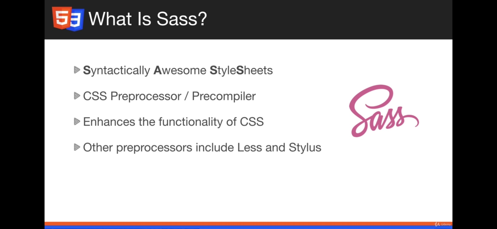
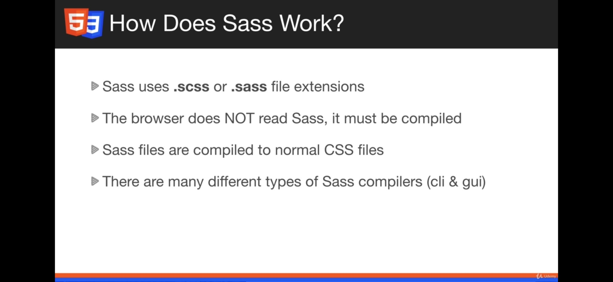
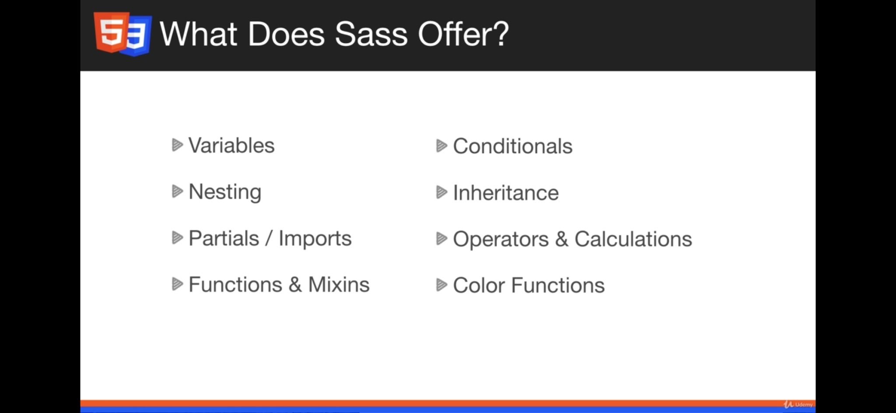
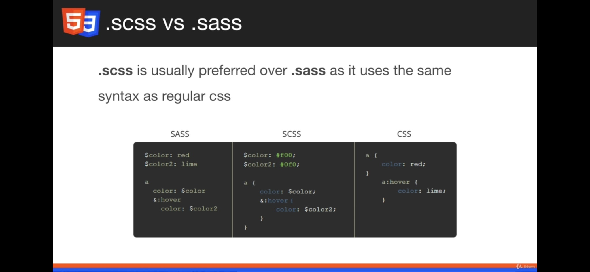

# CSS Architecture, BEM, and CSS Modules (Senior Frontend Engineer Perspective)

Before going deeper into frameworks or libraries, understand this topic as part of real frontend engineering: keeping styles predictable in growing applications.

---

# 1. Fundamentals

* CSS architecture prevents style leaks, specificity wars, and accidental regressions.
* The best architecture depends on team size, framework, design system, and release cadence.
* BEM, CSS Modules, utility CSS, and CSS-in-JS all solve scoping and consistency differently.

---

# 2. Core Concepts

| Concept | Practical meaning |
| ------- | ----------------- |
| BEM | Block, element, modifier naming convention. |
| CSS Modules | Build-time local class name scoping. |
| Utility class | Small single-purpose class. |
| Design system | Reusable components and tokens. |
| Style boundary | A rule that defines ownership and prevents leaks. |

---

# 3. Internal Working

* Plain CSS is global by default. CSS Modules transform class names to avoid collisions. Utility systems trade semantic class names for constrained composition.
* CSS import order still matters unless layers or tooling control it.

---

# 4. Common Mistakes

* Mixing naming systems without rules.
* Styling child internals from distant parents.
* Letting one component depend on another component's private class names.
* Adding global overrides for one-off fixes.

---

# 5. Best Practices

* Pick one primary strategy and document it.
* Keep component styles close to components.
* Use tokens for design consistency.
* Prefer explicit variants over selector gymnastics.

---

# 6. Code Example

```css
.card {
  border: 1px solid var(--color-border);
  padding: 1rem;
}

.card__title {
  margin: 0;
  font-weight: 700;
}

.card--selected {
  border-color: var(--color-accent);
}
```

---

# 7. Real-world Scenarios

* Using CSS Architecture, BEM, and CSS Modules while building a real frontend feature.
* Debugging a production issue where CSS Architecture, BEM, and CSS Modules was misunderstood.
* Explaining CSS Architecture, BEM, and CSS Modules clearly during a frontend interview.

---

# 8. CSS Modules in React

CSS Modules use files like `Component.module.css` to scope class names locally to a component.

Normal CSS is global:

```css
.button {
  color: red;
}
```

If multiple components use `.button`, styles can clash.

CSS Module:

```css
/* Button.module.css */
.button {
  color: red;
}
```

```jsx
import styles from "./Button.module.css";

function Button() {
  return <button className={styles.button}>Click</button>;
}
```

The build tool generates a unique class name, which avoids global naming collisions.

Benefits:

* scoped styles
* fewer class name conflicts
* easier component maintenance
* better code navigation
* good fit for React component architecture

Drawbacks of normal/global CSS in large React apps:

* style leakage
* accidental overwrites
* hard-to-track source of styles
* harder maintenance as app grows

Use CSS Modules when:

* styling component-level UI
* you want style encapsulation
* the app is component-based
* you are not using another scoped styling approach

---

# 8.1 Sass / SCSS Practical Notes

Install Dart Sass:

```bash
npm install -D sass
```

Use `.scss` partials with a leading underscore:

```text
styles/
  _tokens.scss
  _mixins.scss
  main.scss
```

```scss
// _tokens.scss
$brand-color: #2563eb;

// main.scss
@use "tokens";

.button {
  color: tokens.$brand-color;
}
```

Useful Sass features:

* variables
* nesting
* mixins
* functions
* partials/modules
* conditionals and loops

Prefer modern CSS custom properties for runtime theming. Use Sass when the project already has a Sass architecture or needs build-time utilities.

Visual notes from `htmlCss.docx`:









---

# 9. Senior Deep Dive

## When to Use

* Use normal flow for documents, flexbox for one axis, grid for two axes, and positioning for intentional overlays or offsets.
* Use custom properties and tokens when values express product design decisions.
* Use modern CSS when support is acceptable and it removes complexity.

## Debug Checklist

* Check whether the element participates in block, inline, flex, grid, or positioned layout.
* Inspect computed styles, overwritten declarations, box model, min/max constraints, overflow, and active media/container queries.
* For overlap issues, inspect containing blocks and stacking contexts before increasing `z-index`.

## Code Review Checklist

* Does the layout survive long words, translated text, zoom, and narrow screens?
* Are focus, hover, disabled, validation, and reduced-motion states handled?
* Are selectors shallow and ownership boundaries clear?


---

# Revision Notes

* CSS Architecture, BEM, and CSS Modules matters because it affects real users, future maintainers, and production behavior.
* Learn the mental model before memorizing syntax.
* Use browser DevTools, tests, and small examples to verify behavior.
* CSS architecture prevents style leaks, specificity wars, and accidental regressions.
* The best architecture depends on team size, framework, design system, and release cadence.
* BEM, CSS Modules, utility CSS, and CSS-in-JS all solve scoping and consistency differently.

---

# Cheat Sheet

| Concept | Practical meaning |
| ------- | ----------------- |
| BEM | Block, element, modifier naming convention. |
| CSS Modules | Build-time local class name scoping. |
| Utility class | Small single-purpose class. |
| Design system | Reusable components and tokens. |
| Style boundary | A rule that defines ownership and prevents leaks. |

---

# Interview Questions with Answers

### 1. How do you prevent global CSS from breaking unrelated screens?

Use clear ownership boundaries: component-scoped styles, CSS Modules, BEM, or a controlled utility system. Avoid broad selectors like `.content button`, keep selectors shallow, and define where global reset, tokens, typography, and layout rules are allowed.

### 2. How would you compare BEM, CSS Modules, and utility classes in an interview?

BEM gives readable global class names but relies on discipline. CSS Modules give local scoping at build time. Utility classes create consistency through constrained primitives but can make markup dense if the team has no extraction strategy.

### 3. What does a good class name communicate?

It communicates component ownership and purpose, not the current visual implementation. `.product-card__price` is more maintainable than `.large-blue-text` because the design can change while the role stays stable.

### 4. How would you structure CSS for a large app with a design system?

Keep global files limited to reset, tokens, base typography, and app shell rules. Put component styles near components, expose documented variants through props/classes, and centralize shared patterns in design-system components instead of copying CSS between features.

### 5. What CSS architecture smells do you look for in a pull request?

Deep selectors, repeated magic values, `!important`, global overrides for one screen, class names tied to color or position, and copied component styles. I also check that new variants do not bypass tokens, accessibility states, or existing component APIs.

---

# Hands-on Exercises

## Exercise 1

Build a small responsive layout that demonstrates CSS Architecture, BEM, and CSS Modules.

### Solution

Test at narrow, medium, and wide widths; include long text; inspect computed styles and box model in DevTools.

## Exercise 2

Create one intentional broken version and debug it.

### Solution

Identify whether the issue came from cascade, box model, layout model, overflow, media query, or stacking context.

---

# Senior Frontend Engineer Takeaway

For senior-level work, CSS Architecture, BEM, and CSS Modules is not only a syntax topic. You should be able to explain the mental model, choose the right pattern for a product requirement, identify common failure modes, and verify behavior through tooling, tests, and browser inspection.
