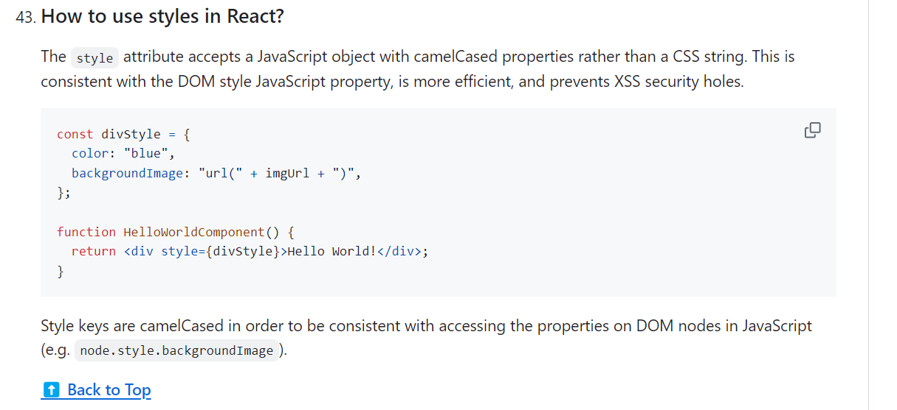

# React Styling Options Revision

This file incorporates React styling notes from the pasted `JS revision.md`.

---

# 1. CSS Modules

```css
/* Button.module.css */
.button {
  color: red;
}
```

```jsx
import styles from "./Button.module.css";

function Button() {
  return <button className={styles.button}>Click</button>;
}
```

Benefits:

* scoped styles
* no global class collision
* easier component maintenance

---

# 2. Styled Components

```bash
npm install styled-components
```

```jsx
import styled from "styled-components";

const Button = styled.button`
  background: #2563eb;
  color: white;
`;
```

Use when:

* the project already uses CSS-in-JS
* styles depend heavily on component props
* theming is centralized through styled-components

---

# 3. SASS / SCSS

```scss
.card {
  padding: 1rem;

  &__title {
    font-weight: 700;
  }
}
```

Use when:

* team wants variables, nesting, mixins
* project already has SCSS architecture

Modern CSS now covers many older Sass needs, so choose deliberately.

SCSS is a CSS preprocessor. It adds features before being transpiled into normal CSS.

Useful SCSS features:

* variables
* nesting
* mixins
* functions
* partials and imports
* better organization for large stylesheets

```scss
$brand-color: #2563eb;

@mixin focus-ring {
  outline: 2px solid $brand-color;
  outline-offset: 2px;
}

.button {
  color: $brand-color;

  &:focus-visible {
    @include focus-ring;
  }
}
```

SCSS advantage: it improves reuse and organization in larger CSS codebases. Tradeoff: it adds a build step and can encourage over-nesting if not reviewed carefully.

---

# 4. UI Libraries

Examples:

* Material UI
* React Bootstrap
* Ant Design
* StyleX

Install examples:

```bash
npm install @mui/material @emotion/react @emotion/styled
npm install react-bootstrap bootstrap
npm install styled-components
npm install sass
```

Use UI libraries when:

* product needs many standard components quickly
* team accepts the design constraints
* accessibility and behavior are handled better than custom code

React Bootstrap setup:

```jsx
import "bootstrap/dist/css/bootstrap.min.css";
import Button from "react-bootstrap/Button";

function SaveButton() {
  return <Button variant="primary">Save</Button>;
}
```

Font Awesome CDN belongs in simple HTML demos, but production React apps usually install icon packages or use the design system's icon component.

---

# 5. Comparison

| Option | Best for |
| ------ | -------- |
| CSS Modules | scoped component styles |
| Styled Components | CSS-in-JS and prop-based styling |
| SCSS | larger stylesheet architecture |
| Tailwind | utility-first fast UI |
| MUI / Bootstrap | prebuilt component systems |
| Ant Design | enterprise component system |
| StyleX | compile-time atomic CSS, often associated with Meta-style architecture |

---

# 6. Visual Notes from `react_1.docx`


