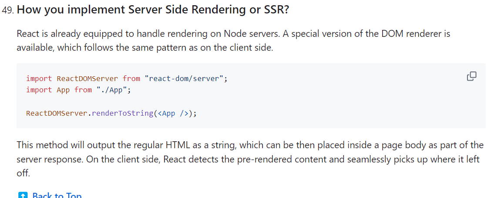

# Source Maps, Debugging, CI, and Frontend Delivery (Senior Frontend Engineer Perspective)

Before going deeper into frameworks or libraries, understand this topic as part of real frontend engineering: debugging builds, source maps, preview deployments, CI checks, CDN delivery, and rollback thinking.

---

# 1. Fundamentals

* Modern frontend tooling improves feedback loops, compatibility, dependency management, and production builds.
* Tooling should serve the product; avoid complexity that the project does not need.
* A senior developer understands both dev-server convenience and production build consequences.

---

# 2. Core Concepts

| Concept | Practical meaning |
| ------- | ----------------- |
| Package manager | Installs and resolves dependencies. |
| Bundler | Builds dependency graph into browser-ready assets. |
| Transpiler | Transforms source syntax. |
| Linter | Finds suspicious code patterns. |
| Build mode | Different configuration for development, test, staging, and production. |

---

# 3. Internal Working

* A bundler follows imports, transforms files, splits chunks, rewrites asset URLs, and emits optimized production files.
* Development servers optimize feedback speed with module replacement and source maps.
* Lockfiles pin dependency resolution so CI and teammates install the same graph.

---

# 4. Common Mistakes

* Installing dependencies without understanding why.
* Committing local secrets.
* Assuming dev behavior equals production behavior.
* Ignoring build warnings.

---

# 5. Best Practices

* Keep scripts simple and documented.
* Use lockfiles.
* Run lint, tests, and builds in CI.
* Audit dependency size and security before adding libraries.

---

# 6. Code Example

```yaml
name: frontend-checks

on: [push, pull_request]

jobs:
  verify:
    runs-on: ubuntu-latest
    steps:
      - uses: actions/checkout@v4
      - uses: actions/setup-node@v4
        with:
          node-version: 22
          cache: npm
      - run: npm ci
      - run: npm run lint
      - run: npm test
      - run: npm run build
```

---

# 7. Real-world Scenarios

* Debugging a production-only build issue.
* Adding a dependency and checking bundle impact.
* Configuring separate API URLs for local and staging environments.

---

# 7.1 Production Mode in React Builds

Production mode removes development-only warnings, enables minification, and lets bundlers remove unreachable development branches.

Modern workflow:

```bash
npm run build
npm run preview
```

In Webpack projects:

```js
module.exports = {
  mode: "production",
};
```

Older interview notes may mention DefinePlugin manually setting `process.env.NODE_ENV` to `"production"`. That still matters in custom Webpack setups, but modern tools usually configure it through the build command.

Production checklist:

* run lint/tests/build in CI
* inspect bundle warnings
* verify env vars are safe for frontend exposure
* test the production build, not only dev server
* keep source maps policy intentional

Visual note:



# 8. Senior Deep Dive

## When to Use

* Use tooling that the team can understand, run locally, and support in CI.
* Use Vite or a similar fast tool for modern React apps unless the codebase already has a mature setup.
* Use TypeScript, linting, formatting, and tests as guardrails, not ceremony.

## Debug Checklist

* Compare dev and production builds.
* Inspect lockfiles, dependency versions, environment variables, and generated bundle output.
* Use source maps to connect runtime errors back to source.

## Code Review Checklist

* Are scripts documented and deterministic?
* Are secrets kept out of frontend bundles?
* Does CI run install, lint, test, and build checks?


---

# Revision Notes

* Source Maps, Debugging, CI, and Frontend Delivery matters because it affects real users, future maintainers, and production behavior.
* Learn the mental model before memorizing syntax.
* Use browser DevTools, tests, and small examples to verify behavior.
* Modern frontend tooling improves feedback loops, compatibility, dependency management, and production builds.
* Tooling should serve the product; avoid complexity that the project does not need.
* A senior developer understands both dev-server convenience and production build consequences.

---

# Cheat Sheet

| Concept | Practical meaning |
| ------- | ----------------- |
| Package manager | Installs and resolves dependencies. |
| Bundler | Builds dependency graph into browser-ready assets. |
| Transpiler | Transforms source syntax. |
| Linter | Finds suspicious code patterns. |
| Build mode | Different configuration for development, test, staging, and production. |

---

# Interview Questions with Answers

### 1. What are source maps used for in production debugging?

They map minified bundle locations back to the original source files, making stack traces and DevTools debugging usable. They are most useful when tied to the exact release/commit that produced the deployed assets.

### 2. What are the security and operational tradeoffs of publishing source maps?

Public source maps can expose source structure and comments. Private upload to an error-monitoring tool gives debugging value while reducing exposure. The right choice depends on product risk and observability needs.

### 3. What should CI verify before deploying a frontend app?

Install from the lockfile, typecheck, lint, test, build, run key smoke or E2E checks, validate assets, and attach the release id/source maps. The pipeline should fail before deployment when the app cannot be built reproducibly.

### 4. How do you debug a bug that appears only after deployment?

Start from the release id, compare the deployed commit and lockfile, inspect production env values, reproduce with a production build locally, check source-mapped stack traces, and review CDN/cache behavior.

### 5. What delivery-pipeline issues do you flag in review?

Skipping lockfile installs, deploying without build/test evidence, source maps not matching releases, long-lived cached HTML, missing rollback plan, and CI scripts that differ from local package scripts without a reason.

---

# Hands-on Exercises

## Exercise 1

Build a small example that demonstrates Source Maps, Debugging, CI, and Frontend Delivery.

### Solution

Keep the example focused, include one realistic edge case, and explain what the browser or React is doing internally.

## Exercise 2

List three production mistakes related to Source Maps, Debugging, CI, and Frontend Delivery.

### Solution

Use the Common Mistakes section, then add how you would prevent each mistake in code review.

---

# Senior Frontend Engineer Takeaway

For senior-level work, Source Maps, Debugging, CI, and Frontend Delivery is not only a syntax topic. You should be able to explain the mental model, choose the right pattern for a product requirement, identify common failure modes, and verify behavior through tooling, tests, and browser inspection.
