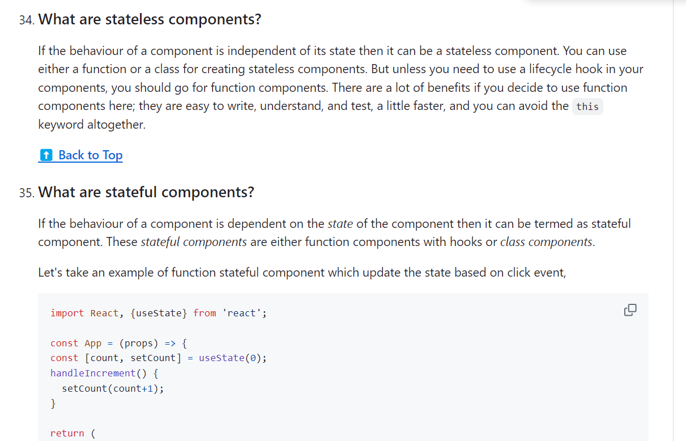
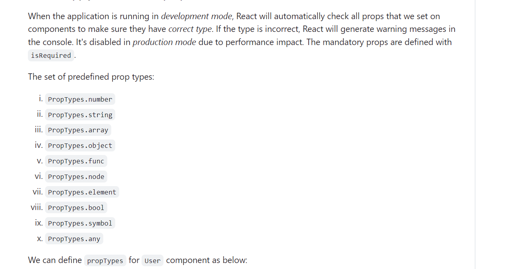
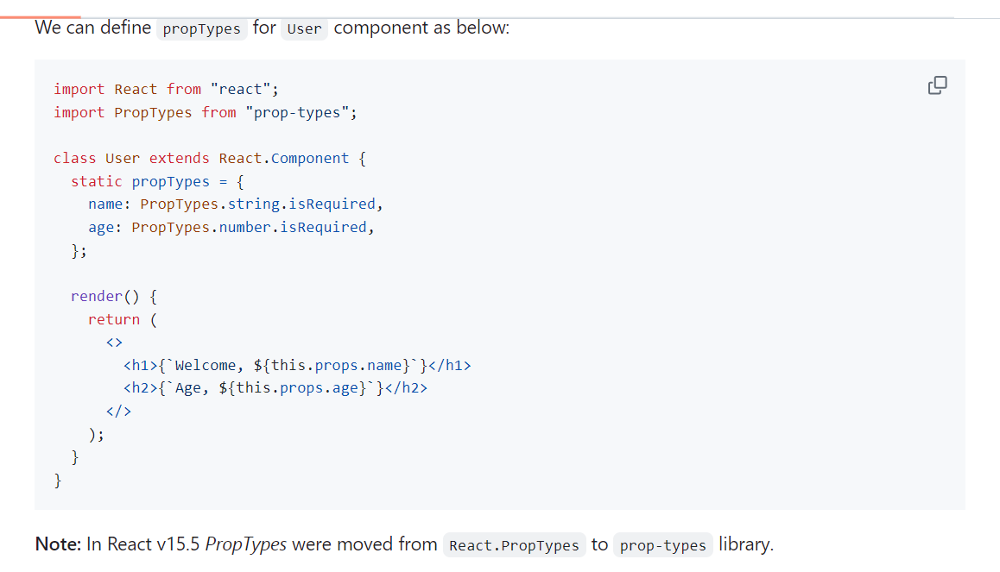
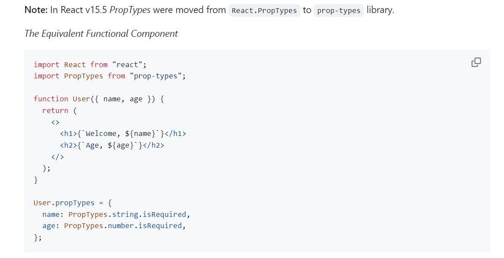
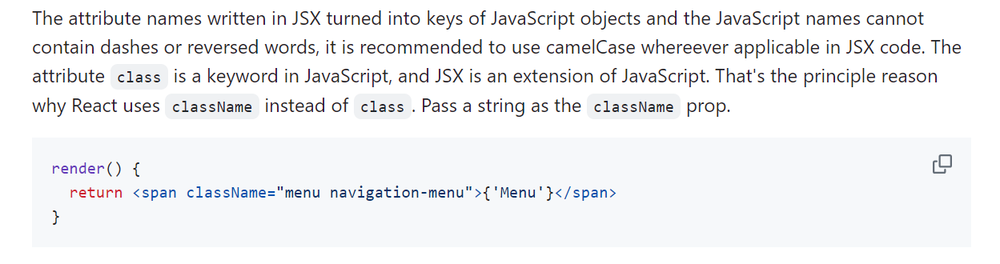
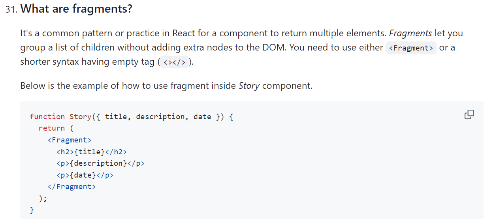
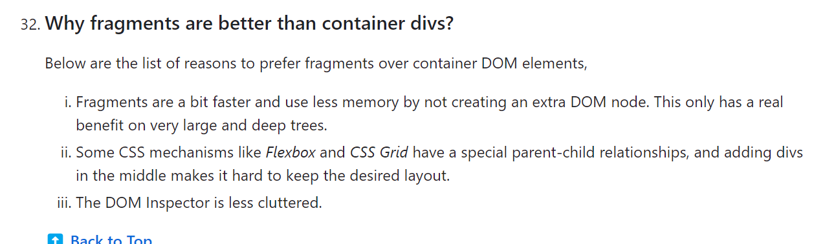
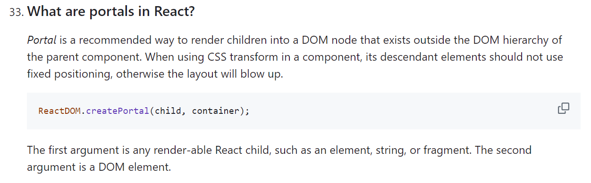
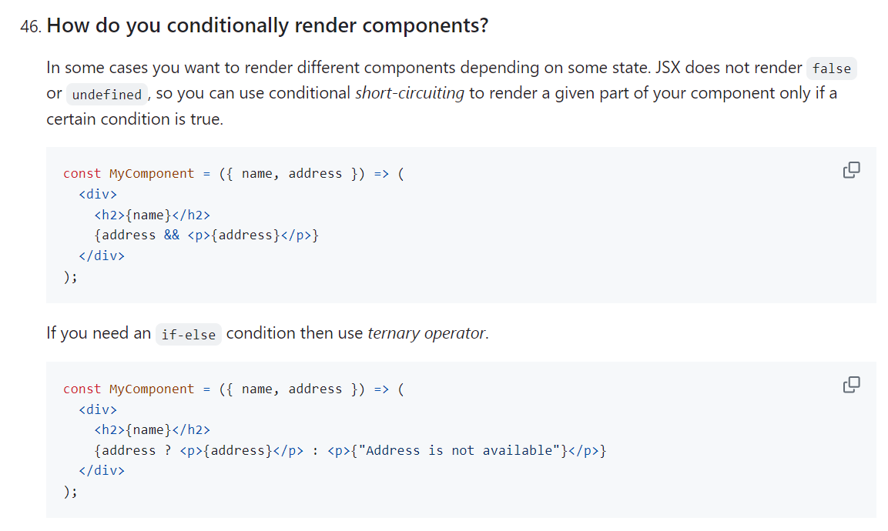
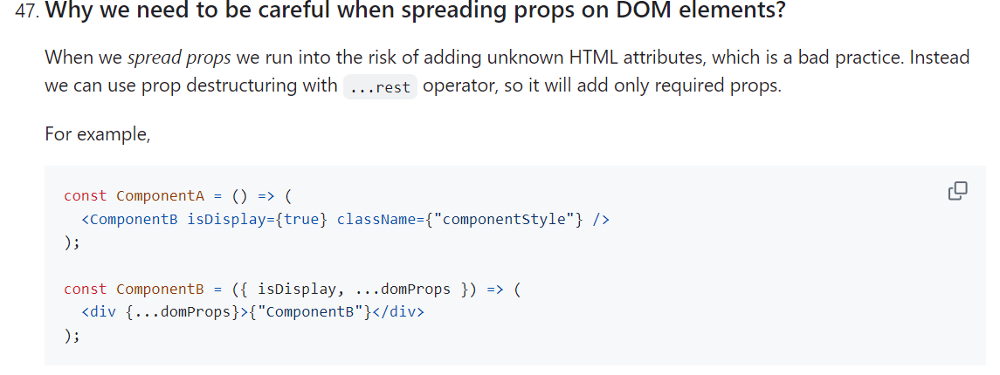

# JSX, Components, and Props (Senior Frontend Engineer Perspective)

Before going deeper into frameworks or libraries, understand this topic as part of real frontend engineering: declaring UI as composable functions of data.

---

# 1. Fundamentals

* React helps build interactive interfaces from reusable components.
* Modern React is centered on function components, props, state, effects, hooks, and predictable rendering.
* Good React code separates UI state, server state, derived values, effects, and reusable logic.

---

# 2. Core Concepts

| Concept | Practical meaning |
| ------- | ----------------- |
| Component | A reusable piece of UI. |
| Props | Inputs passed from parent to child. |
| State | Data that changes over time and triggers rendering. |
| Effect | Synchronization with systems outside React rendering. |
| Render | Calling components to describe UI. |
| Commit | Applying changes to the host environment such as the DOM. |

---

# 3. Internal Working

* React render should stay pure: same inputs should describe the same UI.
* State updates schedule a re-render; React compares the new element tree with the previous tree and commits necessary DOM changes.
* Effects run after commit and should synchronize with external systems such as subscriptions, timers, network, or imperative widgets.

---

# 4. Common Mistakes

* Mutating state directly.
* Putting derived state in state unnecessarily.
* Using effects for calculations that belong in render.
* Using array index keys for reorderable lists.
* Optimizing with memoization before measuring.

---

# 5. Best Practices

* Keep render pure.
* Lift state only when multiple components need it.
* Prefer composition over prop tunnels.
* Use effects only for synchronization.
* Measure before memoizing.

---

# 6. Code Example

```jsx
function EmptyState({ title, action }) {
  return (
    <section aria-labelledby="empty-title">
      <h2 id="empty-title">{title}</h2>
      {action}
    </section>
  );
}

export default function OrdersPage({ orders }) {
  if (orders.length === 0) {
    return <EmptyState title="No orders yet" action={<button>Create order</button>} />;
  }

  return orders.map((order) => <article key={order.id}>{order.name}</article>);
}
```

---

# 7. Real-world Scenarios

* A component re-renders because parent state changed.
* A list has wrong input values because keys are unstable.
* An effect keeps refetching because dependencies are unstable.

---

# 7.1 Practical Revision Notes from `react_1.docx`

## `children` Prop

`children` is the JSX placed between a component's opening and closing tags.

```jsx
function Card({ children }) {
  return <section className="card">{children}</section>;
}

function App() {
  return (
    <Card>
      <h2>Dashboard</h2>
      <p>Welcome back.</p>
    </Card>
  );
}
```

Use `children` for layout and slot-style composition when the wrapper does not need to inject dynamic data into the child.

TypeScript:

```tsx
type CardProps = {
  children: React.ReactNode;
};
```

Safe handling:

```jsx
React.Children.map(children, (child) => <div>{child}</div>);
```

## Render Prop vs `children`

| Pattern | Use when |
| ------- | -------- |
| `children` as JSX | You want to place static or structural UI inside a wrapper |
| render prop | The component provides data/logic and the consumer decides the UI |
| `children` as function | Same idea as render props, but using the `children` prop |

```jsx
function DataFetcher({ url, render, children }) {
  const [data, setData] = React.useState(null);

  React.useEffect(() => {
    fetch(url).then((res) => res.json()).then(setData);
  }, [url]);

  if (typeof children === "function") return children(data);
  if (render) return render(data);
  return null;
}
```

Modern React often replaces render props with custom hooks, but render props still appear in older codebases and libraries.

## `className` and Fragments

React uses `className` instead of `class` because JSX is JavaScript syntax and `class` is a JavaScript keyword.

```jsx
return <div className="panel">Content</div>;
```

Fragments do not render a real DOM element, so they cannot receive `className`, `id`, or styles.

```jsx
// Invalid: Fragment has no DOM node to style.
<React.Fragment className="wrapper">
  <Header />
  <Main />
</React.Fragment>
```

If you need styling, use a real wrapper element, parent CSS selector, or a reusable wrapper component.

## Prop Validation

For JavaScript projects, use the `prop-types` package. For larger apps, prefer TypeScript because it catches many contract mistakes during development.

```jsx
import PropTypes from "prop-types";

Card.propTypes = {
  children: PropTypes.node,
};
```

### Visual Notes from `react_1.docx`





















## React Advantages and Limitations

Advantages:

* component-based UI
* strong ecosystem
* declarative rendering
* virtual DOM/reconciliation model
* works with client rendering, server rendering, and hybrid frameworks
* good testing support with tools like Testing Library

Limitations:

* React is a UI library, not a full framework
* routing, data fetching, state management, and build setup need choices
* JSX and component patterns have a learning curve
* too many tiny components or abstractions can create unnecessary complexity

# 8. Senior Deep Dive

## When to Use

* Use local state for local UI, context for scoped shared values, server-state tools for remote cache, and global stores for truly cross-cutting client state.
* Use effects for synchronization with external systems, not for derived render calculations.
* Use composition before adding global state.

## Debug Checklist

* Use React DevTools to inspect props, state, owners, and render causes.
* Check keys, effect dependencies, stale closures, and state mutation.
* Profile before adding memoization.

## Code Review Checklist

* Is state owned by the smallest sensible component?
* Are effects necessary and cleaned up?
* Are data fetching states and accessibility states complete?


---

# Revision Notes

* JSX, Components, and Props matters because it affects real users, future maintainers, and production behavior.
* Learn the mental model before memorizing syntax.
* Use browser DevTools, tests, and small examples to verify behavior.
* React helps build interactive interfaces from reusable components.
* Modern React is centered on function components, props, state, effects, hooks, and predictable rendering.
* Good React code separates UI state, server state, derived values, effects, and reusable logic.

---

# Cheat Sheet

| Concept | Practical meaning |
| ------- | ----------------- |
| Component | A reusable piece of UI. |
| Props | Inputs passed from parent to child. |
| State | Data that changes over time and triggers rendering. |
| Effect | Synchronization with systems outside React rendering. |
| Render | Calling components to describe UI. |
| Commit | Applying changes to the host environment such as the DOM. |

---

# Interview Questions with Answers

### 1. What is JSX actually compiled into?

JSX is syntax that tooling transforms into JavaScript calls that describe React elements. It is not HTML, which is why attributes, expressions, casing, and component names follow JavaScript/React rules.

### 2. What makes a good component prop API?

It is explicit, minimal, hard to misuse, and shaped around product behavior rather than internal implementation. Good props make states and variants clear without forcing every parent to know component internals.

### 3. When is prop drilling acceptable?

It is acceptable for a few levels when the data is local to that branch and the flow is clear. Context or a store is better when many distant components need the same value or prop chains are hiding ownership.

### 4. Why should components avoid mutating props?

Props are owned by the parent. Mutating them creates hidden side effects, breaks React's data flow, and can cause skipped renders or confusing state changes. Components should request changes through callbacks.

### 5. What prop/component issues do you look for in review?

Boolean prop explosions, unclear children usage, unstable callback contracts, missing accessibility props, duplicated component variants, and props that expose internal styling details instead of supported behavior.

---

# Hands-on Exercises

## Exercise 1

Create a React component that demonstrates JSX, Components, and Props.

### Solution

Include props, state or effects only when needed, stable keys for lists, and visible loading/error/empty states where relevant.

## Exercise 2

Review the component with React DevTools.

### Solution

Inspect props, state ownership, render behavior, effect dependencies, and accessibility names.

---

# Senior Frontend Engineer Takeaway

For senior-level work, JSX, Components, and Props is not only a syntax topic. You should be able to explain the mental model, choose the right pattern for a product requirement, identify common failure modes, and verify behavior through tooling, tests, and browser inspection.
