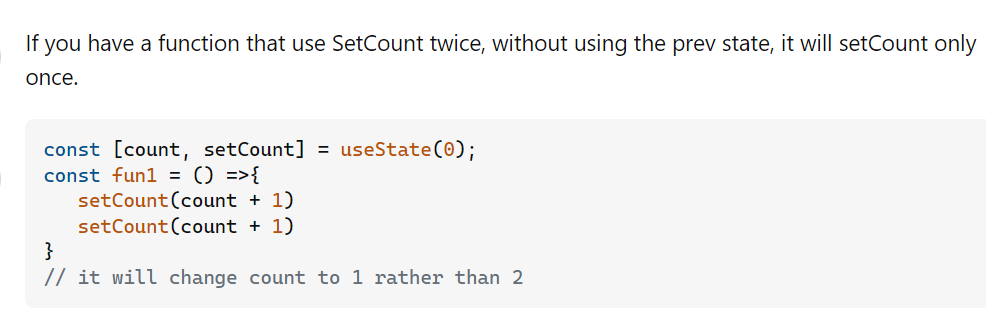

# State, useState, and Events (Senior Frontend Engineer Perspective)

Before going deeper into frameworks or libraries, understand this topic as part of real frontend engineering: local component state and user interactions.

---

# 1. Fundamentals

* React helps build interactive interfaces from reusable components.
* Modern React is centered on function components, props, state, effects, hooks, and predictable rendering.
* Good React code separates UI state, server state, derived values, effects, and reusable logic.

---

# 2. Core Concepts

| Concept | Practical meaning |
| ------- | ----------------- |
| Component | A reusable piece of UI. |
| Props | Inputs passed from parent to child. |
| State | Data that changes over time and triggers rendering. |
| Effect | Synchronization with systems outside React rendering. |
| Render | Calling components to describe UI. |
| Commit | Applying changes to the host environment such as the DOM. |

---

# 3. Internal Working

* React render should stay pure: same inputs should describe the same UI.
* State updates schedule a re-render; React compares the new element tree with the previous tree and commits necessary DOM changes.
* Effects run after commit and should synchronize with external systems such as subscriptions, timers, network, or imperative widgets.

---

# 4. Common Mistakes

* Mutating state directly.
* Putting derived state in state unnecessarily.
* Using effects for calculations that belong in render.
* Using array index keys for reorderable lists.
* Optimizing with memoization before measuring.

---

# 5. Best Practices

* Keep render pure.
* Lift state only when multiple components need it.
* Prefer composition over prop tunnels.
* Use effects only for synchronization.
* Measure before memoizing.

---

# 6. Code Example

```jsx
import { useState } from "react";

function QuantitySelector({ initialValue = 1 }) {
  const [quantity, setQuantity] = useState(initialValue);

  return (
    <div>
      <button onClick={() => setQuantity((value) => Math.max(1, value - 1))}>-</button>
      <output aria-label="Quantity">{quantity}</output>
      <button onClick={() => setQuantity((value) => value + 1)}>+</button>
    </div>
  );
}
```

---

# 7. Real-world Scenarios

* A component re-renders because parent state changed.
* A list has wrong input values because keys are unstable.
* An effect keeps refetching because dependencies are unstable.

---

# 7.1 Functional State Updates and Lifting State

Use the functional updater form when the next state depends on the previous state.

```jsx
setCount((previousCount) => previousCount + 1);
```

This avoids stale values when React batches updates or when multiple updates happen in one event.

```jsx
function Counter() {
  const [count, setCount] = React.useState(0);

  function addThree() {
    setCount((count) => count + 1);
    setCount((count) => count + 1);
    setCount((count) => count + 1);
  }

  return <button onClick={addThree}>{count}</button>;
}
```

## Lifting State Up

Lift state to the closest common parent when multiple child components need the same changing value.

```jsx
function Parent() {
  const [selectedId, setSelectedId] = React.useState(null);

  return (
    <>
      <List selectedId={selectedId} onSelect={setSelectedId} />
      <Details selectedId={selectedId} />
    </>
  );
}
```

Do not lift state higher than needed. Too much lifted state makes unrelated components re-render and increases prop passing.

### Visual Notes from `react_1.docx`



## Class Component `this.setState` Binding

In class components, normal methods do not automatically bind `this`.

```jsx
class Counter extends React.Component {
  constructor(props) {
    super(props);
    this.state = { count: 0 };
    this.increment = this.increment.bind(this);
  }

  increment() {
    this.setState((state) => ({ count: state.count + 1 }));
  }
}
```

Arrow class fields avoid manual binding because they capture lexical `this`.

# 8. Senior Deep Dive

## When to Use

* Use local state for local UI, context for scoped shared values, server-state tools for remote cache, and global stores for truly cross-cutting client state.
* Use effects for synchronization with external systems, not for derived render calculations.
* Use composition before adding global state.

## Debug Checklist

* Use React DevTools to inspect props, state, owners, and render causes.
* Check keys, effect dependencies, stale closures, and state mutation.
* Profile before adding memoization.

## Code Review Checklist

* Is state owned by the smallest sensible component?
* Are effects necessary and cleaned up?
* Are data fetching states and accessibility states complete?


---

# Revision Notes

* State, useState, and Events matters because it affects real users, future maintainers, and production behavior.
* Learn the mental model before memorizing syntax.
* Use browser DevTools, tests, and small examples to verify behavior.
* React helps build interactive interfaces from reusable components.
* Modern React is centered on function components, props, state, effects, hooks, and predictable rendering.
* Good React code separates UI state, server state, derived values, effects, and reusable logic.

---

# Cheat Sheet

| Concept | Practical meaning |
| ------- | ----------------- |
| Component | A reusable piece of UI. |
| Props | Inputs passed from parent to child. |
| State | Data that changes over time and triggers rendering. |
| Effect | Synchronization with systems outside React rendering. |
| Render | Calling components to describe UI. |
| Commit | Applying changes to the host environment such as the DOM. |

---

# Interview Questions with Answers

### 1. Why should React state be treated as immutable?

React uses reference changes to know when state changed and to support predictable rendering. Mutating the existing object or array can cause skipped renders, stale UI, and bugs that are hard to trace.

### 2. When should you use the functional form of `setState`?

Use it when the next state depends on the previous state, especially with repeated clicks, timers, async callbacks, or batched updates: `setCount((count) => count + 1)`.

### 3. Why might `console.log(state)` after `setState` show the old value?

State updates are scheduled; they do not synchronously replace the variable in the current render. The logged value belongs to the current closure. Inspect the next render or use an effect when you need to observe committed state.

### 4. How do you decide whether something should be state or a derived value?

If it can be calculated from props or existing state during render, derive it instead of storing another copy. Extra state creates synchronization bugs, especially with filters, totals, selected labels, and validation summaries.

### 5. What state/event bugs do you look for in review?

Direct mutation, duplicated derived state, stale closures in handlers, state owned too high or too low, event handlers doing too much work, and updates after async ownership has changed.

---

# Hands-on Exercises

## Exercise 1

Create a React component that demonstrates State, useState, and Events.

### Solution

Include props, state or effects only when needed, stable keys for lists, and visible loading/error/empty states where relevant.

## Exercise 2

Review the component with React DevTools.

### Solution

Inspect props, state ownership, render behavior, effect dependencies, and accessibility names.

---

# Senior Frontend Engineer Takeaway

For senior-level work, State, useState, and Events is not only a syntax topic. You should be able to explain the mental model, choose the right pattern for a product requirement, identify common failure modes, and verify behavior through tooling, tests, and browser inspection.
