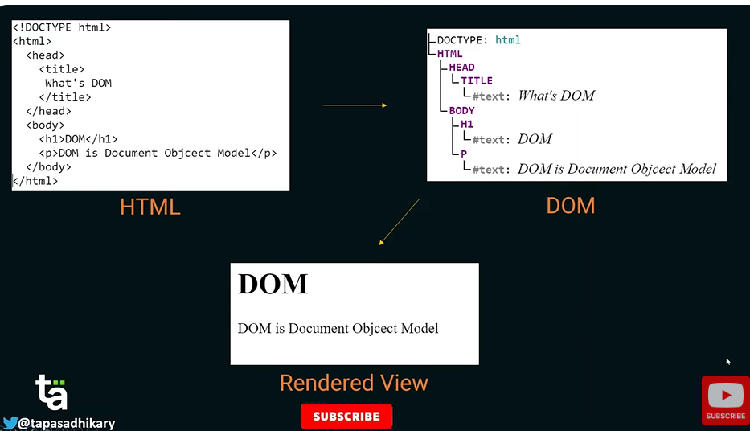

# Rendering, Reconciliation, and Keys (Senior Frontend Engineer Perspective)

Before going deeper into frameworks or libraries, understand this topic as part of real frontend engineering: how React updates UI and why identity matters.

---

# 1. Fundamentals

* React helps build interactive interfaces from reusable components.
* Modern React is centered on function components, props, state, effects, hooks, and predictable rendering.
* Good React code separates UI state, server state, derived values, effects, and reusable logic.

---

# 2. Core Concepts

| Concept | Practical meaning |
| ------- | ----------------- |
| Component | A reusable piece of UI. |
| Props | Inputs passed from parent to child. |
| State | Data that changes over time and triggers rendering. |
| Effect | Synchronization with systems outside React rendering. |
| Render | Calling components to describe UI. |
| Commit | Applying changes to the host environment such as the DOM. |

---

# 3. Internal Working

* React render should stay pure: same inputs should describe the same UI.
* State updates schedule a re-render; React compares the new element tree with the previous tree and commits necessary DOM changes.
* Effects run after commit and should synchronize with external systems such as subscriptions, timers, network, or imperative widgets.

---

# 4. Common Mistakes

* Mutating state directly.
* Putting derived state in state unnecessarily.
* Using effects for calculations that belong in render.
* Using array index keys for reorderable lists.
* Optimizing with memoization before measuring.

---

# 5. Best Practices

* Keep render pure.
* Lift state only when multiple components need it.
* Prefer composition over prop tunnels.
* Use effects only for synchronization.
* Measure before memoizing.

---

# 6. Code Example

```jsx
function CartItems({ items }) {
  return (
    <ul>
      {items.map((item) => (
        <li key={item.id}>
          {item.name} - {item.quantity}
        </li>
      ))}
    </ul>
  );
}

// Stable keys preserve identity when items are inserted, removed, or reordered.
```

---

# 7. Real-world Scenarios

* A component re-renders because parent state changed.
* A list has wrong input values because keys are unstable.
* An effect keeps refetching because dependencies are unstable.

---

# 7.1 Virtual DOM, Reconciliation, Fiber, and Browser DOM

The DOM is the browser's live document tree. React does not usually mutate DOM nodes manually from your component code. Instead, components return React elements, React compares the new element tree with the previous one, and React commits the needed DOM changes.

```text
JSX -> React elements -> render work -> reconciliation -> commit DOM changes -> browser paints
```

Key distinction:

| Concept | Meaning |
| ------- | ------- |
| DOM update | Actual browser DOM node/attribute/text change |
| Re-render | React calls components again to calculate the next UI |
| Reconciliation | React compares previous and next element trees |
| Commit | React applies changes to the real DOM |

Reconciliation rules to remember:

* If the root element type changes, React tears down the old subtree and creates a new one.
* If the element type is the same, React updates changed attributes and keeps the existing DOM node where possible.
* Stable keys help React preserve identity inside lists.

## Virtual DOM vs Shadow DOM

| Topic | Virtual DOM | Shadow DOM |
| ----- | ----------- | ---------- |
| What it is | In-memory UI representation used by libraries like React | Browser feature for DOM/CSS encapsulation |
| Main goal | Efficient UI reconciliation | Web component encapsulation |
| Owned by | JavaScript library/runtime | Browser platform |

## React Fiber

React Fiber is React's internal reconciliation architecture introduced in React 16. It lets React split rendering work into smaller units, prioritize updates, pause work, resume work, and support modern concurrent rendering behavior.

### Visual Notes from `react_1.docx`



# 8. Senior Deep Dive

## When to Use

* Use local state for local UI, context for scoped shared values, server-state tools for remote cache, and global stores for truly cross-cutting client state.
* Use effects for synchronization with external systems, not for derived render calculations.
* Use composition before adding global state.

## Debug Checklist

* Use React DevTools to inspect props, state, owners, and render causes.
* Check keys, effect dependencies, stale closures, and state mutation.
* Profile before adding memoization.

## Code Review Checklist

* Is state owned by the smallest sensible component?
* Are effects necessary and cleaned up?
* Are data fetching states and accessibility states complete?


---

# Revision Notes

* Rendering, Reconciliation, and Keys matters because it affects real users, future maintainers, and production behavior.
* Learn the mental model before memorizing syntax.
* Use browser DevTools, tests, and small examples to verify behavior.
* React helps build interactive interfaces from reusable components.
* Modern React is centered on function components, props, state, effects, hooks, and predictable rendering.
* Good React code separates UI state, server state, derived values, effects, and reusable logic.

---

# Cheat Sheet

| Concept | Practical meaning |
| ------- | ----------------- |
| Component | A reusable piece of UI. |
| Props | Inputs passed from parent to child. |
| State | Data that changes over time and triggers rendering. |
| Effect | Synchronization with systems outside React rendering. |
| Render | Calling components to describe UI. |
| Commit | Applying changes to the host environment such as the DOM. |

---

# Interview Questions with Answers

### 1. What does React reconciliation do?

React compares the previous and next element trees to decide what needs to change in the host environment. It uses component type and keys to preserve or replace component instances and their state.

### 2. Why are array indexes risky as keys?

Indexes break when items are inserted, removed, filtered, or reordered because React may preserve state for the wrong item. This shows up as wrong input values, broken animations, or selected state moving to another row.

### 3. When is using an index as a key acceptable?

It is acceptable for a static list that never reorders, filters, inserts, or deletes and has no item-local state. Even then, a stable id is usually clearer if one exists.

### 4. Why can changing a component's key reset its state?

A different key tells React it is a different component instance, so React unmounts the old one and mounts a new one. This can be useful for resetting forms, but accidental key changes cause lost state.

### 5. What rendering/key issues do you look for in review?

Unstable keys from indexes or random values, state stored in list rows without stable identity, expensive work during render, accidental remounts, and components relying on effects to fix data that could be derived during render.

---

# Hands-on Exercises

## Exercise 1

Create a React component that demonstrates Rendering, Reconciliation, and Keys.

### Solution

Include props, state or effects only when needed, stable keys for lists, and visible loading/error/empty states where relevant.

## Exercise 2

Review the component with React DevTools.

### Solution

Inspect props, state ownership, render behavior, effect dependencies, and accessibility names.

---

# Senior Frontend Engineer Takeaway

For senior-level work, Rendering, Reconciliation, and Keys is not only a syntax topic. You should be able to explain the mental model, choose the right pattern for a product requirement, identify common failure modes, and verify behavior through tooling, tests, and browser inspection.
