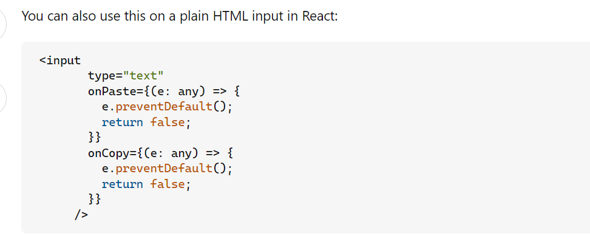

# React Forms, Controlled and Uncontrolled Inputs (Senior Frontend Engineer Perspective)

Before going deeper into frameworks or libraries, understand this topic as part of real frontend engineering: handling input state and submission in React.

---

# 1. Fundamentals

* React helps build interactive interfaces from reusable components.
* Modern React is centered on function components, props, state, effects, hooks, and predictable rendering.
* Good React code separates UI state, server state, derived values, effects, and reusable logic.

---

# 2. Core Concepts

| Concept | Practical meaning |
| ------- | ----------------- |
| Component | A reusable piece of UI. |
| Props | Inputs passed from parent to child. |
| State | Data that changes over time and triggers rendering. |
| Effect | Synchronization with systems outside React rendering. |
| Render | Calling components to describe UI. |
| Commit | Applying changes to the host environment such as the DOM. |

---

# 3. Internal Working

* React render should stay pure: same inputs should describe the same UI.
* State updates schedule a re-render; React compares the new element tree with the previous tree and commits necessary DOM changes.
* Effects run after commit and should synchronize with external systems such as subscriptions, timers, network, or imperative widgets.

---

# 4. Common Mistakes

* Mutating state directly.
* Putting derived state in state unnecessarily.
* Using effects for calculations that belong in render.
* Using array index keys for reorderable lists.
* Optimizing with memoization before measuring.

---

# 5. Best Practices

* Keep render pure.
* Lift state only when multiple components need it.
* Prefer composition over prop tunnels.
* Use effects only for synchronization.
* Measure before memoizing.

---

# 6. Code Example

```jsx
function SignupForm() {
  function handleSubmit(event) {
    event.preventDefault();
    const form = new FormData(event.currentTarget);
    const values = Object.fromEntries(form);
    console.log(values);
  }

  return (
    <form onSubmit={handleSubmit}>
      <label htmlFor="email">Email</label>
      <input id="email" name="email" type="email" required />
      <button type="submit">Create account</button>
    </form>
  );
}
```

---

# 7. Real-world Scenarios

* A component re-renders because parent state changed.
* A list has wrong input values because keys are unstable.
* An effect keeps refetching because dependencies are unstable.

---

# 7.1 Controlled vs Uncontrolled Inputs

| Type | Source of truth | Access value with | Best for |
| ---- | --------------- | ----------------- | -------- |
| Controlled | React state | state variable | validation, conditional UI, instant feedback |
| Uncontrolled | DOM input itself | `ref` or `FormData` | simple forms, file inputs, less rerendering |

Controlled:

```jsx
function NameInput() {
  const [name, setName] = React.useState("");

  return <input value={name} onChange={(event) => setName(event.target.value)} />;
}
```

Uncontrolled:

```jsx
function NameForm() {
  const inputRef = React.useRef(null);

  function handleSubmit(event) {
    event.preventDefault();
    console.log(inputRef.current.value);
  }

  return (
    <form onSubmit={handleSubmit}>
      <input ref={inputRef} name="name" />
      <button>Save</button>
    </form>
  );
}
```

Do not use refs as a replacement for normal UI state. Refs are useful when you need DOM access, previous values, render counters, timers, or uncontrolled inputs.

Uncontrolled ref submit is useful for small forms where you only need the value on submit:

```jsx
function FeedbackForm() {
  const messageRef = React.useRef(null);

  function handleSubmit(event) {
    event.preventDefault();
    alert(messageRef.current.value);
  }

  return (
    <form onSubmit={handleSubmit}>
      <label htmlFor="message">Message</label>
      <textarea id="message" ref={messageRef} name="message" />
      <button type="submit">Send</button>
    </form>
  );
}
```

## Disabling Copy/Paste

React can intercept copy/paste events, but this is a UX rule, not real security. Users can still bypass it through browser tools or other inputs.

```jsx
<input
  onCopy={(event) => event.preventDefault()}
  onPaste={(event) => event.preventDefault()}
/>
```

Use this only for a clear product requirement. Avoid blocking password managers, accessibility tools, or normal user workflows without a strong reason.

### Visual Notes from `react_1.docx`



# 8. Senior Deep Dive

## When to Use

* Use local state for local UI, context for scoped shared values, server-state tools for remote cache, and global stores for truly cross-cutting client state.
* Use effects for synchronization with external systems, not for derived render calculations.
* Use composition before adding global state.

## Debug Checklist

* Use React DevTools to inspect props, state, owners, and render causes.
* Check keys, effect dependencies, stale closures, and state mutation.
* Profile before adding memoization.

## Code Review Checklist

* Is state owned by the smallest sensible component?
* Are effects necessary and cleaned up?
* Are data fetching states and accessibility states complete?


---

# Revision Notes

* React Forms, Controlled and Uncontrolled Inputs matters because it affects real users, future maintainers, and production behavior.
* Learn the mental model before memorizing syntax.
* Use browser DevTools, tests, and small examples to verify behavior.
* React helps build interactive interfaces from reusable components.
* Modern React is centered on function components, props, state, effects, hooks, and predictable rendering.
* Good React code separates UI state, server state, derived values, effects, and reusable logic.

---

# Cheat Sheet

| Concept | Practical meaning |
| ------- | ----------------- |
| Component | A reusable piece of UI. |
| Props | Inputs passed from parent to child. |
| State | Data that changes over time and triggers rendering. |
| Effect | Synchronization with systems outside React rendering. |
| Render | Calling components to describe UI. |
| Commit | Applying changes to the host environment such as the DOM. |

---

# Interview Questions with Answers

### 1. What is the difference between controlled and uncontrolled inputs in React?

A controlled input gets its value from React state and updates through React handlers. An uncontrolled input keeps its current value in the DOM and is read with a ref or form submission. Controlled inputs give more control; uncontrolled inputs can be simpler and faster for some forms.

### 2. When would you avoid making every field controlled?

Very large forms, file inputs, third-party widgets, or simple submit-only forms may not need every keystroke in React state. The choice should balance validation, conditional UI, performance, and simplicity.

### 3. Why do controlled inputs sometimes feel laggy?

Every keystroke schedules React work. Lag can come from expensive parent renders, validation on every input, formatting logic, large lists, or uncontrolled re-renders. Isolate field state, defer expensive work, or validate on blur/change with care.

### 4. How do you make form errors accessible in React?

Connect error text to fields with `aria-describedby`, use clear messages, preserve labels, avoid color-only errors, and focus the first invalid field on submit only when it helps the user recover.

### 5. What form issues do you look for in review?

Missing labels, controlled/uncontrolled warnings, validation that fights user typing, disabled submit with no explanation, client-only validation, poor autofill support, and no loading/error state during submit.

---

# Hands-on Exercises

## Exercise 1

Create a React component that demonstrates React Forms, Controlled and Uncontrolled Inputs.

### Solution

Include props, state or effects only when needed, stable keys for lists, and visible loading/error/empty states where relevant.

## Exercise 2

Review the component with React DevTools.

### Solution

Inspect props, state ownership, render behavior, effect dependencies, and accessibility names.

---

# Senior Frontend Engineer Takeaway

For senior-level work, React Forms, Controlled and Uncontrolled Inputs is not only a syntax topic. You should be able to explain the mental model, choose the right pattern for a product requirement, identify common failure modes, and verify behavior through tooling, tests, and browser inspection.
