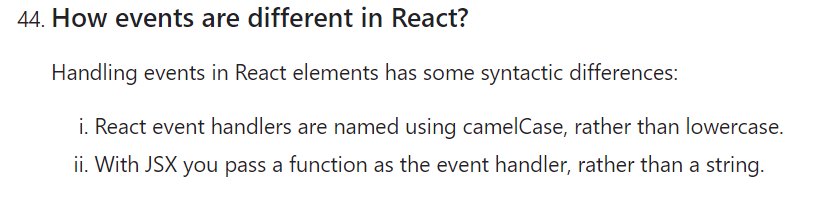
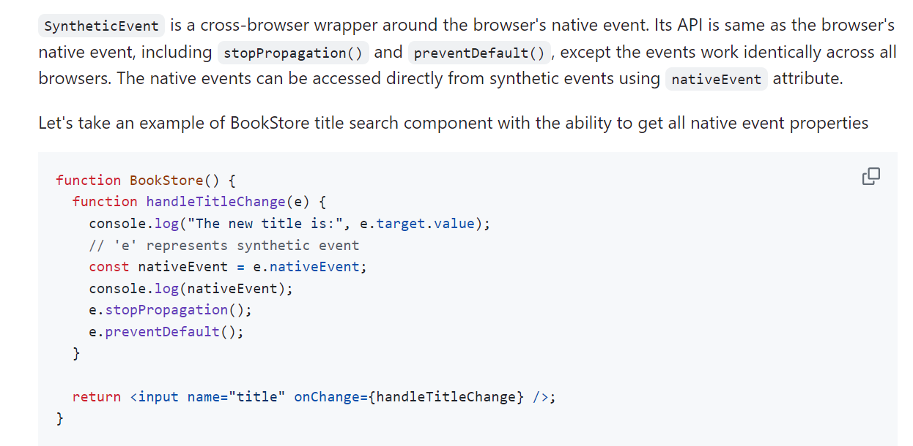
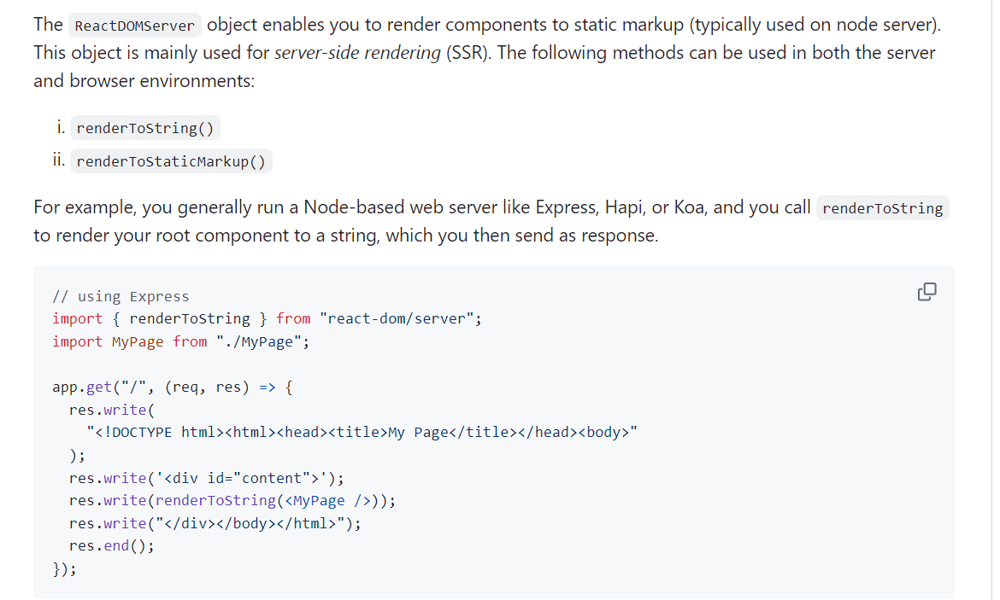

# React Revision and Interview Notes

This file incorporates React revision points from the pasted `JS revision.md` notes.

---

# 1. React Basics

React is an open-source JavaScript library for building interactive and reusable user interfaces.

Why use React:

* component-based architecture
* declarative UI
* reusable components
* unidirectional data flow
* strong ecosystem
* React Router, Redux, Next.js support
* React Native knowledge transfer
* JSX syntax

React was created by Jordan Walke at Facebook and open-sourced in 2013.

Do not memorize "latest React version" from old notes. React versions change, so check the official React release notes when version accuracy matters.

---

# 2. JSX Syntax

JSX lets us write HTML-like syntax inside JavaScript. It is compiled into JavaScript by tools such as Babel.

Rules:

* return one parent element or a fragment
* close all tags
* use `className` instead of `class`
* write JavaScript expressions inside `{}`
* use camelCase attributes like `onClick` and `tabIndex`
* use ternary or `&&` for conditional rendering

```jsx
function Welcome({ name }) {
  return (
    <div>
      <h1>Hello, {name}</h1>
      <button onClick={() => alert("Clicked")}>Click Me</button>
    </div>
  );
}
```

---

# 3. Functional vs Class Components

| Feature | Functional Component | Class Component |
| ------- | -------------------- | --------------- |
| Definition | Function returning JSX | Class extending `React.Component` |
| State | Hooks like `useState` | `this.state` |
| Lifecycle | Hooks like `useEffect` | Lifecycle methods |
| Syntax | Shorter and simpler | More verbose |
| `this` binding | Not needed | Often needed |
| Modern usage | Preferred | Mostly legacy |

Interview answer:

```text
I prefer functional components with Hooks because they are simpler, avoid this-binding issues, and are the current React standard. I use class components mainly when maintaining legacy code.
```

---

# 4. Virtual DOM and Reconciliation

Virtual DOM is a lightweight in-memory representation of the real DOM.

```text
State/props change
  -> new React element tree
  -> React compares with previous tree
  -> reconciliation decides changes
  -> React commits DOM updates
```

Reconciliation uses component type, props, keys, diffing, and batching.

Keys help React identify list items across updates.

---

# 5. Props vs State

| Concept | Meaning |
| ------- | ------- |
| Props | Data passed from parent to child |
| State | Data owned by a component and changed over time |

```jsx
function Greeting({ name }) {
  return <h1>Hello {name}</h1>;
}

function Counter() {
  const [count, setCount] = React.useState(0);
  return <button onClick={() => setCount(count + 1)}>{count}</button>;
}
```

---

# 6. React Events and SyntheticEvent

React events use camelCase names.

Differences from plain HTML event attributes:

* React event handlers are named with camelCase, such as `onClick`.
* JSX receives a function reference, not a string of JavaScript code.

```jsx
function MyButton() {
  function handleClick(event) {
    event.preventDefault();
    console.log("Clicked");
  }

  return <button onClick={handleClick}>Click</button>;
}
```

SyntheticEvent is React's wrapper around native browser events.

Important:

* use `event.preventDefault()` to stop default browser behavior
* use `event.stopPropagation()` to stop bubbling
* modern React no longer has the old event pooling issue in the same way older React versions did

Visual notes:





---

# 7. Conditional Rendering

```jsx
if (isLoading) return <p>Loading...</p>;

return isLoggedIn ? <Dashboard /> : <Login />;
```

Be careful:

```jsx
{count && <p>Messages</p>}
```

If `count` is `0`, React can render `0`. Prefer:

```jsx
{count > 0 && <p>Messages</p>}
```

---

# 8. Lists and Keys

```jsx
function UserList({ users }) {
  return (
    <ul>
      {users.map((user) => (
        <li key={user.id}>{user.name}</li>
      ))}
    </ul>
  );
}
```

Keys should be stable, unique among siblings, and based on IDs when possible.

Avoid index keys for lists that can reorder, insert, or delete items.

---

# 9. Lifecycle

Class phases:

```text
Mounting: constructor -> getDerivedStateFromProps -> render -> componentDidMount
Updating: getDerivedStateFromProps -> shouldComponentUpdate -> render -> componentDidUpdate
Unmounting: componentWillUnmount
```

Functional lifecycle with hooks:

```jsx
useEffect(() => {
  // setup

  return () => {
    // cleanup
  };
}, [dependency]);
```

Effect cleanup runs before the next effect when dependencies change and also on unmount.

Error handling lifecycle methods:

```text
getDerivedStateFromError -> update fallback state
componentDidCatch        -> log/report error details
```

Class update lifecycle reminder:

```text
getDerivedStateFromProps -> shouldComponentUpdate -> render -> getSnapshotBeforeUpdate -> componentDidUpdate
```

`getSnapshotBeforeUpdate` is useful when you need information from the DOM before React applies the final update, such as preserving scroll position.

Practical class lifecycle map:

| Method | When it runs | Common use |
| ------ | ------------ | ---------- |
| `componentDidMount` | After first render is committed | initial API calls, subscriptions, imperative setup |
| `componentDidUpdate` | After updates are committed | react to changed props/state with guarded logic |
| `componentWillUnmount` | Before removal | cleanup timers, subscriptions, sockets |
| `getDerivedStateFromProps` | Before render on mount/update | rare derived state from props |
| `getSnapshotBeforeUpdate` | Before DOM updates are finalized | capture scroll/DOM info before commit |
| `componentDidCatch` | When child render error is caught | log errors in error boundaries |

Modern React normally expresses setup/update/cleanup with hooks, but class lifecycle knowledge is still useful for legacy code and interviews.

---

# 10. `react-dom` and ReactDOMServer

`react-dom` provides DOM-specific React APIs.

Common APIs:

| API | Use |
| --- | --- |
| `createRoot` | mount a React app in modern React |
| `hydrateRoot` | hydrate server-rendered HTML |
| `createPortal` | render outside the parent DOM node |
| `flushSync` | force synchronous DOM update in rare cases |

Legacy APIs you may see in older code:

* `render`
* `hydrate`
* `unmountComponentAtNode`
* `findDOMNode`

`ReactDOMServer` renders React components to HTML on the server. It is used by SSR frameworks and server rendering pipelines.

Visual note:



---

# 11. Production Mode

Production builds remove development warnings and optimize/minify output.

Typical modern command:

```bash
npm run build
```

In custom Webpack setups, `mode: "production"` or DefinePlugin-style environment constants enable production optimizations. Older notes may mention manually defining production mode; modern tools like Vite, Next.js, CRA, and Webpack production mode handle this through build commands.

---

# Interview Checklist

* what React is
* JSX rules
* functional vs class components
* Virtual DOM
* reconciliation
* props vs state
* event handling
* SyntheticEvent
* conditional rendering
* lists and keys
* lifecycle methods
* `useEffect` cleanup
* error boundary lifecycle methods
* `react-dom` and ReactDOMServer
* production build mode
