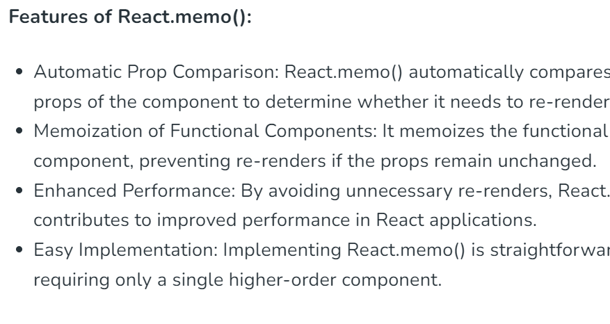
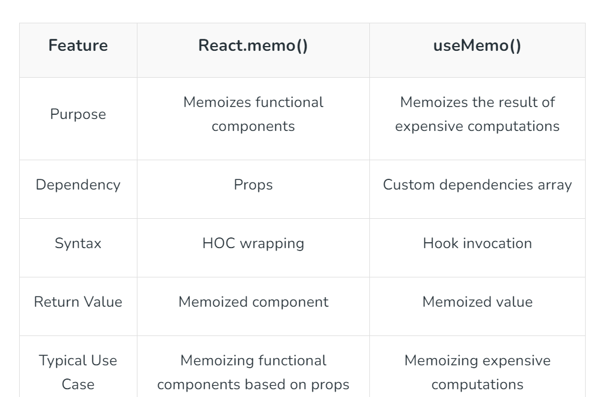
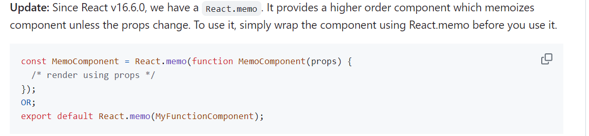

# memo, useMemo, and useCallback (Senior Frontend Engineer Perspective)

Before going deeper into frameworks or libraries, understand this topic as part of real frontend engineering: memoization for correctness of references and measured performance.

---

# 1. Fundamentals

* React helps build interactive interfaces from reusable components.
* Modern React is centered on function components, props, state, effects, hooks, and predictable rendering.
* Good React code separates UI state, server state, derived values, effects, and reusable logic.

---

# 2. Core Concepts

| Concept | Practical meaning |
| ------- | ----------------- |
| Component | A reusable piece of UI. |
| Props | Inputs passed from parent to child. |
| State | Data that changes over time and triggers rendering. |
| Effect | Synchronization with systems outside React rendering. |
| Render | Calling components to describe UI. |
| Commit | Applying changes to the host environment such as the DOM. |

---

# 3. Internal Working

* React render should stay pure: same inputs should describe the same UI.
* State updates schedule a re-render; React compares the new element tree with the previous tree and commits necessary DOM changes.
* Effects run after commit and should synchronize with external systems such as subscriptions, timers, network, or imperative widgets.

---

# 4. Common Mistakes

* Mutating state directly.
* Putting derived state in state unnecessarily.
* Using effects for calculations that belong in render.
* Using array index keys for reorderable lists.
* Optimizing with memoization before measuring.

---

# 5. Best Practices

* Keep render pure.
* Lift state only when multiple components need it.
* Prefer composition over prop tunnels.
* Use effects only for synchronization.
* Measure before memoizing.

---

# 6. Code Example

```jsx
function EmptyState({ title, action }) {
  return (
    <section aria-labelledby="empty-title">
      <h2 id="empty-title">{title}</h2>
      {action}
    </section>
  );
}

export default function OrdersPage({ orders }) {
  if (orders.length === 0) {
    return <EmptyState title="No orders yet" action={<button>Create order</button>} />;
  }

  return orders.map((order) => <article key={order.id}>{order.name}</article>);
}
```

---

# 7. Real-world Scenarios

* A component re-renders because parent state changed.
* A list has wrong input values because keys are unstable.
* An effect keeps refetching because dependencies are unstable.

---

# 7.1 Memoization Quick Map

| Tool | What it memoizes | Use when |
| ---- | ---------------- | -------- |
| `React.memo` | Component result based on props | Child rerenders are expensive and props are often unchanged |
| `useMemo` | Calculated value | Calculation is expensive or a stable object/array reference is needed |
| `useCallback` | Function reference | Passing callbacks to memoized children or hook dependencies |
| `React.PureComponent` | Class component render decision | Legacy/class components need shallow prop/state comparison |

```jsx
const VisibleList = React.memo(function VisibleList({ items, onSelect }) {
  return items.map((item) => (
    <button key={item.id} onClick={() => onSelect(item.id)}>
      {item.name}
    </button>
  ));
});
```

`React.PureComponent` is similar to `React.Component`, but it implements `shouldComponentUpdate` using shallow comparison of props and state.

Memoization is not automatically good. If props are always new references, `React.memo` cannot help much.

`useCallback(fn, deps)` is roughly equivalent to `useMemo(() => fn, deps)`, but `useCallback` communicates the intent more clearly.

Expensive calculation example:

```jsx
function ProductSearch({ products }) {
  const [query, setQuery] = React.useState("");
  const [note, setNote] = React.useState("");

  const filteredProducts = React.useMemo(() => {
    return products.filter((product) =>
      product.name.toLowerCase().includes(query.toLowerCase())
    );
  }, [products, query]);

  return (
    <>
      <input value={query} onChange={(event) => setQuery(event.target.value)} />
      <input value={note} onChange={(event) => setNote(event.target.value)} />
      <p>Draft note: {note}</p>
      {filteredProducts.map((product) => (
        <div key={product.id}>{product.name}</div>
      ))}
    </>
  );
}
```

Here, changing `note` should not recalculate the filtered products.

Stable callback for a memoized child:

```jsx
const UserRow = React.memo(function UserRow({ user, onSelect }) {
  return <button onClick={() => onSelect(user.id)}>{user.name}</button>;
});

function UserList({ users }) {
  const [selectedId, setSelectedId] = React.useState(null);

  const handleSelect = React.useCallback((id) => {
    setSelectedId(id);
  }, []);

  return (
    <>
      <p>Selected: {selectedId ?? "none"}</p>
      {users.map((user) => (
        <UserRow key={user.id} user={user} onSelect={handleSelect} />
      ))}
    </>
  );
}
```

`useCallback` matters here because `UserRow` is memoized. Without a stable callback, the child receives a new function prop on every parent render.

### Visual Notes from `react_1.docx`







# 8. Senior Deep Dive

## When to Use

* Use local state for local UI, context for scoped shared values, server-state tools for remote cache, and global stores for truly cross-cutting client state.
* Use effects for synchronization with external systems, not for derived render calculations.
* Use composition before adding global state.

## Debug Checklist

* Use React DevTools to inspect props, state, owners, and render causes.
* Check keys, effect dependencies, stale closures, and state mutation.
* Profile before adding memoization.

## Code Review Checklist

* Is state owned by the smallest sensible component?
* Are effects necessary and cleaned up?
* Are data fetching states and accessibility states complete?


---

# Revision Notes

* memo, useMemo, and useCallback matters because it affects real users, future maintainers, and production behavior.
* Learn the mental model before memorizing syntax.
* Use browser DevTools, tests, and small examples to verify behavior.
* React helps build interactive interfaces from reusable components.
* Modern React is centered on function components, props, state, effects, hooks, and predictable rendering.
* Good React code separates UI state, server state, derived values, effects, and reusable logic.

---

# Cheat Sheet

| Concept | Practical meaning |
| ------- | ----------------- |
| Component | A reusable piece of UI. |
| Props | Inputs passed from parent to child. |
| State | Data that changes over time and triggers rendering. |
| Effect | Synchronization with systems outside React rendering. |
| Render | Calling components to describe UI. |
| Commit | Applying changes to the host environment such as the DOM. |

---

# Interview Questions with Answers

### 1. How would you explain memo, useMemo, and useCallback in a real project?

React code should be understood as pure rendering plus explicit state and effects. Components describe UI; React decides how to update the DOM.

### 2. What happens internally when memo, useMemo, and useCallback is involved?

State updates schedule rendering; React reconciles element trees using component type and keys, then commits DOM changes and runs effects after commit.

### 3. How do you debug issues related to memo, useMemo, and useCallback?

I check props, state ownership, derived values, keys, effect dependencies, memoization assumptions, and whether server state is being treated as UI state.

### 4. What is the biggest production risk with memo, useMemo, and useCallback?

The biggest risk is building something that works for the demo state but fails with real content, slow networks, accessibility needs, errors, or future changes.

### 5. What should a senior engineer look for in code review?

They should check the mental model, edge cases, accessibility, performance cost, naming, state ownership, test coverage, and whether the simpler native/platform option was considered.

---

# Hands-on Exercises

## Exercise 1

Create a React component that demonstrates memo, useMemo, and useCallback.

### Solution

Include props, state or effects only when needed, stable keys for lists, and visible loading/error/empty states where relevant.

## Exercise 2

Review the component with React DevTools.

### Solution

Inspect props, state ownership, render behavior, effect dependencies, and accessibility names.

---

# Senior Frontend Engineer Takeaway

For senior-level work, memo, useMemo, and useCallback is not only a syntax topic. You should be able to explain the mental model, choose the right pattern for a product requirement, identify common failure modes, and verify behavior through tooling, tests, and browser inspection.
