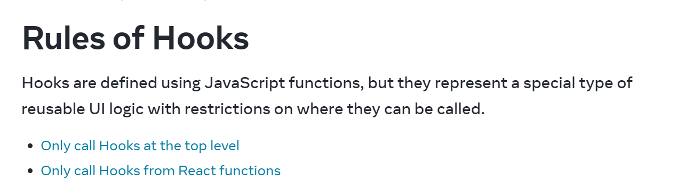

# React Hooks Advanced Revision

This file incorporates advanced React hook notes from the pasted `JS revision.md`.

---

# Rules of Hooks

Hooks are JavaScript functions with React-specific rules.

* Only call hooks at the top level.
* Only call hooks from React function components or custom hooks.
* Do not call hooks inside loops, conditions, nested functions, or normal utility functions.

Why: React relies on hook call order staying the same between renders.

```jsx
function Profile({ userId }) {
  const [user, setUser] = React.useState(null);

  React.useEffect(() => {
    fetch(`/api/users/${userId}`).then((res) => res.json()).then(setUser);
  }, [userId]);

  return <h1>{user?.name}</h1>;
}
```

Visual note:



---

# 1. `React.memo` vs `useMemo`

| Feature | `React.memo` | `useMemo` |
| ------- | ------------ | --------- |
| Type | Higher-order component | Hook |
| Memoizes | Whole component | Computed value |
| Use case | Prevent child re-render when props are same | Avoid expensive recalculation |
| Comparison | Shallow props comparison | Dependency array |

```jsx
const UserCard = React.memo(function UserCard({ user }) {
  return <div>{user.name}</div>;
});

const filteredUsers = useMemo(() => {
  return users.filter((user) => user.active);
}, [users]);
```

---

# 2. `useMemo` vs `useEffect`

`useMemo` calculates a value during render. `useEffect` synchronizes with external systems after render.

Do not replace `useMemo` with `useEffect` for derived render values. It creates extra state and an extra render.

---

# 3. `useCallback`

`useCallback` memoizes a function reference.

```jsx
const fetchTableData = useCallback(() => {
  return fetch(`/api/table?page=${page}`);
}, [page]);

useEffect(() => {
  fetchTableData();
}, [fetchTableData]);
```

Use cases:

* passing callbacks to `React.memo` children
* stable function reference in `useEffect`
* event listener cleanup
* avoiding repeated setup in child hooks

---

# 4. `useReducer`

Use `useReducer` when state logic has multiple transitions.

```jsx
function reducer(state, action) {
  switch (action.type) {
    case "field/change":
      return { ...state, [action.field]: action.value };
    case "form/reset":
      return initialState;
    default:
      return state;
  }
}
```

Use instead of `useState` when state has many fields, updates depend on previous state, or transitions need names.

---

# 5. `useLayoutEffect`

`useLayoutEffect` runs after DOM mutation but before paint.

Use for DOM measurement and layout-sensitive updates. Prefer `useEffect` by default.

Example:

```jsx
function WidthBadge() {
  const boxRef = React.useRef(null);
  const [width, setWidth] = React.useState(0);

  React.useLayoutEffect(() => {
    const rect = boxRef.current.getBoundingClientRect();
    setWidth(Math.round(rect.width));
  }, []);

  return (
    <section ref={boxRef}>
      Width: {width}px
    </section>
  );
}
```

Use this only when the measurement must happen before the browser paints. For logging, fetching, subscriptions, timers, and most side effects, use `useEffect`.

---

# 6. Custom Hooks

A custom hook starts with `use` and extracts reusable hook logic.

Useful examples:

* `useFetch`
* `useLocalStorage`
* `useDebounce`
* `usePrevious`
* `useWindowSize`

---

# 7. `useRef` vs `createRef`

| Feature | `useRef` | `createRef` |
| ------- | -------- | ----------- |
| Common use | Functional components | Class components |
| Identity | Same ref object across renders | New ref if called during render |
| Triggers render? | No | No |

Use `useRef` for DOM access, mutable values, timer IDs, and previous values.
