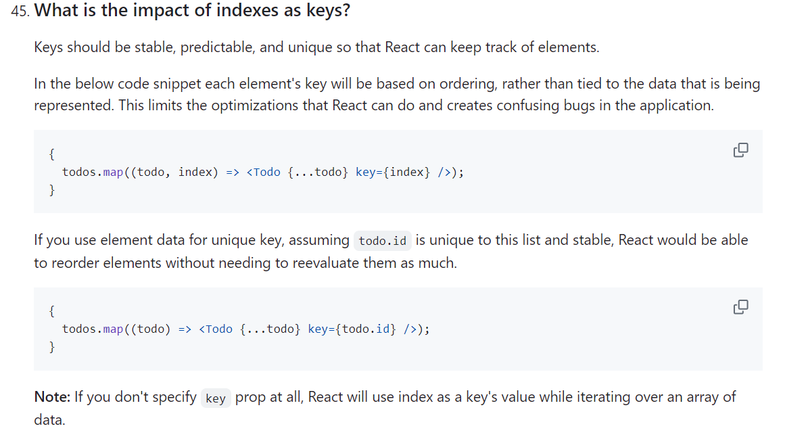

# React Patterns and Ecosystem Revision

This file incorporates advanced React ecosystem notes from the pasted `JS revision.md`.

---

# 1. React.lazy and Suspense

Use `React.lazy` to code-split components.

```jsx
import React, { Suspense } from "react";

const SettingsPage = React.lazy(() => import("./SettingsPage"));

function App() {
  return (
    <Suspense fallback={<p>Loading settings...</p>}>
      <SettingsPage />
    </Suspense>
  );
}
```

Route splitting:

```jsx
const Home = React.lazy(() => import("./pages/Home"));
const About = React.lazy(() => import("./pages/About"));
```

Use for:

* large pages
* rarely visited routes
* admin panels
* heavy chart/editor components

---

# 2. Error Boundaries

Error boundaries catch render errors in child components.

They do not catch:

* event handler errors
* async callback errors
* server errors
* errors inside the boundary itself

Class example:

```jsx
class ErrorBoundary extends React.Component {
  constructor(props) {
    super(props);
    this.state = { hasError: false };
  }

  static getDerivedStateFromError(error) {
    return { hasError: true };
  }

  componentDidCatch(error, errorInfo) {
    console.error("Error caught:", error, errorInfo);
  }

  render() {
    if (this.state.hasError) {
      return <p role="alert">Something went wrong.</p>;
    }

    return this.props.children;
  }
}
```

Use around risky UI:

```jsx
<ErrorBoundary>
  <Dashboard />
</ErrorBoundary>
```

---

# 3. Higher-Order Components

A Higher-Order Component is a function that takes a component and returns an enhanced component.

```jsx
function withLogger(WrappedComponent) {
  return function EnhancedComponent(props) {
    console.log("Props received:", props);
    return <WrappedComponent {...props} />;
  };
}
```

Use HOCs for:

* auth guards in older codebases
* logging
* feature flags
* injecting shared props
* library integrations such as older Redux `connect`
* older router helpers such as `withRouter`

Avoid HOCs when a custom hook or composition is simpler.

---

# 4. Render Props

Render props pass a function that returns JSX.

```jsx
function MouseTracker({ children }) {
  const [position, setPosition] = React.useState({ x: 0, y: 0 });

  React.useEffect(() => {
    function handleMouseMove(event) {
      setPosition({ x: event.clientX, y: event.clientY });
    }

    window.addEventListener("mousemove", handleMouseMove);
    return () => window.removeEventListener("mousemove", handleMouseMove);
  }, []);

  return children(position);
}
```

Modern React usually prefers custom hooks for this pattern.

Use `children` for static/structural composition:

```jsx
function Card({ children }) {
  return <section>{children}</section>;
}
```

Use render props or function-as-children when the reusable component owns logic/data and the consumer controls rendering:

```jsx
<MouseTracker>
  {({ x, y }) => <p>{x}, {y}</p>}
</MouseTracker>
```

Render props were especially useful before hooks. Today, custom hooks often express the same reusable logic with less nesting.

---

# 5. React Portals

Portals render children into a different DOM node without breaking the React component tree.

```jsx
import ReactDOM from "react-dom";

function Modal({ children }) {
  return ReactDOM.createPortal(
    <div role="dialog" aria-modal="true">
      {children}
    </div>,
    document.body
  );
}
```

Use portals for:

* modals
* tooltips
* dropdowns
* overlays

Important:

* events still propagate through the React tree
* focus management is still your responsibility
* do not use portals for normal layout

Visual note:



---

# 6. React Fiber

React Fiber is React's reconciliation engine introduced in React 16.

Why Fiber matters:

* rendering work can be split into units
* React can pause, resume, or prioritize work
* supports modern concurrent rendering capabilities

Render process:

```text
Render phase -> decide what changed
Commit phase -> apply DOM changes
```

Interview answer:

```text
Fiber is React's internal rendering architecture. It lets React organize rendering work as small units, prioritize updates, and keep the UI responsive.
```

---

# 7. PWA with React

PWA means Progressive Web App.

Common PWA features:

* installable app
* service worker
* offline support
* cache strategy
* web app manifest

React can be used to build PWA UI, but PWA behavior comes from browser APIs and service workers.

Detailed practical note: [Progressive Web Apps in React](./l_pwa_react_practical_notes.md).

---

# 8. Internationalization in React

i18n means internationalization.

Common requirements:

* translation files
* language switcher
* date/number formatting
* RTL layout support
* pluralization

Browser `Intl` API:

```js
const amount = new Intl.NumberFormat("en-US", {
  style: "currency",
  currency: "USD",
}).format(1000);
```

Popular React i18n libraries:

* react-i18next
* FormatJS / react-intl

---

# 9. Recommended React Folder Structure

Feature-based structure:

```text
src/
  app/
    router.jsx
    providers.jsx
  features/
    auth/
      components/
      hooks/
      authSlice.js
    products/
      components/
      pages/
      api.js
  shared/
    components/
    hooks/
    utils/
  layouts/
  store/
```

Component folder example:

```text
Button/
  Button.jsx
  Button.module.css
  index.js
```

Rule:

```text
Feature code owns product behavior.
Shared code owns reusable building blocks.
```

---

# 10. React vs Angular

| Topic | React | Angular |
| ----- | ----- | ------- |
| Category | UI library | Full framework |
| Main ownership | View layer and component model | Full application framework |
| Data flow | Usually one-way data flow | Supports two-way binding patterns |
| DOM model | Virtual DOM/reconciliation | Real DOM with Angular rendering/change detection |
| Backing company | Meta ecosystem | Google ecosystem |

Interview answer: React gives more architectural choice, while Angular provides more built-in structure. The better choice depends on team skills, app size, conventions, and ecosystem needs.
