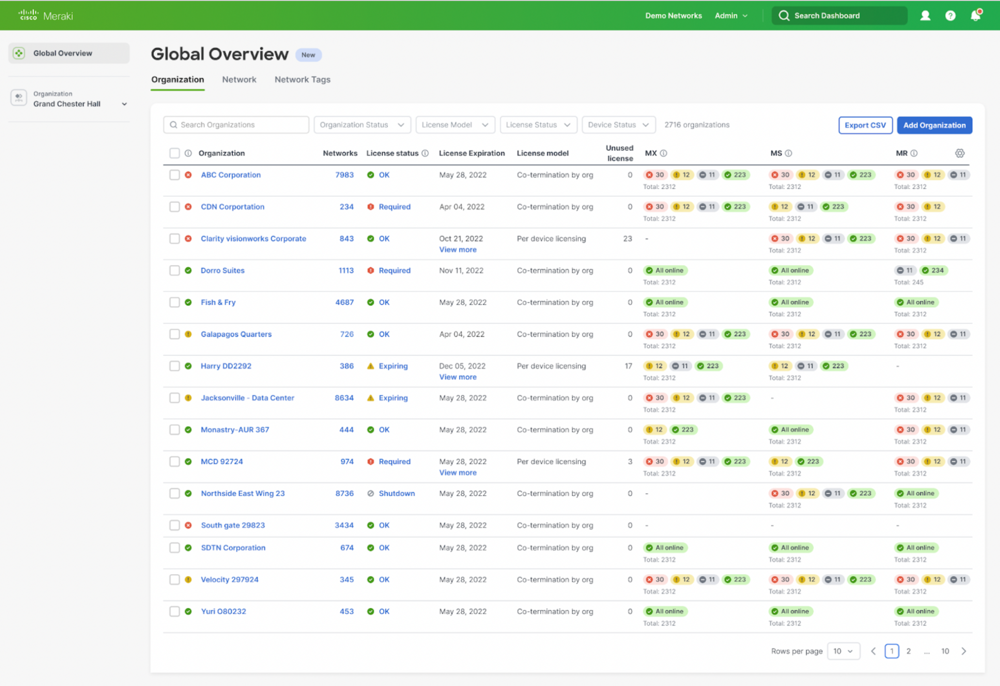

# Design Systems: Harbor, DNAC UI, and Magnetic

This note incorporates the unique practical points from `magnetic_and_harbor-components.docx`.

Use this as an interview and project mental model. Exact Cisco package names and internal implementation details can vary by team, product, and access level, so always verify with the project docs you are working in.

---

# 1. What a Design System Solves

A design system is a shared way to build product UI. It usually contains:

* reusable components such as buttons, alerts, tables, forms, tabs, modals, and navigation
* design tokens for colors, spacing, typography, radius, elevation, and states
* accessibility behavior and keyboard interaction rules
* Storybook or documentation examples
* patterns for common screens such as dashboards, filters, tables, empty states, and forms

For a frontend developer, the main benefit is consistency. Instead of every team designing a slightly different button, status badge, table, or modal, the product gets one shared language.

---

# 2. Harbor / DNAC Components

Harbor is described in the notes as a Cisco internal React component library/design-system layer used for Cisco enterprise/network-management style applications.

In a DNAC-style application, Harbor-style components help teams build:

* dashboards
* inventory tables
* filter panels
* device status indicators
* alerts and toast messages
* forms and validation states
* modals and confirmation flows
* reusable navigation and page layouts

The practical value is not just visual styling. A mature component library also gives standard interaction behavior: disabled states, focus styles, keyboard support, loading states, error states, density, and theming.

---

# 3. Example React Usage

This package name is from the supplied notes and should be treated as a project-specific example.

```jsx
import { Alert, Button } from "@cisco/harbor-react";

export default function SavePanel() {
  function handleSave() {
    console.log("Clicked");
  }

  return (
    <>
      <Alert type="success" message="Successfully saved changes!" />
      <Button variant="primary" onClick={handleSave}>
        Save
      </Button>
    </>
  );
}
```

What to check in real code:

* Does the component already provide accessible labels, roles, and keyboard behavior?
* Does the `variant` match design-system intent, such as `primary`, `secondary`, `danger`, or `ghost`?
* Are loading and disabled states handled during API calls?
* Are validation and error messages connected to form controls?
* Are custom styles using tokens instead of hard-coded one-off values?

---

# 4. DNAC UI Mental Model

Cisco DNA Center style UIs are typically enterprise dashboards. The screen usually has:

* navigation on the side or top
* module-level pages such as Design, Policy, Provision, Inventory, and Assurance
* dense data tables
* status chips and severity indicators
* filters, search, and export actions
* device, network, and license details

Frontend work in this kind of UI is mostly about making large amounts of operational data usable. That means strong table behavior, predictable filters, clear status language, accessible keyboard navigation, and careful loading/error states.

Visual reference from the source doc:



---

# 5. Magnetic UI

Magnetic is described in the notes as Cisco's newer unified design language/UI framework direction, especially connected to networking and security products.

Practical frontend meaning:

* shared design tokens
* common component behavior
* consistent product navigation patterns
* reusable React components
* Storybook-driven development
* migration from older product-specific UI libraries toward a more unified system

For a frontend developer, Magnetic-style work usually means consuming a shared component package, following token rules, and wiring components to real product state and APIs without breaking accessibility or consistency.

---

# 6. Harbor vs Magnetic

| Area | Harbor-style component library | Magnetic-style design system |
| ---- | ------------------------------ | ---------------------------- |
| Practical role | React component library for enterprise/network-management UI patterns | Unified Cisco design language and UI direction across networking/security products |
| Typical usage | Import ready components such as buttons, alerts, tables, modals, and inputs | Follow shared product language, tokens, components, and migration guidance |
| Developer focus | Build DNAC-style app screens quickly and consistently | Align product UI with a broader Cisco experience |
| Main benefit | Prebuilt components, theming, accessibility, and consistent behavior | Cross-product consistency and modernization |
| Risk | Overriding library styles and creating inconsistency | Mixing old and new UI patterns during migration |

Interview phrasing:

> Harbor is closer to the component-library layer I consume in React. Magnetic is closer to the broader design-system/product-language direction. In real project work, I would check the team docs to know which package and token system the product expects.

---

# 7. How a React Developer Uses a Design System

1. Start with the existing component before building a custom one.
2. Read the component docs or Storybook examples.
3. Use supported props for variants, sizes, density, icons, loading, and disabled states.
4. Wire component events to real state, API calls, and form logic.
5. Use design tokens for custom layout or spacing.
6. Check keyboard navigation, screen-reader labels, focus order, and error announcements.
7. Keep custom CSS small and scoped.

Example with API state:

```jsx
function SaveDeviceButton({ deviceId, saveDevice }) {
  const [status, setStatus] = React.useState("idle");

  async function handleClick() {
    try {
      setStatus("saving");
      await saveDevice(deviceId);
      setStatus("saved");
    } catch {
      setStatus("error");
    }
  }

  return (
    <>
      {status === "error" && (
        <Alert type="error" message="Could not save device. Try again." />
      )}

      <Button
        variant="primary"
        disabled={status === "saving"}
        onClick={handleClick}
      >
        {status === "saving" ? "Saving..." : "Save"}
      </Button>
    </>
  );
}
```

---

# 8. Storybook, Tokens, and Theming

Storybook helps developers check components without running the full application.

Use Storybook to verify:

* default, hover, active, focus, disabled, loading, and error states
* long text and empty text
* dark/light themes if supported
* right-to-left layouts if the product supports them
* keyboard interaction
* component props and allowed variants

Design tokens prevent random UI decisions:

```css
.deviceSummary {
  padding: var(--space-4);
  color: var(--color-text-default);
  background: var(--color-surface-default);
  border: 1px solid var(--color-border-subtle);
}
```

Avoid this in design-system code:

```css
.deviceSummary {
  padding: 17px;
  color: #212121;
  background: #f8f8f8;
}
```

Hard-coded values are sometimes fine for one-off prototypes, but product code should normally use approved tokens.

---

# 9. Migration Checklist

When moving from a legacy UI component to a design-system component:

* Match behavior before changing visuals.
* Preserve accessibility labels and focus behavior.
* Confirm form submission, validation, loading, and error states.
* Check table sorting, pagination, filtering, and row selection.
* Avoid mixing old and new spacing/color systems on the same screen.
* Replace custom CSS with tokens or supported component props where possible.
* Add tests for the workflow, not just the component render.

Code review questions:

* Is this already available in the component library?
* Are unsupported overrides hiding a design-system issue?
* Does the component still work with keyboard only?
* Does the UI handle loading, empty, partial-error, and permission-denied states?
* Are icons, badges, and colors used with semantic meaning?

---

# 10. Interview Answers

What is a design system?

A design system is a shared set of components, tokens, accessibility rules, and usage patterns that helps teams build consistent UI across a product.

Why use Harbor/DNAC components?

They let teams build enterprise network-management screens faster with shared Cisco-style components for dashboards, tables, alerts, forms, and navigation. The bigger value is consistent behavior, accessibility, and theming across modules.

What is Magnetic?

Magnetic is Cisco's unified design-system direction for networking and security product experiences. As a frontend developer, I would use it through approved components, tokens, Storybook docs, and migration guidelines.

Project-experience angle from the work-summary notes: Magnetic/Figma integration is useful to mention as design-system collaboration, visual consistency work, and enterprise UI alignment. Tie the story to practical output: reusable components, accessibility, CSS Modules, and consistent DNAC EVPN workflow screens.

How do you customize a design-system component?

First use supported props and variants. If custom styling is required, keep it small, use tokens, and avoid overriding internals that can break upgrades or accessibility.

---

# Public References

* Cisco Magnetic GitHub organization: https://github.com/cisco-magnetic
* Momentum Design: https://momentum.design/
* Momentum React V2 GitHub: https://github.com/momentum-design/momentum-react-v2
* Cisco Security Design article on Magnetic: https://security.design/blog/design-as-a-differentiator-one-year-at-cisco
