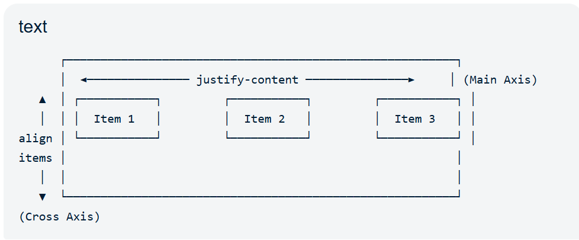

# 1. Fundamentals

## What is `display`?

The `display` property defines **how an element behaves in the layout**.

It determines:

* Whether the element starts on a new line
* Whether width/height can be applied
* How child elements are arranged

Example:

```css
.box {
    display: block;
}
```

---

## Common Display Values

* `block`
* `inline`
* `inline-block`
* `flex`
* `grid`
* `none`

---

# 2. display: block

## What is it?

A block element occupies the **entire available width** and always starts on a **new line**.

```css
div {
    display: block;
}
```

---

## Characteristics

* Starts on a new line.
* Takes full available width by default.
* Width and height work.
* Margin and padding work.

---

## Example

```html
<div>One</div>
<div>Two</div>
```

Output

```text
One
-------------------

Two
-------------------
```

---

## Common Block Elements

* `div`
* `p`
* `h1-h6`
* `section`
* `article`
* `header`
* `footer`

---

# 3. display: inline

## What is it?

Inline elements occupy **only as much width as their content**.

```css
span {
    display: inline;
}
```

---

## Characteristics

* Doesn't start on a new line.
* Width and height are ignored.
* Horizontal padding/margin work.
* Vertical margin has no effect on layout, and vertical padding affects painting but doesn't change line box height in the same way as block elements.

---

## Example

```html
<span>Hello</span>
<span>React</span>
```

Output

```text
Hello React
```

---

## Common Inline Elements

* `span`
* `a`
* `strong`
* `em`
* `label`

---

# 4. display: inline-block

## What is it?

Combines features of **inline** and **block**.

```css
.box {
    display: inline-block;
}
```

---

## Characteristics

* Appears on the same line.
* Width and height work.
* Margin and padding work.

---

## Example

```css
.box {
    width: 120px;
    height: 80px;
    display: inline-block;
}
```

Output

```text
+------+ +------+
| Box1 | | Box2 |
+------+ +------+
```

---

## When to Use?

Historically used for horizontal layouts before Flexbox.

Today it's mainly useful for:

* Small UI elements
* Badges
* Chips
* Icons

---

# 5. display: flex

## What is Flexbox?

Flexbox is a **one-dimensional layout system**.

It arranges children in:

* Row (default)
* Column

---

## Example

```css
.container {
    display: flex;
}
```

```html
<div class="container">
    <div>A</div>
    <div>B</div>
    <div>C</div>
</div>
```

Output

```text
A   B   C
```

---

## Default Direction

```css
flex-direction: row;
```

---

## Common Properties

### justify-content

Controls alignment on the **main axis**.

```css
justify-content: center;
justify-content: space-between;
justify-content: space-around;
justify-content: flex-end;
```

---

### align-items

Controls alignment on the **cross axis**.

```css
align-items: center;
```



---

### gap

Space between flex items.

```css
gap: 20px;
```

---

### flex-wrap

Allows wrapping.

```css
flex-wrap: wrap;
```

---

## React Use Cases

* Navbar
* Forms
* Cards
* Buttons
* Toolbars
* Responsive layouts

---

# 6. display: grid

## What is Grid?

Grid is a **two-dimensional layout system**.

It controls:

* Rows
* Columns

---

## Example

```css
.container {
    display: grid;
    grid-template-columns: repeat(3, 1fr);
}
```

Output

```text
A   B   C
D   E   F
```

---

## Common Properties

### grid-template-columns

```css
grid-template-columns: 1fr 1fr 1fr;
```

---

## What does `1fr` mean in CSS Grid?

`fr` stands for **fraction**.

It represents **one fraction of the available free space** inside a CSS Grid container.

### Example 1

```css
.container {
  display: grid;
  grid-template-columns: 1fr 1fr;
}
```

This creates **2 equal columns**.

```text
+-------------+-------------+
|      A      |      B      |
+-------------+-------------+
```

Each column gets **50%** of the available space.

---

### Example 2

```css
.container {
  display: grid;
  grid-template-columns: 1fr 2fr;
}
```

Output:

```text
+---------+------------------+
|    A    |        B         |
+---------+------------------+
```

Space is divided into **3 equal parts**:

* First column → **1 part (1fr)**
* Second column → **2 parts (2fr)**

So:

* Column A = **33.3%**
* Column B = **66.7%**

---

### Example 3

```css
.container {
  display: grid;
  grid-template-columns: 200px 1fr;
}
```

If the container width is **1000px**:

```text
First column  = 200px
Remaining     = 800px
Second column = 1fr = 800px
```

`1fr` uses **all the remaining available space** after fixed-size columns are allocated.

---

## Interview Tip

`fr` is **not a fixed unit** like `px`. It is a **flexible unit** that divides the remaining free space proportionally among grid columns or rows.

### Interview Answer (30 seconds)

> **"`fr` stands for fraction. It represents a proportional share of the available space in a CSS Grid container. For example, `1fr 1fr` creates two equal columns, while `1fr 2fr` creates columns in a 1:2 ratio. It's the preferred way to build flexible and responsive Grid layouts."**

---

### grid-template-rows

```css
grid-template-rows: auto auto;
```

---

### gap

```css
gap: 16px;
```

---

### place-items

Centers content.

```css
place-items: center;
```

---

### Example

```css
.container {
  display: grid;
  grid-template-columns: repeat(3, 1fr);
  gap: 16px;
}
```

```html
<div class="container">
  <div>A</div>
  <div>B</div>
  <div>C</div>
  <div>D</div>
</div>
```

Output:

```text
+---+---+---+
| A | B | C |
+---+---+---+
| D |   |   |
+---+---+---+
```

### Common Properties

* `display: grid` → Enables Grid layout.
* `grid-template-columns` → Defines the number and width of columns.
* `grid-template-rows` → Defines rows.
* `gap` → Space between grid items.
* `place-items: center` → Centers items horizontally and vertically.

### Flex vs Grid

| Flexbox                | Grid                      |
| ---------------------- | ------------------------- |
| 1D (Row **or** Column) | 2D (Rows **and** Columns) |
| Component layout       | Page/Grid layout          |

### Interview Answer (30 seconds)

> **"CSS Grid is a two-dimensional layout system that arranges elements in both rows and columns. It's ideal for complex layouts like dashboards, galleries, and product grids. The main properties are `display: grid`, `grid-template-columns`, `grid-template-rows`, and `gap`. Compared to Flexbox, which is one-dimensional, Grid is better suited for full-page or multi-row/multi-column layouts."**

---

## React Use Cases

* Dashboard
* Product listing
* Gallery
* Analytics widgets
* Card layouts

---

# Flex vs Grid

| Flex                | Grid                  |
| ------------------- | --------------------- |
| One-dimensional     | Two-dimensional       |
| Row OR Column       | Rows AND Columns      |
| Best for components | Best for page layouts |

---

# 7. display: none

## What is it?

Completely removes the element from the layout.

```css
.hidden {
    display: none;
}
```

---

## Characteristics

* Not visible.
* Doesn't occupy space.
* Cannot receive focus.
* Not read by screen readers because it's removed from the accessibility tree.

---

## Example

```css
.menu {
    display: none;
}
```

Menu disappears completely.

---

## Difference

### display: none

```text
Item removed completely.
```

### visibility: hidden

```text
Item invisible

↓

Still occupies space.
```

---

# Display Comparison

| Property     | New Line            | Width/Height | Occupies Space |
| ------------ | ------------------- | ------------ | -------------- |
| block        | ✅                   | ✅            | ✅              |
| inline       | ❌                   | ❌            | ✅              |
| inline-block | ❌                   | ✅            | ✅              |
| flex         | Depends on children | ✅            | ✅              |
| grid         | Depends on grid     | ✅            | ✅              |
| none         | ❌                   | ❌            | ❌              |

---

# Real-world React Example

```jsx
<div className="card">
    
    <h3>iPhone</h3>
    <button>Buy</button>
</div>
```

```css
.card {
    display: flex;
    flex-direction: column;
    gap: 12px;
}
```

Children are arranged vertically with equal spacing.

---

# Best Practices

* Use **Flexbox** for one-dimensional layouts.
* Use **Grid** for two-dimensional layouts.
* Avoid `inline-block` for complex layouts.
* Use `display: none` when an element should be completely removed from the layout.
* Prefer semantic HTML and use CSS only for layout.

---

# Common Mistakes

❌ Using Grid for simple horizontal alignment.

Flexbox is simpler.

---

❌ Using Flexbox for complex dashboards.

Grid is more suitable.

---

❌ Using `display: none` when you only want to hide visually but preserve layout.

Use `visibility: hidden` instead.

---

❌ Expecting width/height to work on inline elements.

They don't.

---

# Revision Notes

## Display Cheat Sheet

| Display        | New Line          | Width/Height | Common Use            |
| -------------- | ----------------- | ------------ | --------------------- |
| `block`        | ✅                 | ✅            | Sections, divs        |
| `inline`       | ❌                 | ❌            | Text, links           |
| `inline-block` | ❌                 | ✅            | Badges, icons         |
| `flex`         | Child layout (1D) | ✅            | Navbars, forms, cards |
| `grid`         | Child layout (2D) | ✅            | Dashboards, galleries |
| `none`         | Removed           | ❌            | Hide elements         |

---

## Remember

```text
block
↓

Full width
New line

inline
↓

Content width
Same line

inline-block
↓

Content width
Width/Height allowed

flex
↓

1 Dimension
(Row OR Column)

grid
↓

2 Dimensions
(Rows + Columns)

none
↓

Removed from layout
```

---

## Flex vs Grid

| Flex            | Grid              |
| --------------- | ----------------- |
| One-dimensional | Two-dimensional   |
| Components      | Full-page layouts |
| Navbar          | Dashboard         |
| Form            | Gallery           |
| Toolbar         | Analytics Grid    |

---

# Common Interview Questions (6 Years React)

### 1. What is the difference between `block` and `inline`?

| Block                | Inline                 |
| -------------------- | ---------------------- |
| Starts on a new line | Stays on the same line |
| Takes full width     | Takes content width    |
| Width/Height work    | Width/Height ignored   |

---

### 2. What is `inline-block`?

It behaves like an inline element (stays on the same line) but allows setting width and height like a block element.

---

### 3. What is the difference between Flexbox and Grid?

* **Flexbox** is for one-dimensional layouts (row or column).
* **Grid** is for two-dimensional layouts (rows and columns).

---

### 4. When should you use Flexbox?

Use Flexbox when arranging items in a single direction, such as:

* Navigation bars
* Forms
* Card content
* Button groups
* Toolbars

---

### 5. When should you use Grid?

Use Grid for layouts that require both rows and columns, such as:

* Dashboards
* Product grids
* Photo galleries
* Analytics pages

---

### 6. What does `display: none` do?

It completely removes the element from the layout. It doesn't occupy space, can't receive focus, and isn't exposed to assistive technologies.

---

### 7. What is the difference between `display: none` and `visibility: hidden`?

| `display: none`                 | `visibility: hidden`              |
| ------------------------------- | --------------------------------- |
| Removed from layout             | Layout space preserved            |
| Doesn't occupy space            | Occupies space                    |
| Removed from accessibility tree | Still in layout (but not visible) |

---

### 8. Can width and height be applied to inline elements?

No. They are ignored for standard inline elements.

---

### 9. Why is Flexbox commonly used in React applications?

Because React components often represent one-dimensional UI sections (headers, forms, cards, toolbars), and Flexbox provides simple, responsive alignment for these layouts.

---

### 10. How do you decide between Flexbox and Grid?

* **Flexbox** → Aligning or distributing items in one direction.
* **Grid** → Building layouts with rows and columns simultaneously.

**Rule of Thumb:**

* **Component layout → Flexbox**
* **Page layout → Grid**
